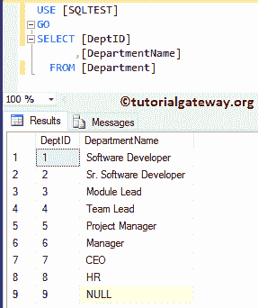
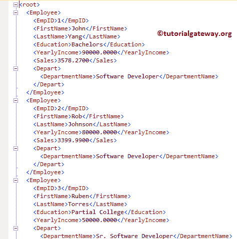

# XML 自动模式

> 原文：<https://www.tutorialgateway.org/sql-for-xml-auto/>

SQL Server 中的自动搜索 XML 模式将结果集作为嵌套的 XML 元素返回。与其他 XML 模式不同，For XML AUTO 并没有对生成的 XML 文件提供太多的控制。这就是为什么我们不实时使用这种 SQL FOR XML AUTO 模式。

对于这个 SQL FOR XML AUTO 示例，我们使用了 SQL 测试中的“新员工”、“部门”表。下面的截图将向您展示 SQL Server 中的“新员工”表数据。


部门内的数据如下所示:



## 面向 XML 的 SQL 自动示例 1

在这个例子中，我们将向您展示使用 SQL FOR XML 自动模式的基本方法。使用自动模式最简单的方法是在[`SELECT`语句](https://www.tutorialgateway.org/sql-select-statement/)后追加 FOR XML AUTO。

```
-- SQL Server FOR XML AUTO Example

SELECT  [EmpID]
      ,[FirstName]
      ,[LastName]
      ,[Education]
      ,[YearlyIncome]
      ,[Sales]
      ,[DeptID]
  FROM [NewEmployees]
  FOR XML AUTO;
```


如您所见，查询已经生成了 XML 文件。请点击超链接查看 XML 文件。


从上面的截图可以看到，New Employees 表中的每一行都映射了<newemployees>元素，列成为了属性。它非常适合单个表，让我使用[连接](https://www.tutorialgateway.org/sql-joins/)在多个 [SQL Server](https://www.tutorialgateway.org/sql/) 表上尝试一下。</newemployees>

```
-- SQL Server FOR XML AUTO Example
SELECT Employee.[EmpID]
      ,Employee.[FirstName]
      ,Employee.[LastName]
      ,Employee.[Education]
      ,Employee.[YearlyIncome]
      ,Employee.[Sales]
      ,Depart.[DepartmentName]
  FROM [NewEmployees] AS Employee
  INNER JOIN [Department] AS Depart 
  ON Employee.DeptID = Depart.DeptID
  FOR XML AUTO;
```


现在，您可以看到行元素根据别名进行了更改。


## 面向 XML 的 SQL 自动示例 2

如您所见，所有列都被添加为<employee>和<depart>元素的属性。在本例中，我们将向您展示如何添加列值作为子元素(而不是属性)。为了达到同样的目的，我们在 SQL Server 中使用了 ELEMENTS 关键字和 FOR XML AUTO。</depart></employee>

```
-- SQL Server FOR XML AUTO Example
SELECT Employee.[EmpID]
      ,Employee.[FirstName]
      ,Employee.[LastName]
      ,Employee.[Education]
      ,Employee.[YearlyIncome]
      ,Employee.[Sales]
      ,Depart.[DepartmentName]
  FROM [NewEmployees] AS Employee
  INNER JOIN [Department] AS Depart 
  ON Employee.DeptID = Depart.DeptID
  FOR XML AUTO, ELEMENTS;
```


现在，您可以看到“用于 XML”自动添加了列值作为子元素


## 对于 XML 自动示例 3

您可以使用 SQL Server FOR XML AUTO 创建一个新的根元素，它将包装其中的所有现有元素。为了实现同样的目的，我们必须使用 ROOT 关键字和 FOR XML AUTO。

```
-- SQL Server FOR XML AUTO Example

SELECT Employee.[EmpID]
      ,Employee.[FirstName]
      ,Employee.[LastName]
      ,Employee.[Education]
      ,Employee.[YearlyIncome]
      ,Employee.[Sales]
      ,Depart.[DepartmentName]
  FROM [NewEmployees] AS Employee
  INNER JOIN [Department] AS Depart 
  ON Employee.DeptID = Depart.DeptID
  FOR XML AUTO, ROOT, ELEMENTS;
```


这个 XML 文件是:



如果观察上面的截图，有一个<root>元素作为父级。让我更改这个默认元素名。</root>

```
-- SQL Server FOR XML AUTO Example
SELECT Employee.[EmpID]
      ,Employee.[FirstName]
      ,Employee.[LastName]
      ,Employee.[Education]
      ,Employee.[YearlyIncome]
      ,Employee.[Sales]
      ,Depart.[DepartmentName]
  FROM [NewEmployees] AS Employee
  INNER JOIN [Department] AS Depart 
  ON Employee.DeptID = Depart.DeptID
  FOR XML AUTO, ROOT('EmployeDetails'), ELEMENTS;
```

现在可以看到<root>元素被<employeedetails></employeedetails></root>


所取代

## 用于 XML 自动示例 4

如果观察以上所有情况，生成的 XML 文件会忽略具有空值的元素。这是 For XML 自动的默认模式，但是您可以通过添加 XSINIL 关键字来更改这种模式。

```
-- SQL Server FOR XML AUTO Example
SELECT Employee.[EmpID]
      ,Employee.[FirstName]
      ,Employee.[LastName]
      ,Employee.[Education]
      ,Employee.[YearlyIncome]
      ,Employee.[Sales]
      ,Depart.[DepartmentName]
  FROM [NewEmployees] AS Employee
  INNER JOIN [Department] AS Depart 
  ON Employee.DeptID = Depart.DeptID
  FOR XML AUTO, 
          ROOT('EmployeDetails'), 
          ELEMENTS XSINIL;
```


现在您可以看到，XML 文件显示的元素是空的

