# 用于 XML 路径的 SQL

> 原文：<https://www.tutorialgateway.org/sql-for-xml-path/>

SQL Server 中带有 FOR XML 的路径模式返回一个结果集作为 XML 元素。与其他 XML 模式不同，这种 SQL FOR XML PATH 模式提供了对生成的 XML 文件的控制。这是因为 FOR XML 路径模式将列名和别名视为 XPath 表达式。

对于这个 SQL FOR XML 路径模式示例，我们使用的是 SQL 测试数据库中的“新员工”、“部门”表。下面的截图将向您显示新员工表数据。

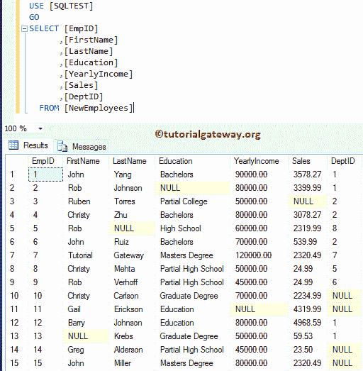

我们[数据库](https://www.tutorialgateway.org/how-to-create-database-in-sql-server/)中 [SQL Server](https://www.tutorialgateway.org/sql/) 部门的数据如下所示:

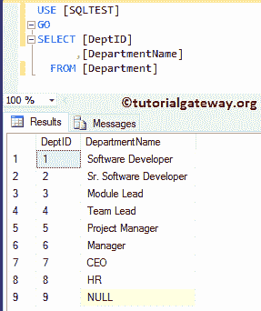

## 用于 XML 路径的 SQL 示例 1

这个例子展示了使用 FOR XML 路径模式的基本方法。使用路径模式最简单的方法是在[`SELECT`语句](https://www.tutorialgateway.org/sql-select-statement/)后追加 FOR XML PATH。

```
-- SQL Server FOR XML PATH Example

SELECT  [EmpID]
      ,[FirstName]
      ,[LastName]
      ,[Education]
      ,[YearlyIncome]
      ,[Sales]
      ,[DeptID]
  FROM [NewEmployees]
  FOR XML PATH;
```

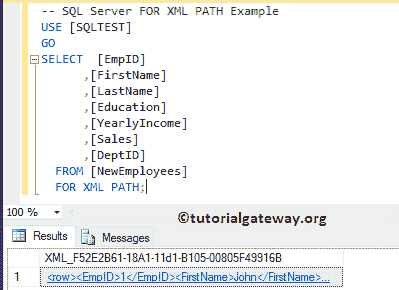

上面的查询已经生成了 XML 文件。请点击超链接查看 XML 文件。

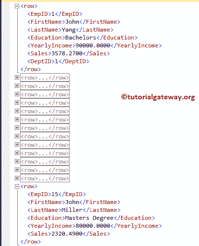

单个表没问题，让我用[连接](https://www.tutorialgateway.org/sql-joins/)在多个表上试试。

```
-- SQL Server FOR XML PATH Example

SELECT Employee.[EmpID]
      ,Employee.[FirstName]
      ,Employee.[LastName]
      ,Employee.[Education]
      ,Employee.[YearlyIncome]
      ,Employee.[Sales]
      ,Depart.[DepartmentName]
  FROM [NewEmployees] AS Employee
  INNER JOIN [Department] AS Depart 
  ON Employee.DeptID = Depart.DeptID
  FOR XML PATH
```

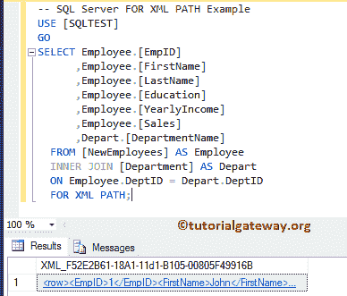

它与多个表

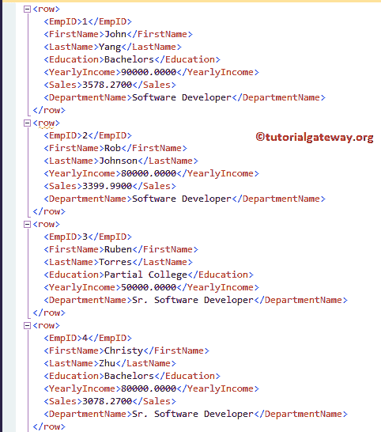

完美配合

## 用于 XML 路径的 SQL 示例 2

SQL Server 提供了 ELEMENTS 关键字来将列名显示为嵌套元素。让我把这个关键字和 FOR XML 路径一起使用。

```
-- SQL Server FOR XML PATH Example

SELECT Employee.[EmpID]
      ,Employee.[FirstName]
      ,Employee.[LastName]
      ,Employee.[Education]
      ,Employee.[YearlyIncome]
      ,Employee.[Sales]
      ,Depart.[DepartmentName]
  FROM [NewEmployees] AS Employee
  INNER JOIN [Department] AS Depart 
  ON Employee.DeptID = Depart.DeptID
  FOR XML PATH, ELEMENTS;
```

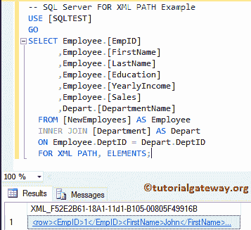

看，输出没有区别。因为路径模式已经在执行这个操作

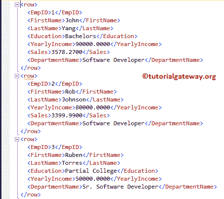

## 对于 XML 路径示例 3

如果观察上面的截图，每一行都被默认的<row>元素隔开。在本例中，我们将向您展示如何用自定义元素覆盖默认行。</row>

```
-- SQL Server FOR XML PATH Example

SELECT Employee.[FirstName] 
      ,Employee.[LastName] 
      ,Employee.[Education]
      ,Employee.[YearlyIncome]
      ,Employee.[Sales]
      ,Depart.[DepartmentName]
  FROM [NewEmployees] AS Employee
  INNER JOIN [Department] AS Depart 
  ON Employee.DeptID = Depart.DeptID
  FOR XML PATH('Employees')
```

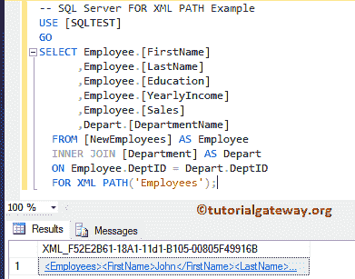

从下面的截图来看，<row>元素被替换为</row>

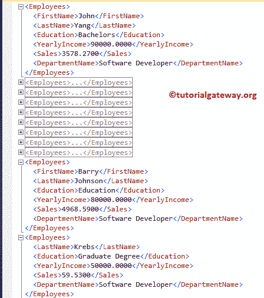

## 对于 XML 路径示例 4

SQL Server FOR XML PATH 允许您创建一个新的根元素，它将包装其中的所有现有元素。为了达到同样的目的，我们必须使用 ROOT 关键字和 FOR XML 路径。

```
-- SQL Server FOR XML PATH Example

SELECT Employee.[FirstName] 
      ,Employee.[LastName] 
      ,Employee.[Education]
      ,Employee.[YearlyIncome]
      ,Employee.[Sales]
      ,Depart.[DepartmentName]
  FROM [NewEmployees] AS Employee
  INNER JOIN [Department] AS Depart 
  ON Employee.DeptID = Depart.DeptID
  FOR XML PATH('Employees'), ROOT;
```

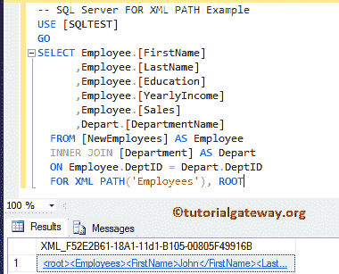

而 XML 文件是:

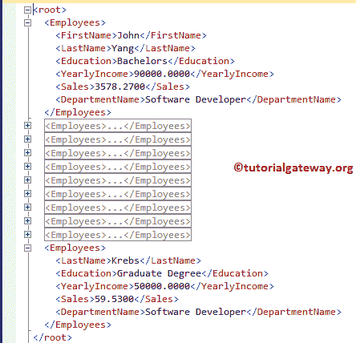

## 对于 XML 路径示例 5

如果观察上面的截图，有一个<root>元素作为父级。在这个 sql for xml 路径示例中，我们将更改这个默认元素名。</root>

```
-- SQL Server FOR XML PATH Example

SELECT Employee.[FirstName] 
      ,Employee.[LastName] 
      ,Employee.[Education]
      ,Employee.[YearlyIncome]
      ,Employee.[Sales]
      ,Depart.[DepartmentName]
  FROM [NewEmployees] AS Employee
  INNER JOIN [Department] AS Depart 
  ON Employee.DeptID = Depart.DeptID
  FOR XML PATH('Employees'), ROOT('EmployeeDetails')
```

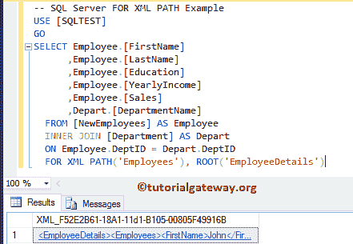

现在可以看到<root>元素被<employeedetails></employeedetails></root>

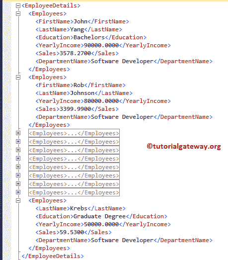

所取代

## 用于 XML 路径的 SQL 示例 6

如果列名(或别名)以@符号开头，并且不包含/符号，则该列将作为属性添加到行元素中。

在下面的 SQL Server 的 XML 路径代码片段中，第一个和最后一个以@开头。这意味着它们都作为属性添加到“员工”行中。

```
-- SQL Server FOR XML PATH Example

SELECT Employee.[FirstName] AS [@First]
      ,Employee.[LastName] AS [@Last]
      ,Employee.[Education]
      ,Employee.[YearlyIncome]
      ,Employee.[Sales]
      ,Depart.[DepartmentName]
  FROM [NewEmployees] AS Employee
  INNER JOIN [Department] AS Depart 
  ON Employee.DeptID = Depart.DeptID
  FOR XML PATH('Employees'), 
          ROOT('EmployeeDetails');
```

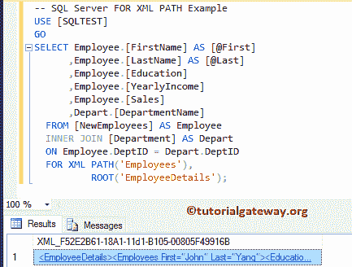

而 XML 文件是:

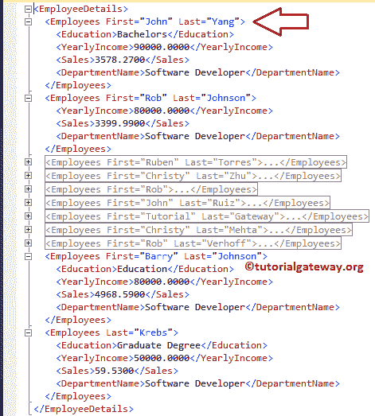

## 用于 XML 路径的 SQL 示例 7

如果列名(或别名)不以@符号开头，但包含/符号，则该列名表示层次结构。

从下面的 XML 路径代码片段来看，First 和 Last 不是以@开头，而是包含一个斜杠符号。这意味着创建了一个名为全名的新层次结构，名字和姓氏都作为属性添加到了全名中。

```
-- SQL Server FOR XML PATH Example

SELECT Employee.[FirstName] AS 'FullName/@First'
      ,Employee.[LastName] AS 'FullName/@Last'
      ,Employee.[Education]
      ,Employee.[YearlyIncome]
      ,Employee.[Sales]
      ,Depart.[DepartmentName]
  FROM [NewEmployees] AS Employee
  INNER JOIN [Department] AS Depart 
  ON Employee.DeptID = Depart.DeptID
  FOR XML PATH('Employees'), 
          ROOT('EmployeeDetails');
```

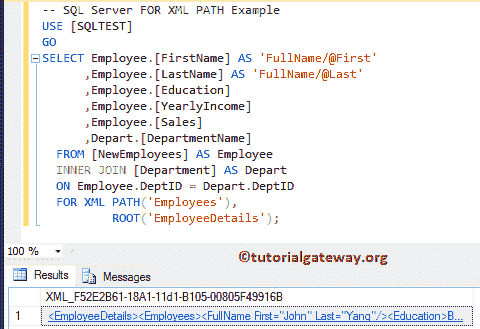

而 XML 文件是:

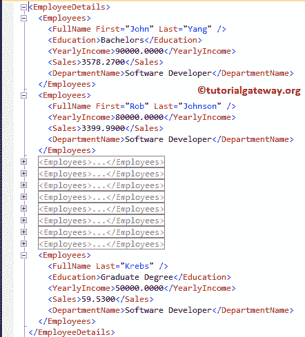

## 对于 XML 路径示例 8

您还可以将通配符与用于 XML 路径的 Sql Server 一起使用。

```
-- SQL Server FOR XML PATH Example

SELECT Employee.[EmpID] AS [@EmployeeID]
      ,Employee.[FirstName] "*"
      ,Employee.[LastName] "*"
      ,Employee.[Education]
      ,Employee.[YearlyIncome]
      ,Employee.[Sales]
      ,Depart.[DepartmentName]
  FROM [NewEmployees] AS Employee
  INNER JOIN [Department] AS Depart 
  ON Employee.DeptID = Depart.DeptID
  FOR XML PATH('Employees'), 
          ROOT('EmployeeDetails'),
	  ELEMENTS XSINIL;
```

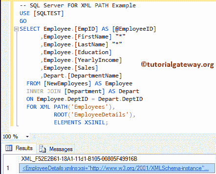

而 XML 文件是:

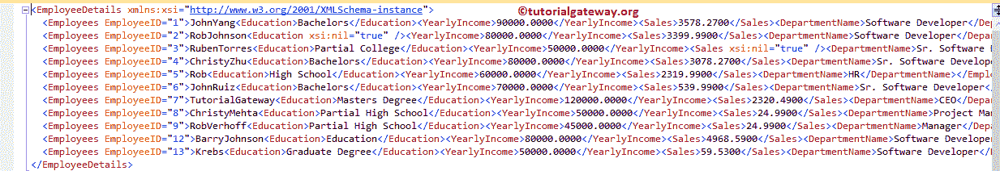

## 对于 XML 路径示例 9

在本例中，我们将向您展示，Sql Server XML 路径如何处理未命名的列。

```
-- SQL Server FOR XML PATH Example

SELECT Employee.[Education]
      ,SUM(Employee.[YearlyIncome])
  FROM [NewEmployees] AS Employee
  GROUP BY 	Employee.[Education]
  FOR XML PATH('Employees'), 
          ROOT('EmployeeDetails'),
		  ELEMENTS XSINIL;
```

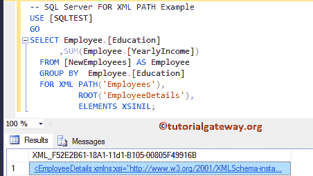

而 XML 文件是:

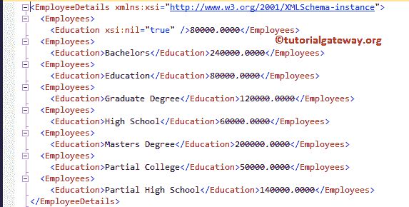

## 对于 XML 路径示例 10

如果您观察以上所有示例，生成的 XML 文件将忽略具有空值的元素。这是用于 XML 路径的默认行为。但是，您可以通过添加 ELEMENTS XSINIL 关键字来更改这一点。

```
-- SQL Server FOR XML PATH Example

SELECT Employee.[FirstName] AS 'Name/@First'
      ,Employee.[LastName] AS 'Name/@Last'
      ,Employee.[Education]
      ,Employee.[YearlyIncome]
      ,Employee.[Sales]
      ,Depart.[DepartmentName]
  FROM [NewEmployees] AS Employee
  INNER JOIN [Department] AS Depart 
  ON Employee.DeptID = Depart.DeptID
  FOR XML PATH('Employees'), 
          ROOT('EmployeeDetails'),
	  ELEMENTS XSINIL;
```

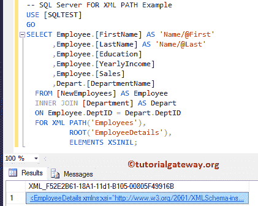

现在您可以看到，XML 文件显示的元素是空的

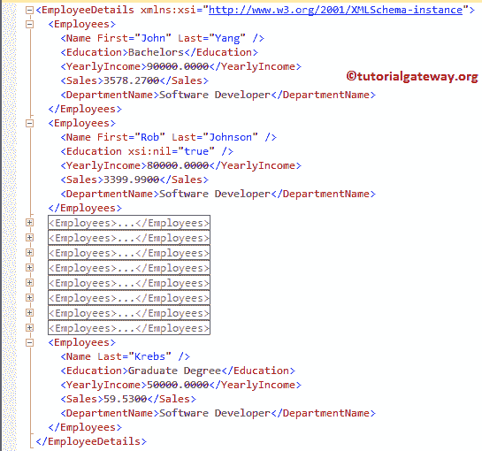

## 对于 XML 路径示例 11

通过使用 XMLNAMESPACES 关键字和 SQL For XML 路径，您可以将自定义命名空间分配给 XML 文件。在本例中，我们将展示相同的内容。

```
-- SQL Server FOR XML PATH Example

WITH XMLNAMESPACES('tutorialgateway.org' as TutorialGateway)  
SELECT Employee.[FirstName] AS 'Name/@First'
      ,Employee.[LastName] AS 'Name/@Last'
      ,Employee.[Education]
      ,Employee.[YearlyIncome]
      ,Employee.[Sales]
      ,Depart.[DepartmentName]
  FROM [NewEmployees] AS Employee
  INNER JOIN [Department] AS Depart 
  ON Employee.DeptID = Depart.DeptID
  FOR XML PATH('Employees'), 
          ROOT('EmployeeDetails'),
	  ELEMENTS XSINIL;
```

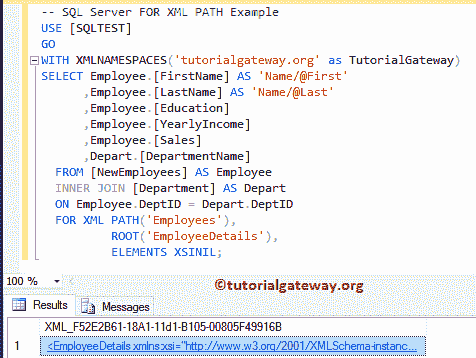

您可以看到我们在上面的查询

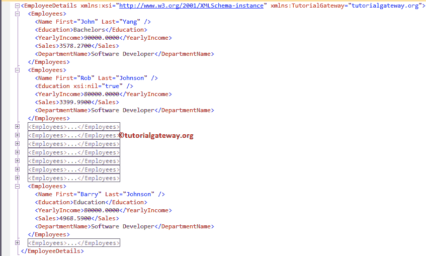

中使用的名称空间