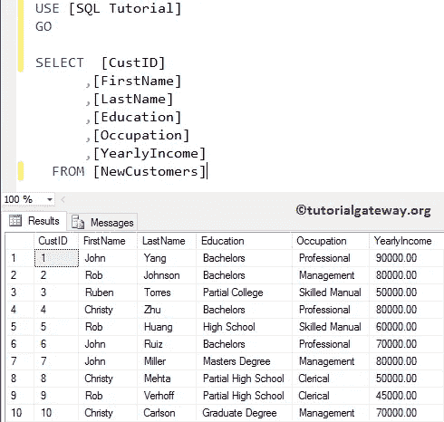
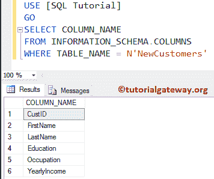
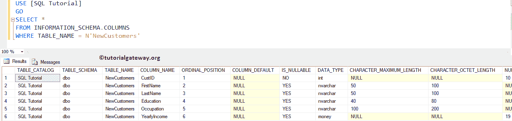
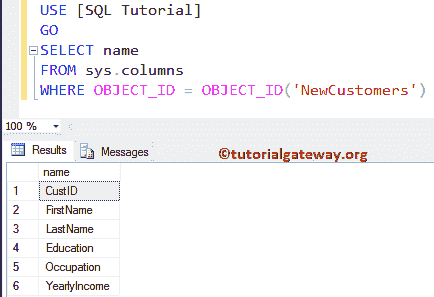
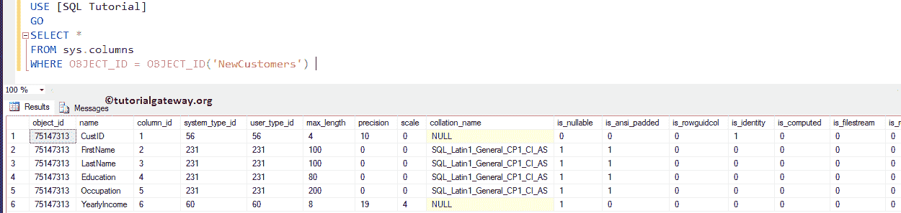

# 在 SQL 中从表中获取列名

> 原文：<https://www.tutorialgateway.org/get-column-names-from-table-in-sql/>

如何在 SQL Server 中编写从表中获取列名的查询是您可能会遇到的标准面试问题之一。对于这个从表中获取列名的例子，我们将使用下面显示的数据



上面的截图将向您展示 SQL Tutorial 数据库中的 NewCustomer 表中的数据。

## 从 SQL Server 示例 1 的表中获取列名

在这个 [SQL](https://www.tutorialgateway.org/sql/) 示例中，我们将向您展示如何使用 INFORMATION_SCHEMA 获取列名。

```sql
-- Query to Get Column Names From Table in SQL Server

SELECT COLUMN_NAME
FROM INFORMATION_SCHEMA.COLUMNS
WHERE TABLE_NAME = N'NewCustomers'
```



您可以使用下面的查询来获取关于该表的所有信息

```sql
-- Query to Get Column Names From Table in SQL Server

SELECT *
FROM INFORMATION_SCHEMA.COLUMNS
WHERE TABLE_NAME = N'NewCustomers'
```



## 从表中获取列名示例 2

此常见问题解释了如何使用 sys.columns 在表中查找列名列表

```sql
-- Query to Get Column Names From Table in SQL Server

SELECT name
FROM sys.columns 
WHERE OBJECT_ID = OBJECT_ID('NewCustomers')
```



让我来告诉你如果我们用*替换名称列会发生什么

```sql
-- Query for Sql Server Get Column Names

SELECT *
FROM sys.columns 
WHERE OBJECT_ID = OBJECT_ID('NewCustomers')
```

