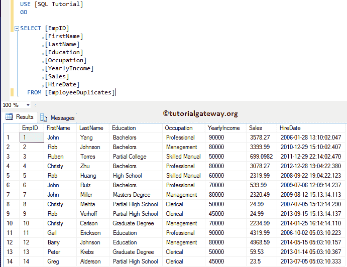
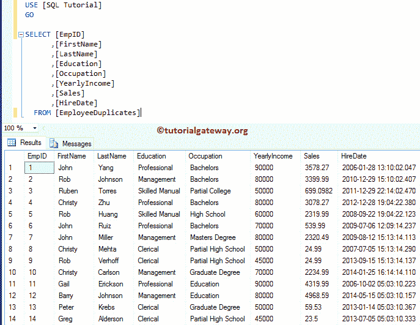

# 如何在 SQL Server 中交换列值

> 原文：<https://www.tutorialgateway.org/how-to-swap-column-values-in-sql-server/>

在本文中，我们将通过示例向您展示如何编写一个查询来交换 SQL Server 中的列值。对于这个 SQL 交换列值面试问题，我们将使用下面显示的数据



## 如何在 SQL Server 中交换列值？

请使用下面显示的频繁查询来交换两个列值。

```
UPDATE [dbo].[EmployeeDuplicates]
	SET [Education] = [Occupation],
	    [Occupation] = [Education]
GO
```

```
Messages
--------
(14 row(s) affected)
```

让我给你看看更新后的 [SQL Server](https://www.tutorialgateway.org/sql/) 记录。从下面的截图可以看到，教育栏目中的信息存储在职业栏目中。“职业”列中的数据存储在“教育”列中。

