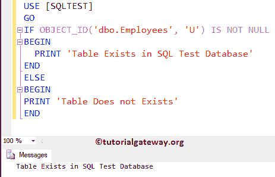
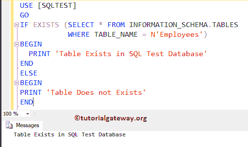
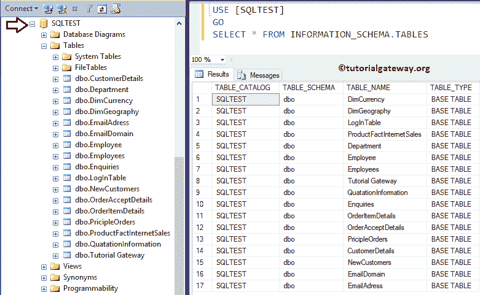
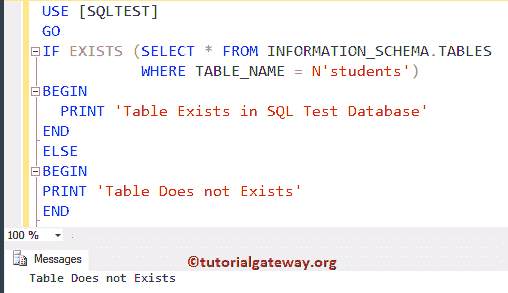
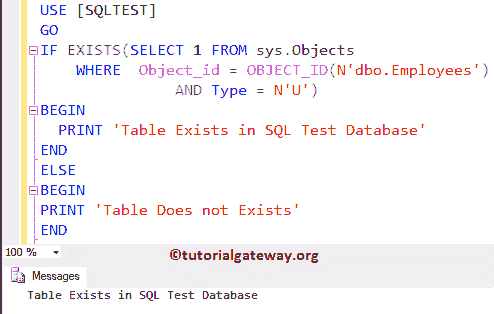
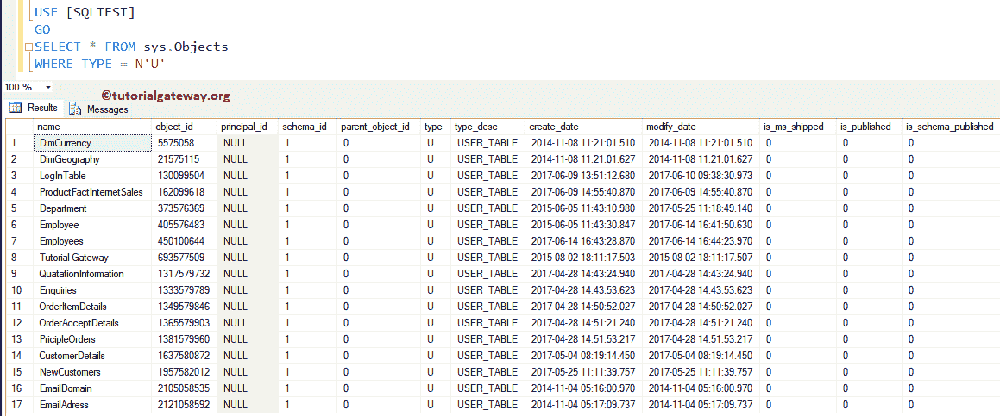
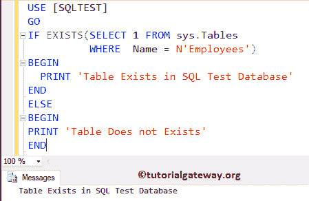
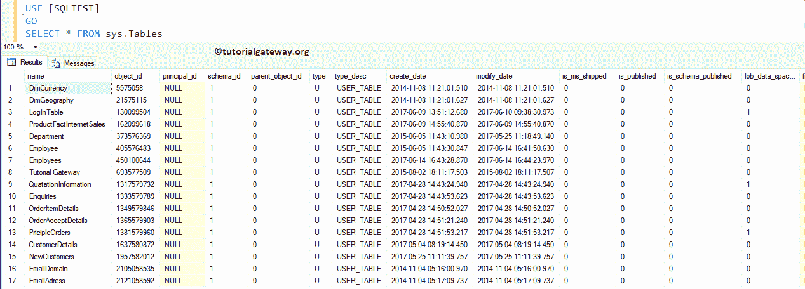

# 如何检查 SQL Server 中是否存在表

> 原文：<https://www.tutorialgateway.org/how-to-check-if-a-table-exists-in-sql-server/>

如何用例子检查一个表在 SQL Server 中是否存在？。这是 SQL Server 常见问题之一。

## 检查一个表是否存在于 SQL Server 中，或者是否接近 1

在这个例子中，我们展示了如何使用对象标识来检查一个表是否存在于 SQL Server 中。这里我们使用`if-else`语句根据条件结果打印不同的输出(消息)。

```sql
-- Query:- Sql Server check table exists before creating

IF OBJECT_ID('dbo.Employees', 'U') IS NOT NULL 
BEGIN
  PRINT 'Table Exists in SQL Test Database'
END
ELSE
BEGIN
PRINT 'Table Does not Exists'
END
```

提示:在开始创建[表](https://www.tutorialgateway.org/sql-create-table/)之前，最好检查一下[服务器](https://www.tutorialgateway.org/sql/)表是否存在，或者是否使用 [IF ELSE](https://www.tutorialgateway.org/sql-if-else/) 。



## 检查一个 SQL 表是否存在或是否接近 2

在这个例子中，我们使用信息模式表来检查一个表是否存在

这里我们使用 [SQL EXISTS](https://www.tutorialgateway.org/sql-exists-operator/) 运算符来检查数据库中是否存在 Employees 表。如果是真的，那么它将返回第一个 PRINT 语句。否则，它将返回 ELSE 块中的语句

```sql
-- Sql Server check table exists before creating

IF EXISTS (SELECT * FROM INFORMATION_SCHEMA.TABLES 
           WHERE TABLE_NAME = N'Employees')
BEGIN
  PRINT 'Table Exists in SQL Test Database'
END
ELSE
BEGIN
PRINT 'Table Does not Exists'
END
```



让我告诉你，信息模式中有哪些列。桌子

```sql
SELECT * FROM INFORMATION_SCHEMA.TABLES
```



现在，让我用不存在的表来试试。



## 检查 SQL 方法 3 中是否存在表

这里，我们使用 sys.Objects 检查一个表是否存在于 SQL Server 中

```sql
-- SQL check if table exists before creating

IF EXISTS(SELECT 1 FROM sys.Objects 
    WHERE  Object_id = OBJECT_ID(N'dbo.Employees') 
           AND Type = N'U')
BEGIN
  PRINT 'Table Exists in SQL Test Database'
END
ELSE
BEGIN
PRINT 'Table Does not Exists'
END
```



让我向您展示系统对象中可用列的列表

```sql
-- SQL check if table exists before creating

SELECT * FROM sys.Objects
WHERE TYPE = N'U'
```



## 检查表是否存在方法 4

在这个例子中，我们将展示如何使用 sys.Tables 检查一个表是否存在

```sql
-- Sql Server check table exists before creating

IF EXISTS(SELECT 1 FROM sys.Tables 
          WHERE  Name = N'Employees')
BEGIN
  PRINT 'Table Exists in SQL Test Database'
END
ELSE
BEGIN
PRINT 'Table Does not Exists'
END
```



让我向您展示系统表中的可用列列表

```sql
-- SQL check table exists before creating

SELECT * FROM sys.Tables
```

