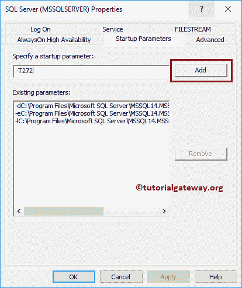

# 重新启动 SQL Server 后标识值跳转

> 原文:[https://www . tutorialgateway . org/identity-value-jumps-重启后-sql-server/](https://www.tutorialgateway.org/identity-value-jumps-after-restarting-sql-server/)

很多人都在问一个问题，叫做:重启 SQL Server 后，身份值为什么会跳？在本文中，我们将提供解决方案来消除这种不必要的跳跃。它是常见的 SQL 常见问题之一。让我创建一个表，并插入一个新记录

如果有任何原因重新启动您的 [SQL Server](https://www.tutorialgateway.org/sql/) 实例，那么身份列将插入 1000、10000 等

## 解决方案:重新启动 SQL Server 后标识值跳跃

转到 SQL Server 配置管理器。接下来，右键单击实例名称，并从上下文菜单中选择属性。

选择属性窗口将打开如下窗口

转到启动参数选项卡，添加-T272

点击应用

点击【确定】，重启

SQL Server 实例