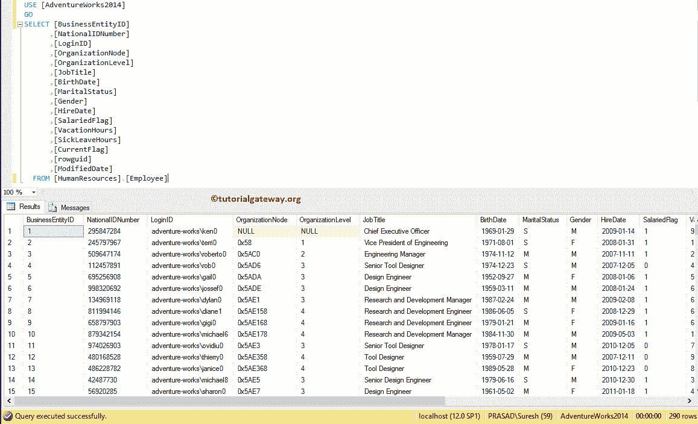
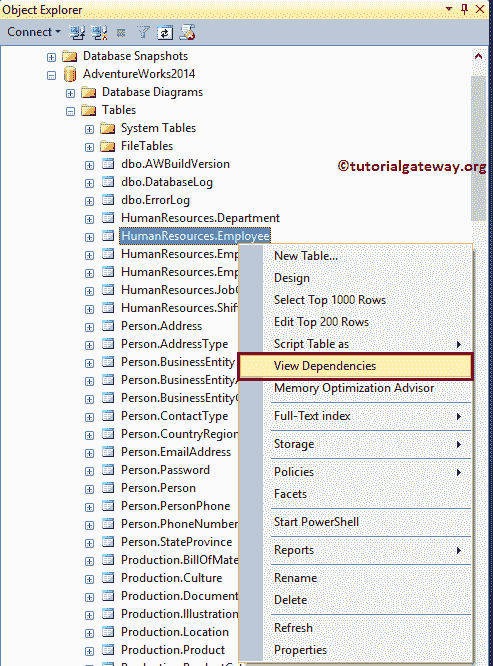
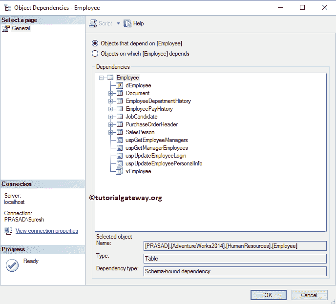
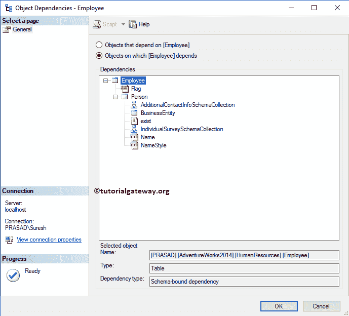
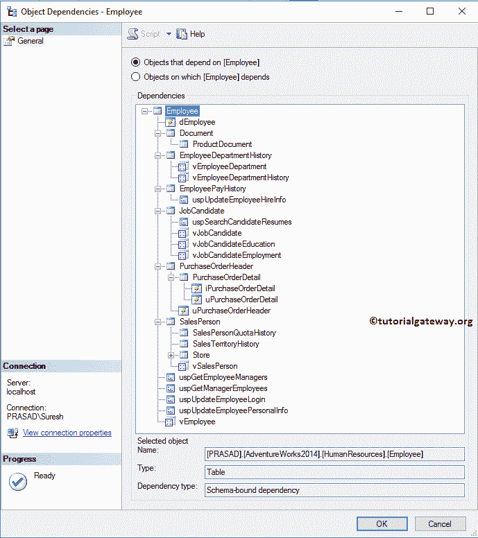
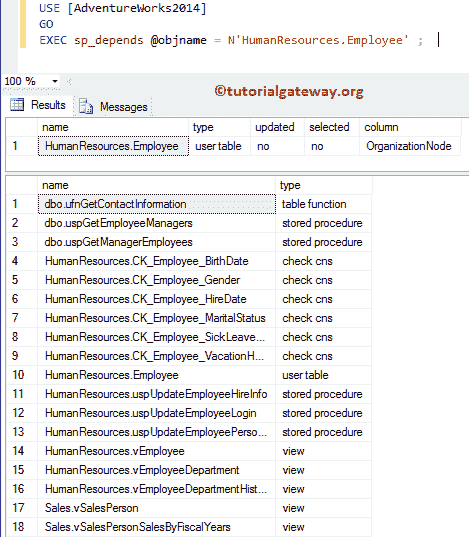
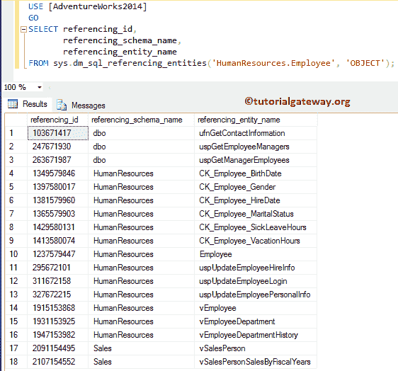
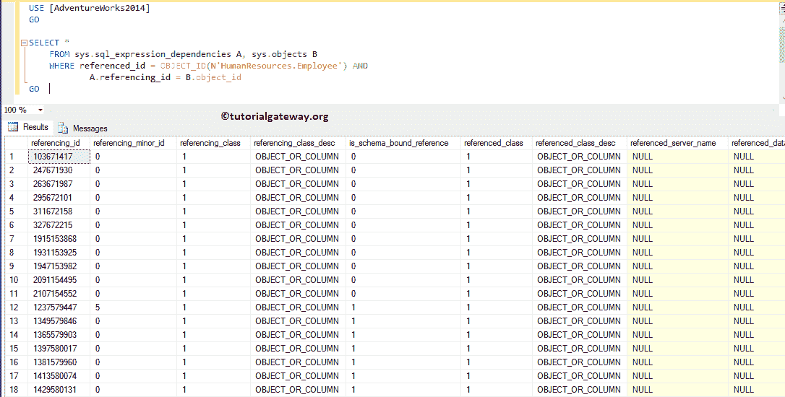
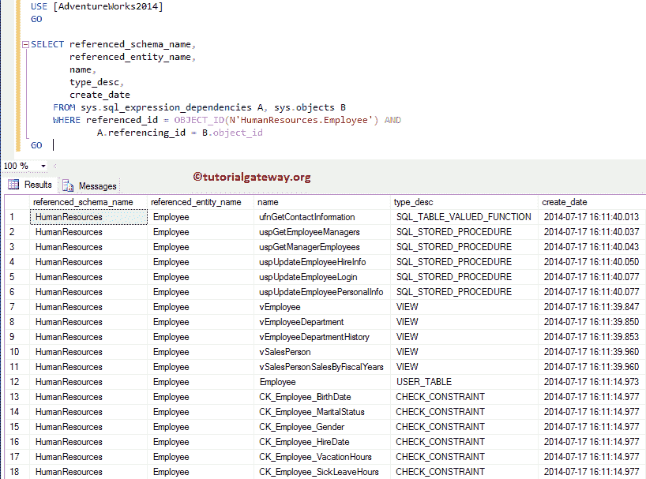

# 在 SQL Server 中查找表的依赖关系

> 原文:[https://www . tutorialgateway . org/find-SQL server 中表的依赖关系/](https://www.tutorialgateway.org/find-the-dependencies-of-a-table-in-sql-server/)

在本文中，我们将向您展示如何使用 SQL Server 管理工作室和 SQL Query 在 SQL Server 中查找表的依赖关系。在更改或删除表时，了解依赖关系是有益的。

这是 SQL Server 论坛中最常见的问题之一。为了展示同样的情况，我们使用了人力资源。使用[冒险作品](https://www.tutorialgateway.org/download-and-install-adventureworks-database/)数据库中的表格。



## 在 SQL Server 中查找表的依赖关系

有两种方法可以找到表依赖关系

### 使用 SSMS 查找表的依赖关系

您可以使用 SQL Server 管理工作室来查看表依赖关系。为此，请转到对象资源管理器->展开 Adventure Works 数据库文件夹->并找到要查找依赖项的表。

右键单击表名，并从上下文菜单中选择“查看相关性”选项。



选择“查看依赖项”选项后，将打开以下窗口。此窗口有两个选项:

依赖于员工的对象:这个 [SQL Server](https://www.tutorialgateway.org/sql/) 选项将显示所有的表、[函数](https://www.tutorialgateway.org/user-defined-functions-in-sql/)、依赖于员工表的视图。



员工所依赖的对象:此选项显示此员工表所依赖的所有表。



以下是雇员表的依赖关系列表。



### 使用查询在 SQL Server 中查找表的依赖关系

您还可以使用查询来查找表依赖项。

#### 在 SQL Server 中查找表依赖关系的方法 1

在这个例子中，我们使用的是 SP_DEPENDS 存储过程。它返回指定对象的所有依赖关系，包括表、[视图](https://www.tutorialgateway.org/views-in-sql-server/)、[存储过程](https://www.tutorialgateway.org/stored-procedures-in-sql/)、约束等。

```
-- Query to find Table Dependencies in SQL Server is: 
USE [AdventureWorks2014]
GO
EXEC sp_depends @objname = N'HumanResources.Employee' ;
```



这是另一种查找表依赖关系的方法

```
-- Query to find Table Dependencies in SQL Server is: 
USE [AdventureWorks2014]
GO
SELECT referencing_id, 
       referencing_schema_name, 
       referencing_entity_name 
FROM sys.dm_sql_referencing_entities('HumanResources.Employee', 'OBJECT');
```



查找表依赖关系的方法 3

```
-- Query to find Table Dependencies in SQL Server is: 
USE [AdventureWorks2014]
GO

SELECT ROUTINE_SCHEMA,
       ROUTINE_NAME, 
       ROUTINE_TYPE,
       ROUTINE_DEFINITION 
FROM INFORMATION_SCHEMA.ROUTINES 
WHERE ROUTINE_DEFINITION LIKE '%Employee%'
```


查找表依赖关系的方法 4

```
-- Query to find Table Dependencies in SQL Server is: 
USE [AdventureWorks2014]
GO

SELECT *
	FROM sys.sql_expression_dependencies A, sys.objects B
	WHERE referenced_id = OBJECT_ID(N'HumanResources.Employee') AND 
		A.referencing_id = B.object_id  
GO
```



我认为选择所需的列比使用 SELECT *更好

```
-- Query to find Table Dependencies in SQL Server is: 
USE [AdventureWorks2014]
GO

SELECT referenced_schema_name, 
       referenced_entity_name, 
       name, 
       type_desc, 
       create_date 
FROM sys.sql_expression_dependencies A, sys.objects B
WHERE referenced_id = OBJECT_ID(N'HumanResources.Employee') AND 
	A.referencing_id = B.object_id  
GO
```

