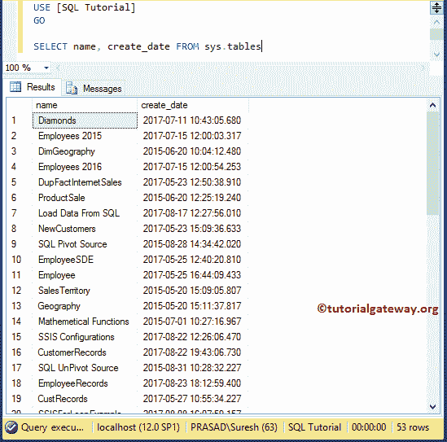
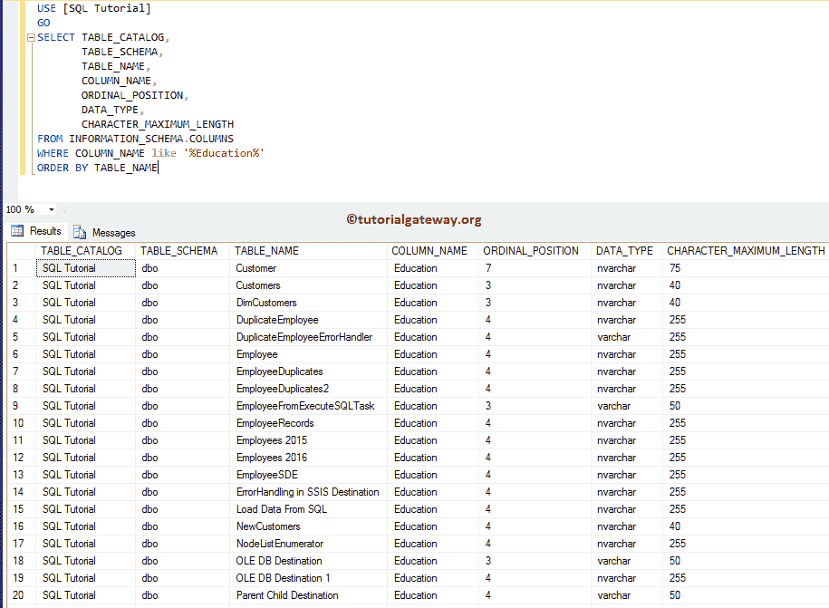
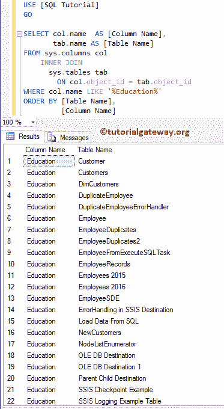

# 查找包含特定列名的所有表

> 原文：<https://www.tutorialgateway.org/find-all-tables-that-contain-specific-column-name/>

在本文中，我们将通过示例展示如何编写一个 SQL 查询来查找包含特定列名的所有表。对于这个 SQL 面试问题，我们使用的是 SQL 教程数据库。下面的截图将向您展示该数据库中的表。



## 在 Sql Server 中查找包含特定列名的所有表

在这个 [SQL Server](https://www.tutorialgateway.org/sql/) 的例子中，我们使用的是 INFORMATION_SCHEMA。列，以获取列名等于教育程度的表名

```
SELECT TABLE_CATALOG, 
       TABLE_SCHEMA, 
       TABLE_NAME, 
       COLUMN_NAME, 
       ORDINAL_POSITION, 
       DATA_TYPE, 
       CHARACTER_MAXIMUM_LENGTH
FROM INFORMATION_SCHEMA.COLUMNS 
WHERE COLUMN_NAME like '%Education%' 
ORDER BY TABLE_NAME
```



## 查找具有特定列名的所有表

在本例中，我们使用 sys.column 获取列信息，使用 sys.tables 获取[数据库](https://www.tutorialgateway.org/how-to-create-database-in-sql-server/)表名。

```
SELECT col.name  AS [Column Name],
       tab.name AS [Table Name]
FROM sys.columns col
  INNER JOIN        
     sys.tables tab
	ON col.object_id = tab.object_id
WHERE col.name LIKE '%Education%'
ORDER BY [Table Name],
         [Column Name]
```

