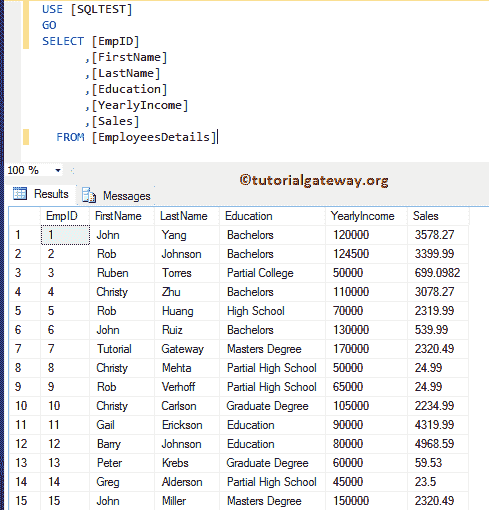
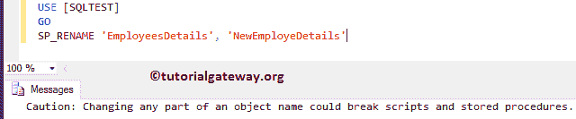
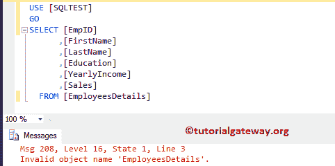
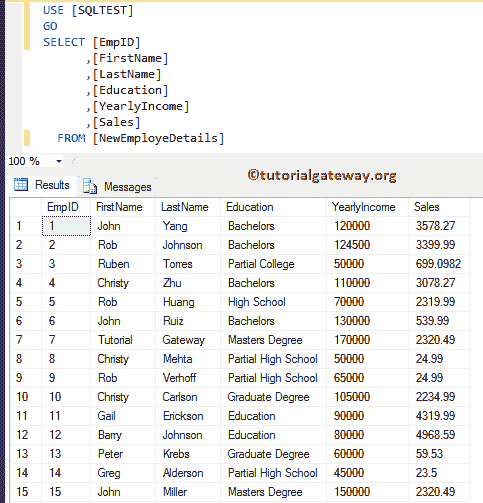
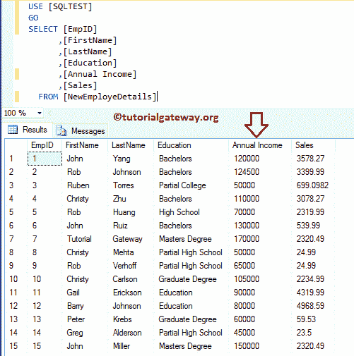

# 在 SQL Server 中重命名表名和列名

> 原文：<https://www.tutorialgateway.org/rename-table-name-and-column-name-in-sql-server/>

如何在 SQL Server 中重命名列名，或者如何在 Sql Server 中重命名表名，是 Sql Server 论坛中最常见的问题之一。在本文中，我们将向您展示重命名表名和列名，并分别给出一个示例。

为了演示 SQL 重命名表名和列名，我们将使用[SQL 测试]数据库中的雇员详细信息表。员工详细信息表中的数据为:



在这一系列常见示例中，我们将使用标准存储过程 SP_RENAME 来重命名[表](https://www.tutorialgateway.org/sql-create-table/)名称和列名称。

## SQL Server 重命名表名

在这个 SQL Server 重命名表名的例子中，我们将使用 SP_RENAME 来重命名表名。这种 [SQL Server](https://www.tutorialgateway.org/sql/) 方法背后的语法如下所示:

```
-- Syntax for SQL Server rename Table Name is: 
SP_RENAME '[Old Table Name]', '[New table Name]'
```

我们将使用上面指定的语法将 EmployeesDetails 表重命名为 NewEmployeesDetails

```
-- SQL Server rename Table Name is: 

SP_RENAME 'EmployeesDetails', 'NewEmployeDetails'
```



现在让我试着从旧表



中选择记录

从上面的截图可以看出，它抛出了一个错误。让我试试新表名



## SQL Server 重命名列名

在这个 SQL 重命名列名的例子中，我们将使用 SP_RENAME 来重命名列名，这种方法背后的语法如下所示:

```
-- Syntax for SQL Server rename Column Name is: 
SP_RENAME '[Table Name].[Old Column Name]', '[New Column Name]', 'COLUMN'
```

我们将使用上面指定的语法将旧的列名“年收入”重命名为“年收入”

```
-- SQL Rename Column Name query is: 

SP_RENAME 'NewEmployeDetails.YearlyIncome', 'Annual Income', 'COLUMN'
```

执行上面的 sp_rename 存储过程来重命名列查询

```
Messages
--------
Caution: Changing any part of an object name could break scripts and stored procedures.
```

从下面的截图可以看到



这一栏发生了变化