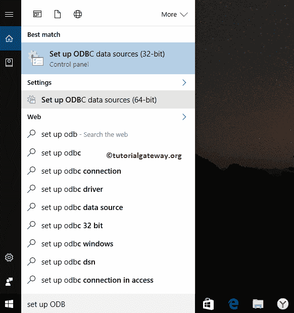
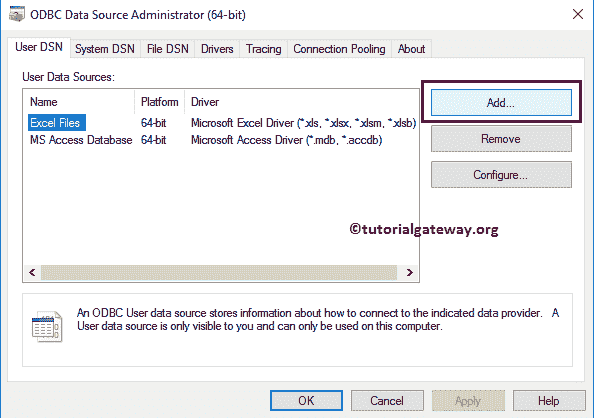
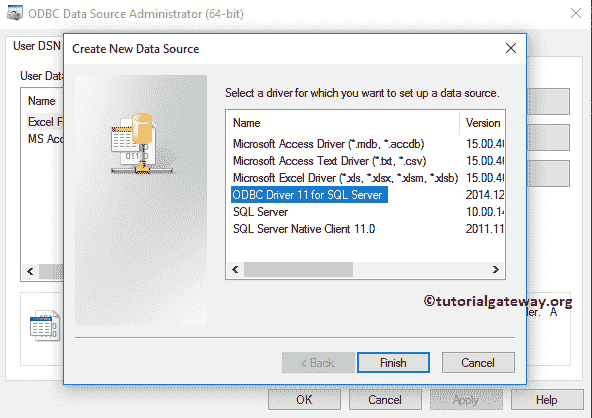
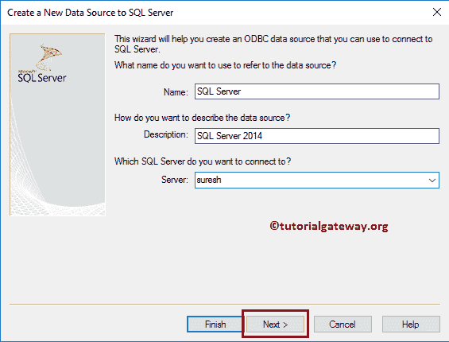
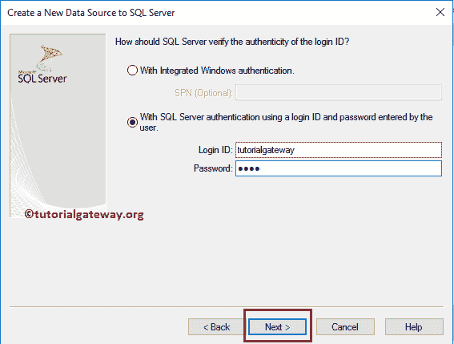
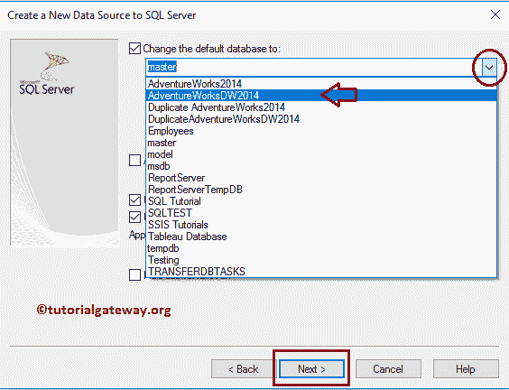
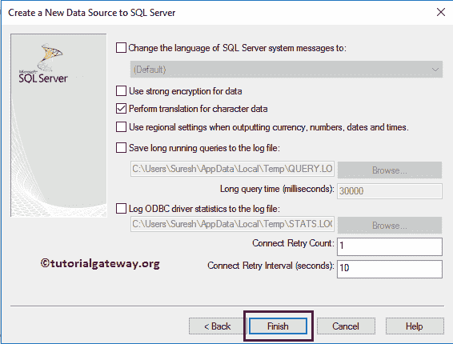
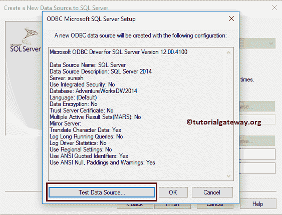
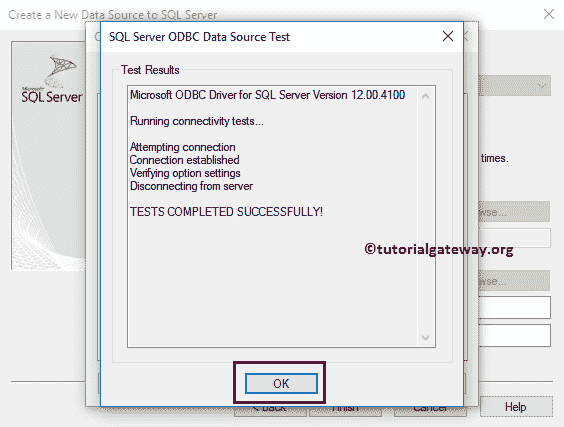
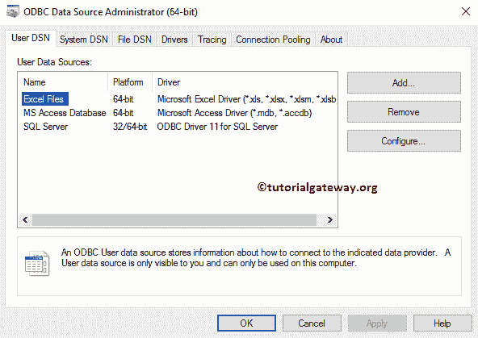

# 创建 ODBC 连接

> 原文：<https://www.tutorialgateway.org/create-odbc-connection/>

开放式数据库连接，简称为 ODBC，是一种用于访问数据库管理系统的标准应用编程接口。让我们看看在 Windows 10 中为 SQL Server 创建 ODBC 连接的分步方法。

## 如何为 SQL Server 创建 ODBC 连接

第一步:进入搜索栏，输入设置 ODBC 数据源，这将显示两个选项:32 位和 64 位。我们的系统是 64 位的，所以我们选择建立 ODBC 数据源(64 位)

提示:如果您的系统是 32 位的，那么选择 32 位，并按照剩余的步骤操作。

步骤 2:单击设置 ODBC 数据源(64 位)选项后，ODBC 数据源管理员(64 位)窗口打开。从下面的截图中，您可以观察到它显示了现有的连接。要添加新的 ODBC 连接，请单击添加按钮。

第 3 步:单击添加按钮后，将打开创建新数据源窗口。这里，我们必须从可用驱动程序列表中选择所需的驱动程序。在这个例子中，我们想要为 [SQL Server](https://www.tutorialgateway.org/sql/) 创建一个 ODBC 连接。因此，我们选择了用于 SQL Server 的 ODBC 驱动程序 11(任何支持 ODBC 连接的数据库管理系统)。您也可以选择 SQL Server 原生客户端 11.0(仅适用于 SQL Server)

第 4 步:单击“完成”按钮后，将打开一个名为“为 SQL Server 创建新数据源”的新弹出窗口。在这里，我们必须填写所需的详细信息:

*   名称:请为此 ODBC 连接指定一个唯一的名称。在这里，我们将名称指定为 SQL Server。
*   描述:请指定我们要建立的连接的有效描述。
*   服务器:请指定数据库服务器名称。

步骤 5:接下来，我们必须提供连接各自数据库(SQL Server)所需的凭据。让我给出我们的微软服务器 2014 的用户名和密码。填写完详细信息后，请点击“下一步”按钮。它将连接数据库，并显示可供用户 tutorialgateway 使用的数据库列表。

提示:请用您的凭据替换这些凭据。

步骤 6:从下面的截图中，您可以观察到我们选择 AdventureWorksDW2014 数据库作为我们的默认数据库。

第七步:点击完成按钮，完成在窗口中为 SQL Server 配置 ODBC 连接。

单击完成按钮后，会打开一个弹出窗口来测试连接。您也可以通过单击测试数据源来测试它..按钮，或者单击取消按钮。我们强烈建议您测试数据源

单击测试数据源后..按钮，它将显示测试结果。

下面的截图将向您展示新创建的连接。单击确定关闭窗口。

