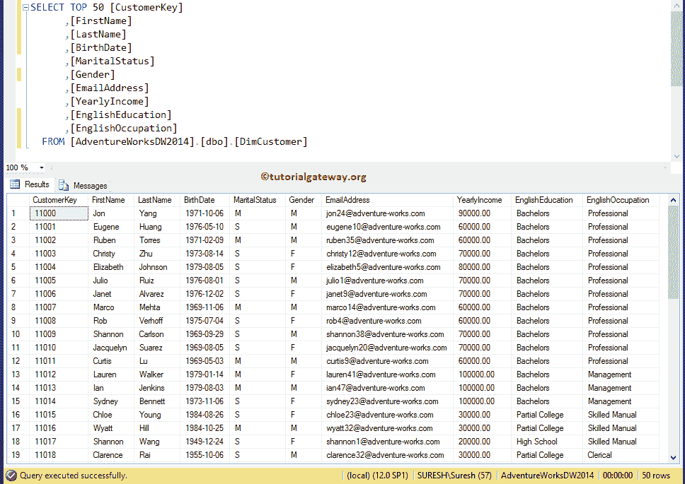
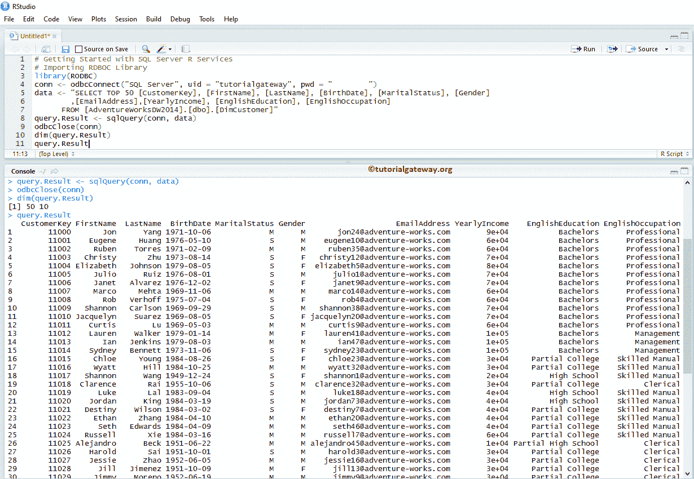
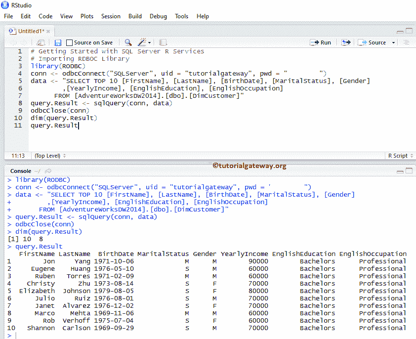

# 服务

> 原文：<https://www.tutorialgateway.org/sql-server-r-services/>

R 编程中的 odbcConnect 函数在 SQL Server 和 R 之间建立连接很方便。这个 odbcConnect 函数启动 SQL Server R 服务。sqlQuery 函数从 SQL 表中提取数据，并将数据存储在数据框中。让我通过示例展示如何使用由 RODBC 库提供的 ODBC 连接和 SQL Server 本机客户端连接来设置 SQL Server R 服务。

## R 中 odbcConnect 和 SqlQuery 的语法

启动服务的语法是

```
odbcConnect(ConnectionName, uid = "User name", pwd = "password")
```

*   连接名称:在这里，指定 ODBC 连接或 SQL Server 本机客户端连接名称。
*   uid:请指定有权访问 SQL Server 的用户名。
*   pwd:请指定上述用户名的密码

R 编程数据提取背后的语法是

```
sqlQuery(ConnectionString, query, errors = TRUE,..., rows_at_time)
```

在 R 编程中，sqlQuery 函数支持许多参数，以下是实时中最常用的一些参数:

*   连接字符串:在这里，指定连接字符串的详细信息。
*   查询:请指定任何有效的 SQL 语句。
*   错误:它接受布尔值。如果为真，当遇到错误时，则返回-1 或错误消息。
*   rows_at_time:您可以限制一次提取的行数，该值可以在 1 到 1024 之间。

在我们进入 SQL Server R 服务示例之前，让我向您展示我们将要提取的数据。



从上面的截图中，可以看到我们从 DimCustomers 表中选择了前 50 行。我们在本例中使用的[选择语句](https://www.tutorialgateway.org/sql-select-statement/)是:

注意:RODBC 库不是内置库。所以，你必须从 CRAN 镜像安装那个库。 [R 编程](https://www.tutorialgateway.org/r-programming/)中的程序包安装请参考[安装 R 程序包](https://www.tutorialgateway.org/install-r-packages/)一文。

```
SELECT TOP 50 [CustomerKey]
      ,[FirstName]
      ,[LastName]
      ,[BirthDate]
      ,[MaritalStatus]
      ,[Gender]
      ,[EmailAddress]
      ,[YearlyIncome]
      ,[EnglishEducation]
      ,[EnglishOccupation]
  FROM [AdventureWorksDW2014].[dbo].[DimCustomer]
```

## 设置服务器服务连接

在这个例子中，我们用一个实际的例子展示了如何使用 [ODBC 连接](https://www.tutorialgateway.org/create-odbc-connection/)建立 SQL Server 和 R 语言之间的连接。

```
# Getting Started with SQL Server R Services
# Importing RDBOC Library
library(RODBC)

# Setting up connection to SQL Server Database
conn <- odbcConnect("SQL Server", uid = "tutorialgateway", pwd = "password")

# SQL Query we are going to use
data <- "SELECT TOP 50 [CustomerKey], [FirstName], [LastName], [BirthDate], [MaritalStatus], [Gender]
        ,[EmailAddress],[YearlyIncome], [EnglishEducation], [EnglishOccupation]
      FROM [AdventureWorksDW2014].[dbo].[DimCustomer]"

# Import Data From SQL Server
query.Result <- sqlQuery(conn, data)
odbcClose(conn)
dim(query.Result)
query.Result
```



首先，我们正在导入 RODBC 库，它具有从 R Studio 建立与 SQL Server 连接所需的所有功能。

```
library(RODBC)
```

接下来，我们使用 odbcConnect 函数来启动 SQL Server R 服务。在这里，“SQL Server”是我们在上一篇文章中创建的 [ODBC 连接](https://www.tutorialgateway.org/create-odbc-connection/)。请用您的凭据替换连接名称、uid、pwd 值。

```
conn <- odbcConnect("SQL Server", uid = "tutorialgateway", pwd = "password")
```

接下来，我们从 [SQL Server](https://www.tutorialgateway.org/sql/) 导入数据

```
query.Result <- sqlQuery(conn, data)
```

以下语句关闭已建立的连接。

```
odbcClose(conn)
```

dim 函数返回[数据框](https://www.tutorialgateway.org/data-frame-in-r/)查询返回的行数和列数

```
dim(query.Result)
```

最后，我们正在打印输出

```
query.Result
```

## 设置服务器本地客户端连接

在这个例子中，我们通过一个实际的例子展示了如何使用[本地客户端连接](https://www.tutorialgateway.org/create-sql-server-native-client-connection/)来建立 SQL Server 和 R Programming 之间的连接。这里，“SQLServer”是我们在上一篇文章中创建的连接名称。

```
# Use SQL Server Native CLimnt Connection to Set up SQL Server R Services

# Importing RDBOC Library
library(RODBC)

# Setting up connection to SQL Server Database
conn <- odbcConnect("SQLServer", uid = "tutorialgateway", pwd = "password")

# SQL Query we are going to use
data <- "SELECT TOP 10 [FirstName], [LastName], [BirthDate], [MaritalStatus], [Gender]
        ,[YearlyIncome], [EnglishEducation], [EnglishOccupation]
      FROM [AdventureWorksDW2014].[dbo].[DimCustomer]"

# Import Data From SQL Server
query.Result <- sqlQuery(conn, data)
odbcClose(conn)
dim(query.Result)
query.Result
```

