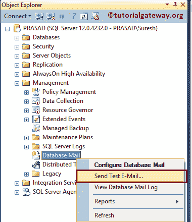

# 配置 SQL Server 数据库邮件

> 原文:[https://www . tutorialgateway . org/configure-SQL-server-database-mail/](https://www.tutorialgateway.org/configure-sql-server-database-mail/)

本文展示了配置 SQL Server 数据库邮件以使用您的 Gmail 帐户或任何其他帐户发送电子邮件的分步方法。要配置 SQL Server 数据库邮件，请在对象资源管理器中选择管理文件夹，然后选择数据库邮件。


右键单击数据库邮件将打开上下文菜单。请选择“配置数据库邮件”选项来配置新的，或在 SQL Server 中查看、编辑、删除现有的数据库邮件。


一旦选择 [SQL Server](https://www.tutorialgateway.org/sql/) 配置选项，将会打开一个新的向导。


## 配置 SQL Server 数据库邮件

选择配置任务:此页面用于创建或管理数据库邮件。在本例中，我们想要配置一个新的 SQL Server 数据库邮件。因此，请通过执行以下任务选项


来选择设置数据库邮件

新配置文件:此页面用于创建新配置文件，并添加 SMTP 帐户。从下面的截图中，您可以看到，我们将电子邮件指定为配置文件名称，这是一个电子邮件配置作为配置文件描述。接下来，单击“添加”按钮向此配置文件添加新的 SMTP 帐户。


单击添加按钮后，将弹出一个新窗口来配置 SQL Server 数据库邮件。

*   帐户名:此 SMTP 帐户的唯一名称。
*   描述:上述指定帐户的有效描述
*   电子邮件地址:用于发送电子邮件的电子邮件标识。发件人电子邮件地址。
*   显示名称:此名称显示在发送的电子邮件中。
*   回复电子邮件:与电子邮件地址相同
*   服务器名称:有效的 SMTP 名称。如果你用的是 Gmail，那就用 smtp.gmail.com，Windows live 账号用 smtp.live.com，等等
*   端口号:默认情况下，可以使用端口号 25，但是对于 Gmail SSL，请使用 587。

接下来，在 SMTP 身份验证部分，您必须为 SQL 数据库邮件指定身份验证详细信息。

*   Windows 身份验证:它将使用 Windows 凭据
*   基本身份验证:始终使用此选项。请在此指定发件人的电子邮件标识、密码。
*   匿名认证:它不会使用任何认证


从下面的截图中你可以看到，我们指定 MSBI 作为帐户名，这是一个 Gmail 帐户作为描述，Suresh 作为显示名。


点击确定后，SMTP 账号创建表单将关闭


如果是您的默认个人资料，请选择是，否则，请将选项保留为默认编号


点击【下一步】按钮


单击“完成”按钮，完成配置 SQL Server 数据库邮件以发送电子邮件。


最后，它将显示细节。请单击关闭按钮关闭 SQL Server 数据库邮件配置向导。


现在右键单击数据库邮件将打开上下文菜单。这次，请选择发送测试电子邮件..使用我们之前创建的 SMTP 帐户发送电子邮件的选项。



根据您的要求添加电子邮件地址、更改主题和邮件正文。完成编辑后，请单击发送测试电子邮件按钮发送电子邮件。


让我打开我的 Gmail 账户


## 删除 SQL Server 数据库邮件

要删除已配置的 SQL Server 数据库电子邮件，右键单击数据库邮件将打开上下文菜单。请选择“配置数据库邮件”选项以打开向导。在第二页，这次请选择管理数据库邮件帐户和配置文件选项。


管理配置文件和帐户:使用此页面创建、查看、编辑或删除帐户和配置文件。

*   创建新帐户:此选项用于创建新帐户。
*   查看、更改或删除现有帐户:顾名思义，我们可以查看、编辑或删除现有帐户。
*   创建新配置文件:使用此选项创建新配置文件。
*   查看、更改或删除现有配置文件:顾名思义，我们可以查看、编辑或删除现有配置文件。

在开始删除之前，您必须删除链接到该帐户的配置文件。因此，我们选择最后一个选项来删除配置文件。


从下拉列表中，请选择配置文件名称，然后单击删除按钮删除配置文件。


删除配置文件后，请选择第二个选项删除已配置的 SQL Server 数据库邮件账户


或者可以用下面的 [SQL](https://www.tutorialgateway.org/sql/) 查询删除

```
EXECUTE msdb.dbo.sysmail_delete_account_sp 
 @account_name = 'MSBI' ;
```