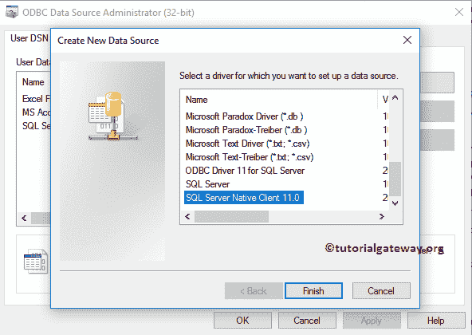
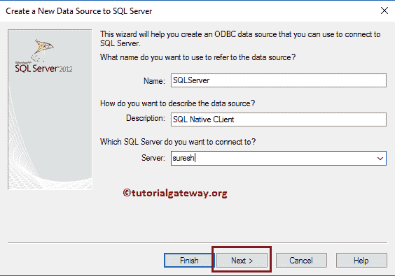
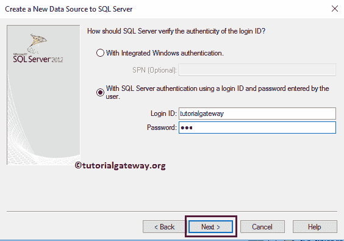
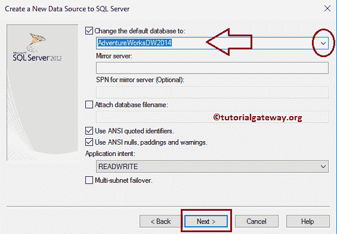
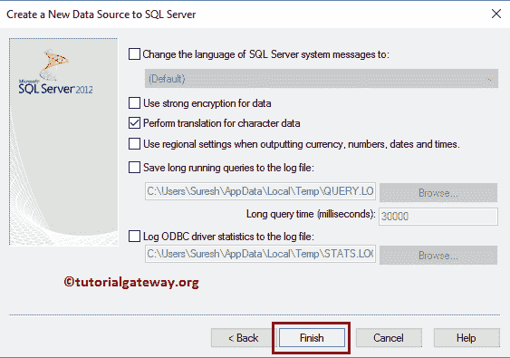
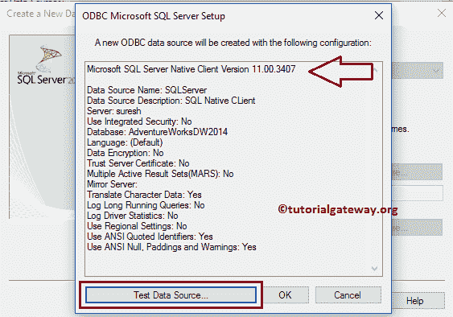
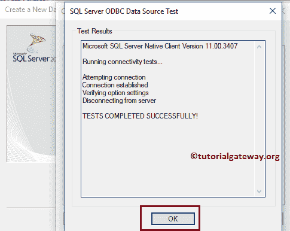
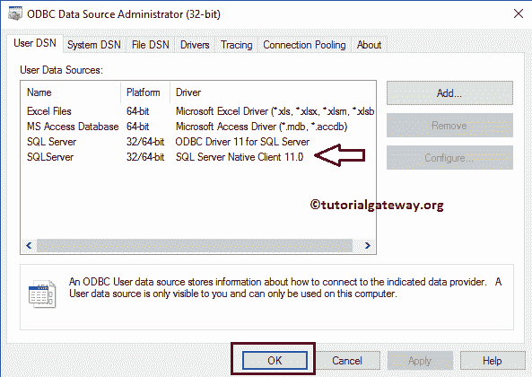

# 创建 SQL Server 本机客户端连接

> 原文：<https://www.tutorialgateway.org/create-sql-server-native-client-connection/>

微软的 SQL Server 本机客户端 11.0 驱动程序是一个单独的动态链接库。它包含对应用程序的运行时支持，该应用程序使用 API 连接到 SQL Server 2005 到 2014 和 Windows Azure SQL 数据库。当您使用 SQL Server 时，这种连接比 ODBC 连接更快。让我向您展示在 Windows 10 中创建 SQL Server 本机客户端连接的分步方法。

## 如何创建 SQL Server 本机客户端连接

步骤 1:转到搜索栏，键入“设置 ODBC 数据源”，这将显示两个选项:32 位和 64 位。我们的系统是 32 位的，所以我们选择了建立 ODBC 数据源(32 位)

提示:如果您的系统是 64 位的，那么选择 64 位，并按照剩余的步骤操作。

步骤 2:单击设置 ODBC 数据源(34 位)选项后，ODBC 数据源管理员(34 位)窗口打开。请单击添加按钮添加新数据源。这里，我们选择的是 SQL Server 原生客户端 11.0(仅适用于 [SQL Server](https://www.tutorialgateway.org/sql/) )

提示:请参考[创建 ODBC 连接](https://www.tutorialgateway.org/create-odbc-connection/)了解在 Windows 中创建 ODBC 连接涉及的步骤。

第三步:单击“完成”按钮后，将打开一个名为“为 SQL Server 创建新数据源”的新窗口。请填写所需的详细信息:

*   名称:请为此 ODBC 连接指定一个唯一的名称。这里，我们将名称指定为 SQLServer。
*   描述:请详细说明我们将要建立的连接的准确描述。
*   服务器:请指定 SQL 数据库服务器名称。

第 4 步:接下来，我们必须提供与之连接所需的凭据。让我为我的 Microsoft SQL Server 2014 提供用户名和密码。填写完详细信息后，单击“下一步”按钮。它连接数据库并显示用户教程网关可用的数据库列表。

提示:请用您的凭据替换这些凭据。

第五步:从下面的截图中，您可以观察到我们正在选择 Adventure Works DW 2014 数据库作为我们的默认数据库。

步骤 6:单击完成按钮，在窗口中完成配置 SQL Server 本机客户端连接。

单击完成按钮后，会打开一个弹出窗口来测试已建立的数据连接。您也可以通过单击测试数据源来测试它..按钮，否则取消它。建议在完成配置之前测试数据源。

从下面的截图中，您可以观察到它正在显示测试成功完成作为测试结果。

下面的屏幕截图显示了新创建的 SQL Server 本机客户端连接。单击确定关闭窗口。

