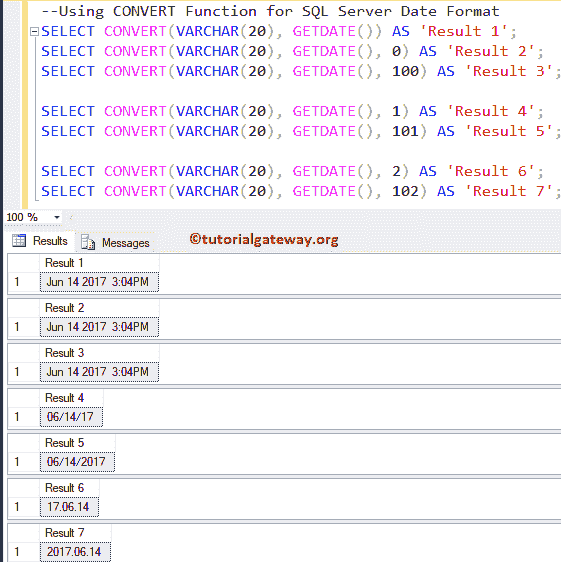
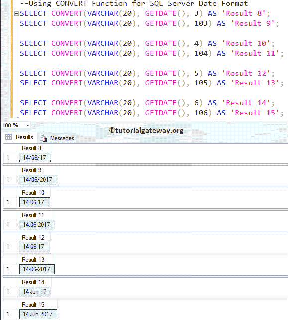
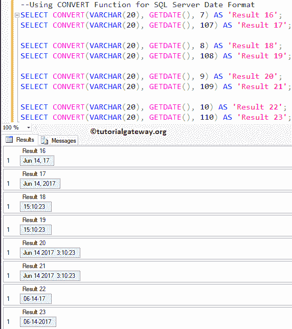
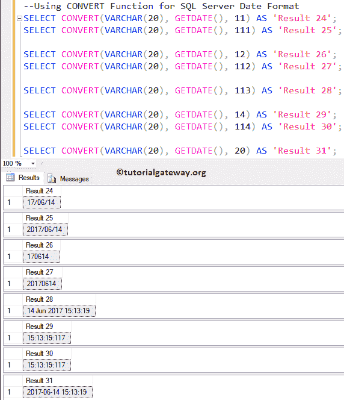
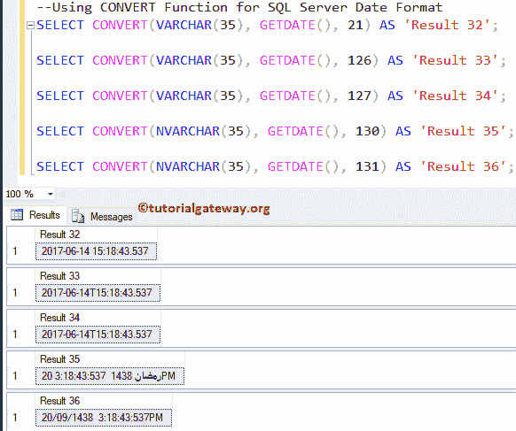
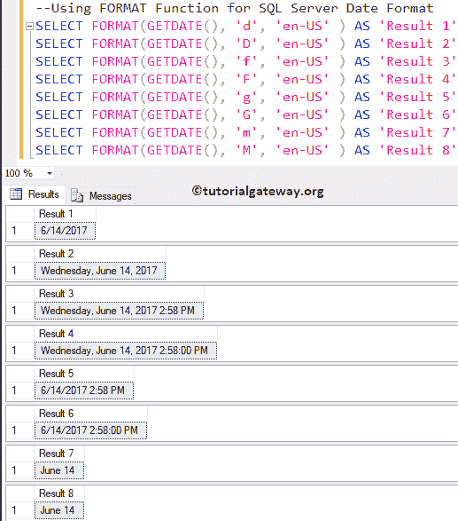
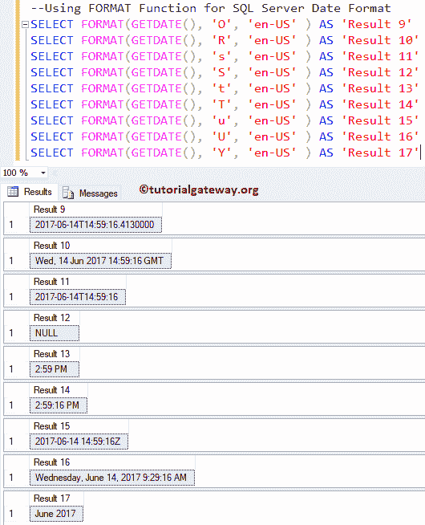
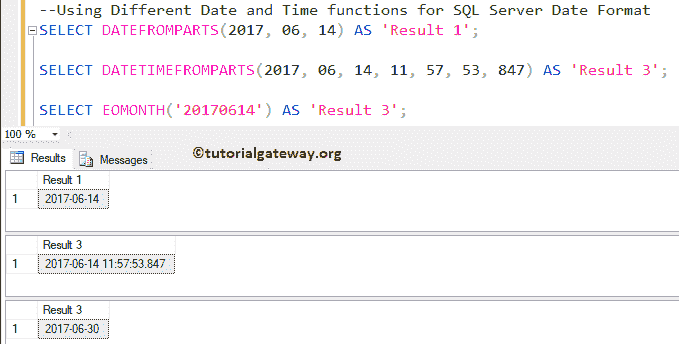
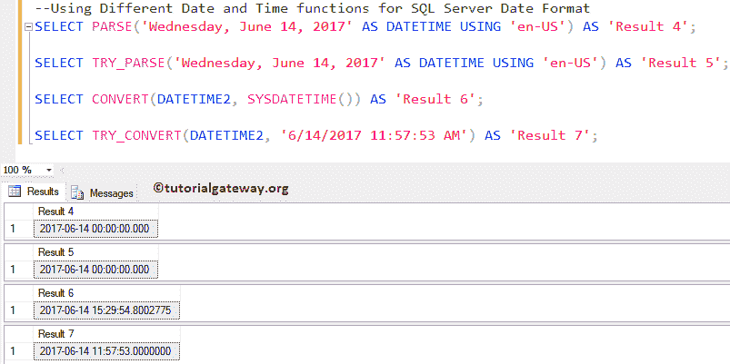

# SQL 日期格式

> 原文：<https://www.tutorialgateway.org/sql-date-format/>

在本文中，我们将通过一个例子向您展示如何执行 SQL 日期格式或格式化 SQL Server 日期和时间。

## 转换 SQL 日期格式示例

在我们进入实际的 SQL 日期格式示例之前，让我向您解释一下在 Sql Server 中转换日期格式的可用列表。在这个演示中，我们将使用 CONVERT 和`format()`函数编写不同的 SQL 日期格式查询。`CONVERT()`函数提供不同的样式来格式化日期和时间。

| 没有世纪(yy) | 带世纪(年) | 输入/输出 | 标准 |
| – | 0 至 100 | 我的 dd yyyy hh:miAM (or PM) | 这是日期时间和小日期时间的默认值 |
| one | One hundred and one | 1 =毫米/日/年
101 =毫米/日/年 | 美国（United States 的缩写） |
| Two | One hundred and two | 2 = yyy . mm . DD
102 = yyy . mm . DD | 美国国家标准学会 |
| three | One hundred and three | 3 =日/月/年
103 =日/月/年 | 英国/法国 |
| four | One hundred and four | 4 = DD . mm . YY
104 = DD . mm . yyy | 德国人 |
| five | One hundred and five | 5 =日-月-年
105 =日-月-年 | 意大利的 |
| six | One hundred and six | 6 = dd mon yy
106 = dd mon yyyy | – |
| seven | One hundred and seven | 7 =我的 dd，YY
107 =我的 dd，yyyy | – |
| eight | One hundred and eight | hh:mi:ss | – |
| – | 9 或 109 | 我的 dd yyyy hh:mi:ss:mmmmAM (or PM) | 默认值+毫秒 |
| Ten | One hundred and ten | 10 =毫米-日-年
110 =毫米-日-年 | 美利坚合众国 |
| Eleven | One hundred and eleven | 11 =年/月/日
111 =年/月/日 | 黑漆；（Japan）日本 |
| Twelve | One hundred and twelve | 12 = yymmdd
112 = yymmdd | 国际标准化组织 |
| – | 13 或 113 | DD mon yyyy hh:mi:ss:mmm(24 小时) | 欧洲默认值+毫秒 |
| Fourteen | One hundred and fourteen | hh:mi:ss:mmm(24 小时) | – |
| – | 20 或 120 | yyyy-mm-DD hh:mi:ss(24 小时) | ODBC 规范的 |
| – | 21 还是 121 | yyyy-mm-DD hh:mi:ss . mmm(24 小时) | 以毫秒为单位的 ODBC 规范。这是时间、日期、日期时间 2 和日期时间偏移量的默认值 |
| – | One hundred and twenty-six | yyyy-mm-ddThh:mi:ss.mmm(无空格) | ISO8601 |
| – | One hundred and twenty-seven | yyyy-mm-ddThh:mi:ss.mmmZ(无空格) | 带时区 Z 的 ISO8601 |
| – | One hundred and thirty | dd mon yyyy hh:mi:ss:mmmAM | 回历 |
| – | One hundred and thirty-one | dd/mm/yyyy hh:mi:ss:mmmAM | 回历 |

### SQL 转换日期格式示例

在这个 [SQL](https://www.tutorialgateway.org/sql/) 示例中，我们将使用 [GETDATE()](https://www.tutorialgateway.org/sql-getdate-function/) 上的 [CONVERT](https://www.tutorialgateway.org/sql-convert/) 函数以不同的格式返回日期。

```
SELECT CONVERT(VARCHAR(20), GETDATE()) AS 'Result 1';
SELECT CONVERT(VARCHAR(20), GETDATE(), 0) AS 'Result 2';
SELECT CONVERT(VARCHAR(20), GETDATE(), 100) AS 'Result 3';

SELECT CONVERT(VARCHAR(20), GETDATE(), 1) AS 'Result 4';
SELECT CONVERT(VARCHAR(20), GETDATE(), 101) AS 'Result 5';

SELECT CONVERT(VARCHAR(20), GETDATE(), 2) AS 'Result 6';
SELECT CONVERT(VARCHAR(20), GETDATE(), 102) AS 'Result 7';
```



### 转换 SQL 日期格式示例 2

这个示例查询几乎没有涉及转换函数

```
SELECT CONVERT(VARCHAR(20), GETDATE(), 3) AS 'Result 8';
SELECT CONVERT(VARCHAR(20), GETDATE(), 103) AS 'Result 9';

SELECT CONVERT(VARCHAR(20), GETDATE(), 4) AS 'Result 10';
SELECT CONVERT(VARCHAR(20), GETDATE(), 104) AS 'Result 11';

SELECT CONVERT(VARCHAR(20), GETDATE(), 5) AS 'Result 12';
SELECT CONVERT(VARCHAR(20), GETDATE(), 105) AS 'Result 13';

SELECT CONVERT(VARCHAR(20), GETDATE(), 6) AS 'Result 14';
SELECT CONVERT(VARCHAR(20), GETDATE(), 106) AS 'Result 15';
```



在这个示例查询中，我们在`Convert()`函数中展示了其他几种日期格式

```
SELECT CONVERT(VARCHAR(20), GETDATE(), 7) AS 'Result 16';
SELECT CONVERT(VARCHAR(20), GETDATE(), 107) AS 'Result 17';

SELECT CONVERT(VARCHAR(20), GETDATE(), 8) AS 'Result 18';
SELECT CONVERT(VARCHAR(20), GETDATE(), 108) AS 'Result 19';

SELECT CONVERT(VARCHAR(20), GETDATE(), 9) AS 'Result 20';
SELECT CONVERT(VARCHAR(20), GETDATE(), 109) AS 'Result 21';

SELECT CONVERT(VARCHAR(20), GETDATE(), 10) AS 'Result 22';
SELECT CONVERT(VARCHAR(20), GETDATE(), 110) AS 'Result 23';
```



SQL Server 中的其他一些转换日期格式

```
SELECT CONVERT(VARCHAR(20), GETDATE(), 11) AS 'Result 24';
SELECT CONVERT(VARCHAR(20), GETDATE(), 111) AS 'Result 25';

SELECT CONVERT(VARCHAR(20), GETDATE(), 12) AS 'Result 26';
SELECT CONVERT(VARCHAR(20), GETDATE(), 112) AS 'Result 27';

SELECT CONVERT(VARCHAR(20), GETDATE(), 113) AS 'Result 28';

SELECT CONVERT(VARCHAR(20), GETDATE(), 14) AS 'Result 29';
SELECT CONVERT(VARCHAR(20), GETDATE(), 114) AS 'Result 30';

SELECT CONVERT(VARCHAR(20), GETDATE(), 20) AS 'Result 31';
```



以下是日期格式转换功能中剩余可用选项的列表。

```
SELECT CONVERT(VARCHAR(35), GETDATE(), 21) AS 'Result 32';

SELECT CONVERT(VARCHAR(35), GETDATE(), 126) AS 'Result 33';

SELECT CONVERT(VARCHAR(35), GETDATE(), 127) AS 'Result 34';

SELECT CONVERT(NVARCHAR(35), GETDATE(), 130) AS 'Result 35';

SELECT CONVERT(NVARCHAR(35), GETDATE(), 131) AS 'Result 36';
```



## SQL 日期格式函数

在这个 SQL 日期格式示例中，我们将使用 [GETDATE()](https://www.tutorialgateway.org/sql-getdate-function/) 上的 [FORMAT](https://www.tutorialgateway.org/sql-format/) 函数以不同的格式返回日期。我建议你参考[标准日期和时间格式字符串](https://www.tutorialgateway.org/standard-sql-date-and-time-format-strings/)来理解我们在这个例子中使用的字符串格式。

```
SELECT FORMAT(GETDATE(), 'd', 'en-US' ) AS 'Result 1'
SELECT FORMAT(GETDATE(), 'D', 'en-US' ) AS 'Result 2'
SELECT FORMAT(GETDATE(), 'f', 'en-US' ) AS 'Result 3'
SELECT FORMAT(GETDATE(), 'F', 'en-US' ) AS 'Result 4'
SELECT FORMAT(GETDATE(), 'g', 'en-US' ) AS 'Result 5'
SELECT FORMAT(GETDATE(), 'G', 'en-US' ) AS 'Result 6'
SELECT FORMAT(GETDATE(), 'm', 'en-US' ) AS 'Result 7'
SELECT FORMAT(GETDATE(), 'M', 'en-US' ) AS 'Result 8'
```



以下是日期格式的格式功能中可用的剩余变体列表。

```
SELECT FORMAT(GETDATE(), 'O', 'en-US' ) AS 'Result 9'
SELECT FORMAT(GETDATE(), 'R', 'en-US' ) AS 'Result 10'
SELECT FORMAT(GETDATE(), 's', 'en-US' ) AS 'Result 11'
SELECT FORMAT(GETDATE(), 'S', 'en-US' ) AS 'Result 12'
SELECT FORMAT(GETDATE(), 't', 'en-US' ) AS 'Result 13'
SELECT FORMAT(GETDATE(), 'T', 'en-US' ) AS 'Result 14'
SELECT FORMAT(GETDATE(), 'u', 'en-US' ) AS 'Result 15'
SELECT FORMAT(GETDATE(), 'U', 'en-US' ) AS 'Result 16'
SELECT FORMAT(GETDATE(), 'Y', 'en-US' ) AS 'Result 17'
```



### 使用日期时间函数

这里，我们将使用 [`DATETIME()`函数](https://www.tutorialgateway.org/sql-date-functions/)，该函数可用于在 SQL Server 中格式化日期和时间，以不同的格式返回日期。

```
SELECT DATEFROMPARTS(2017, 06, 14) AS 'Result 1';

SELECT DATETIMEFROMPARTS(2017, 06, 14, 11, 57, 53, 847) AS 'Result 3';

SELECT EOMONTH('20170614') AS 'Result 3';
```



## 使用转换函数

在本例中，我们将使用 Sql Server 转换函数来格式化日期时间。对话功能有 [PARSE](https://www.tutorialgateway.org/sql-parse-function/) 、 [TRY_PARSE](https://www.tutorialgateway.org/sql-try_parse-function/) 、 [CONVERT](https://www.tutorialgateway.org/sql-convert/) 、 [TRY_CONVERT](https://www.tutorialgateway.org/sql-try-convert/) 。我们在不同的日期使用这些函数，以不同的方式返回相同的结果。

```
SELECT PARSE('Wednesday, June 14, 2017' AS DATETIME USING 'en-US') AS 'Result4'; 

SELECT TRY_PARSE('Wednesday, June 14, 2017' AS DATETIME USING 'en-US') AS 'Result5'; 

SELECT CONVERT(DATETIME2, SYSDATETIME()) AS 'Result6'; 

SELECT TRY_CONVERT(DATETIME2, '6/14/2017 11:57:53 AM') AS 'Result7';
```

