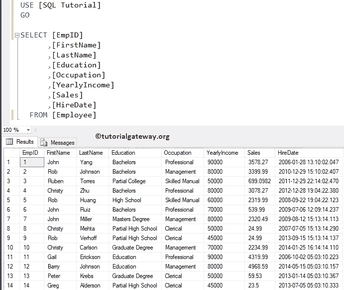
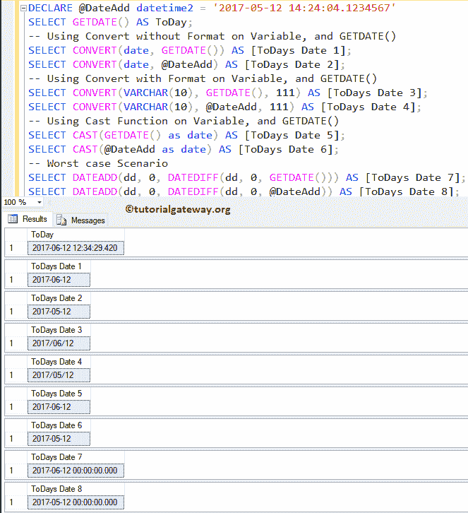
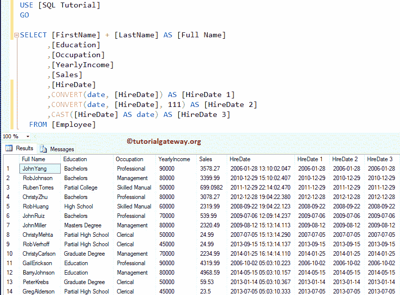

# 如何仅从 SQL Server 日期时间数据类型中返回日期部分

> 原文：<https://www.tutorialgateway.org/how-to-return-date-part-only-from-a-sql-server-datetime-datatype/>

如何编写一个只从 SQL Server 日期时间数据类型返回日期部分的 SQL 查询，示例如下。这是 SQL Server 常见问题之一。对于这个 SQL 日期部分示例，我们将使用下面显示的数据



## 如何仅从 SQL Server 日期时间数据类型返回日期部分示例 1

在这个 [SQL Server](https://www.tutorialgateway.org/sql/) 的例子中，首先我们要声明一个 DateTime 变量，并且还要使用 [GETDATE()](https://www.tutorialgateway.org/sql-getdate-function/) 函数。接下来，我们将使用 CONVERT、 [CAST](https://www.tutorialgateway.org/sql-cast-function/) 、 [DATEADD](https://www.tutorialgateway.org/sql-dateadd/) 和 [DATEPART](https://www.tutorialgateway.org/sql-datepart/) 函数仅从 SQL server Datetime [数据类型](https://www.tutorialgateway.org/sql-data-types/)中提取日期部分。

```
-- Query to Return Date Part from a Datetime datatype in SQL Server
DECLARE @DateAdd datetime2 = '2017-05-12 14:24:04.1234567'
SELECT GETDATE() AS ToDay;

-- Using Convert without Format on Variable, and GETDATE()
SELECT CONVERT(date, GETDATE()) AS [ToDays Date 1];
SELECT CONVERT(date, @DateAdd) AS [ToDays Date 2];

-- Using Convert with Format on Variable, and GETDATE()
SELECT CONVERT(VARCHAR(10), GETDATE(), 111) AS [ToDays Date 3];
SELECT CONVERT(VARCHAR(10), @DateAdd, 111) AS [ToDays Date 4];

-- Using Cast Function on Variable, and GETDATE()
SELECT CAST(GETDATE() as date) AS [ToDays Date 5];
SELECT CAST(@DateAdd as date) AS [ToDays Date 6];

-- Worst case Scenario  
SELECT DATEADD(dd, 0, DATEDIFF(dd, 0, GETDATE())) AS [ToDays Date 7];
SELECT DATEADD(dd, 0, DATEDIFF(dd, 0, @DateAdd)) AS [ToDays Date 8];
```



## 如何仅从日期时间数据类型返回日期部分示例 2

在这个 [SQL Server 常见问题](https://www.tutorialgateway.org/sql-interview-questions/)中，我们将只从雇佣日期列中提取数据部分。

```
SELECT [FirstName] + [LastName] AS [Full Name]
      ,[Education]
      ,[Occupation]
      ,[YearlyIncome]
      ,[Sales]
      ,[HireDate]
      ,CONVERT(date, [HireDate]) AS [HireDate 1]
      ,CONVERT(date, [HireDate], 111) AS [HireDate 2]
      ,CAST([HireDate] AS date) AS [HireDate 3]
  FROM [Employee]
```

