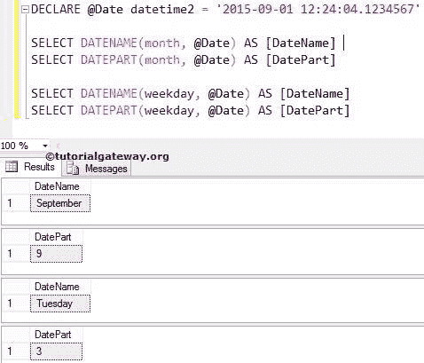
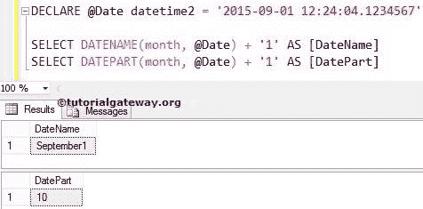
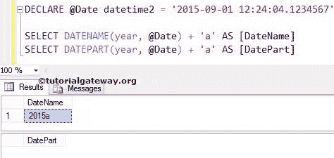
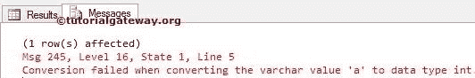

# 数据库中`DATEPART`和`DATENAME`的区别

> 原文：<https://www.tutorialgateway.org/difference-between-datepart-and-datename-in-sql/>

SQL 中 DATEPART 和 DATENAME 的区别是最常见的面试问题之一。虽然 SQL DATEPART 和 SQL DATENAME 的语法相同，但它们的返回值不同。

它们之间的根本区别是 SQL `DATEPART()`函数返回整数值，而`DATENAME()`函数返回字符串数据。

## SQL 1 中 DATEPART 和 DATENAME 的区别

在本例中，我们将声明一个 datetime2 数据类型的变量，并为该变量分配一个有效的日期。使用该变量，让我们使用日期部分和日期名称提取月份和工作日

```
DECLARE @Date datetime2 = '2015-09-01 12:24:04.1234567'

SELECT DATENAME(month, @Date) AS [DateName] 
SELECT DATEPART(month, @Date) AS [DatePart] 

SELECT DATENAME(weekday, @Date) AS [DateName] 
SELECT DATEPART(weekday, @Date) AS [DatePart]
```



我们声明了一个 [SQL](https://www.tutorialgateway.org/sql/) 变量，并为该变量分配了日期和时间

```
DECLARE @Date datetime2 = '2015-09-01 12:24:04.1234567'
```

我们要求 [SQL DATENAME](https://www.tutorialgateway.org/sql-datename/) 函数显示给定日期的月份名称和工作日名称。它将月份名称返回为九月，将工作日返回为星期二

```
SELECT DATENAME(month, @Date) AS [DateName]

SELECT DATENAME(weekday, @Date) AS [DateName]
```

我们要求 [SQL DATEPART](https://www.tutorialgateway.org/sql-datepart/) 函数显示从给定日期开始的月数和工作日数。它将返回月号 9 和工作日号 3 (o=星期日)

```
SELECT DATEPART(month, @Date) AS [DatePart] 

SELECT DATEPART(weekday, @Date) AS [DatePart]
```

## SQL 2 中 DATEPART 和 DATENAME 的区别

在本例中，我们将声明一个 datetime2 数据类型的变量，并为该变量分配一个有效的日期。使用该变量，让我们使用日期部分和日期名称提取月份，并执行算术加法

```
DECLARE @Date datetime2 = '2015-09-01 12:24:04.1234567'

SELECT DATENAME(month, @Date) + '1' AS [DateName] 
SELECT DATEPART(month, @Date) + '1' AS [DatePart]
```



我们要求 SQL `Datename()`函数显示给定日期的月份名称，并向其中添加了整数 1。由于`Datename()`函数的输出是字符串，下面的语句将进行字符串连接

```
SELECT DATENAME(month, @Date) + '1' AS [DateName]
```

由于`Datepart()`函数的输出是一个整数，下面的 SQL Datepart 语句将执行算术加法(9 + 1 = 10)

```
SELECT DATEPART(month, @Date) AS [DatePart]
```

## SQL 3 中 DATEPART 和 DATENAME 的区别

让我们使用 DATEPART 和 DATENAME 提取年份，并在输出中附加一个字符串

```
DECLARE @Date datetime2 = '2015-09-01 12:24:04.1234567'

SELECT DATENAME(year, @Date) + 'a' AS [DateName] 
SELECT DATEPART(year, @Date) + 'a' AS [DatePart]
```



我们要求 SQL `Datename()`函数显示给定日期的年份名称，并在其中添加了字符 a。下面的语句将进行字符串连接

```
SELECT DATENAME(month, @Date) + 'a' AS [DateName]
```

由于 SQL `Datepart()`函数的输出是一个整数，下面的语句将抛出一个如下所示的错误

```
SELECT DATEPART(month, @Date) + 'a' AS [DatePart] 

```

