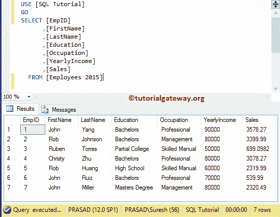

# SQL 中`UNION`和`UNION ALL`的区别

> 原文：<https://www.tutorialgateway.org/difference-between-union-and-union-all-in-sql/>

SQL Server 中 UNION 和 UNION ALL 的区别是您在面试中可能会遇到的问题之一。为了演示 sql union 和 union，我们将使用数据库中的两个表(雇员 2015 和雇员 2016)。

从下面的截图可以看到，表格中有七行



这张桌子有九排。请记住，EmpID 为 6 和 7 的两行在[员工 2015]和[员工 2016]表中重复


## SQL Server 中 UNION 和 UNION ALL 的区别

这两个运算符都用于将两个或多个 [`SELECT`语句](https://www.tutorialgateway.org/sql-select-statement/)的结果集组合成一个结果集。但是它们在[服务器](https://www.tutorialgateway.org/sql/)中的工作功能略有不同，结果集:

*   [UNION](https://www.tutorialgateway.org/sql-union-query/) 将通过删除任何重复项从所有查询中选择所有不同的记录。这个运算符的性能略低于另一个运算符，因为它必须检查重复项(这是一个耗时的过程)
*   [UNIONAL](https://www.tutorialgateway.org/sql-union-all/)命令将从所有查询中选择所有行(包括重复记录)。

提示:如果您知道表中没有重复的行，那么选择“`UNION ALL`”。否则，使用另一个运算符。

为了展示这些运算符之间的比较，我们结合了上表中相同数量的列。以下查询将组合雇员 2015、雇员 2016 表的结果集，并显示不同的结果集。

```sql
SELECT [EmpID]
      ,[FirstName]
      ,[LastName]
      ,[Education]
      ,[Occupation]
      ,[YearlyIncome]
      ,[Sales]
  FROM [Employees 2015]
UNION 
SELECT [EmpID]
      ,[FirstName]
      ,[LastName]
      ,[Education]
      ,[Occupation]
      ,[YearlyIncome]
      ,[Sales]
  FROM [Employees 2016]
```

从下面的截图中，您可以观察到最终的结果，它返回了 14 行。因为，除了 2 条记录(EMPID 6 和 7)之外，《员工 2016》中所有剩余的记录都是不同的。这是因为该运算符仅选择不同的记录并删除重复的行。


以下查询将返回 2015 年员工表和 2016 年员工表中的所有记录(包括重复记录)，并显示结果

```sql
SELECT [EmpID]
      ,[FirstName]
      ,[LastName]
      ,[Education]
      ,[Occupation]
      ,[YearlyIncome]
      ,[Sales]
  FROM [Employees 2015]
UNION ALL
SELECT [EmpID]
      ,[FirstName]
      ,[LastName]
      ,[Education]
      ,[Occupation]
      ,[YearlyIncome]
      ,[Sales]
  FROM [Employees 2016]
```

从下图中，您可以看到它返回了 16 个重涂器。EMPID 6 和 7 都重复了两次(一个记录来自员工 2015，另一个记录来自员工 2016)。希望，你明白了在 SQL Server 中 UNION 和 UNION ALL 的区别。

