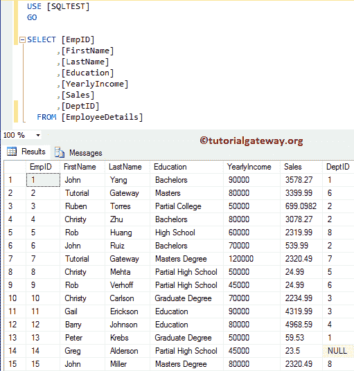
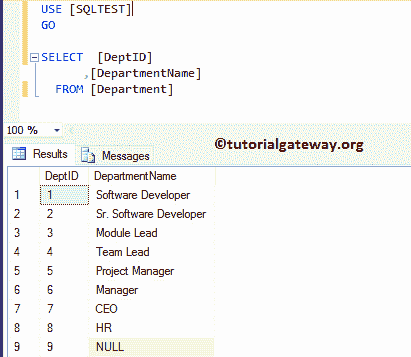
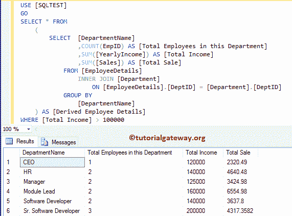
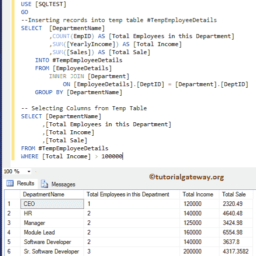
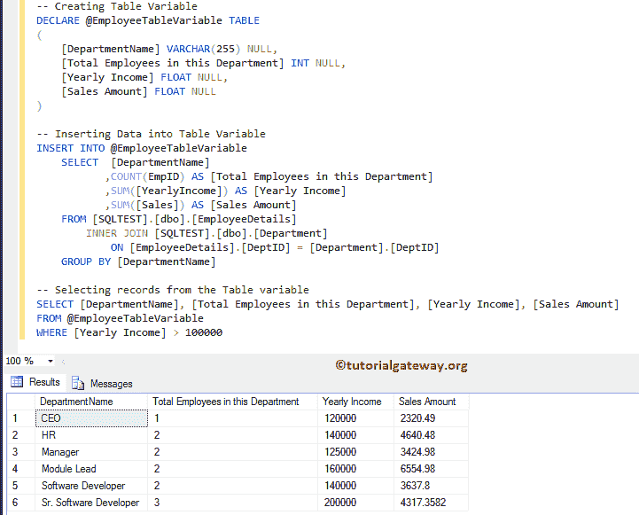
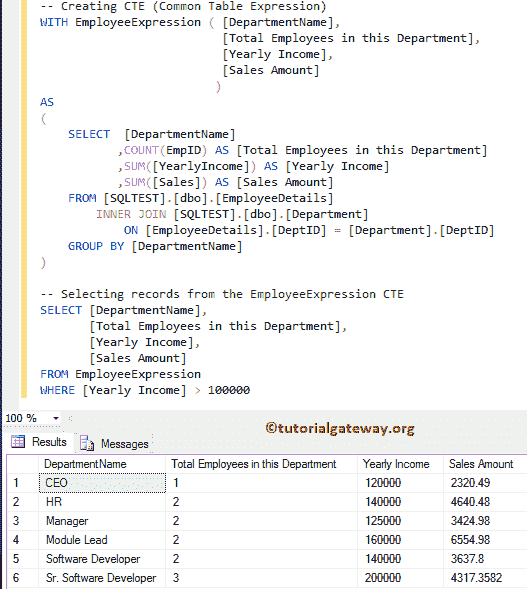
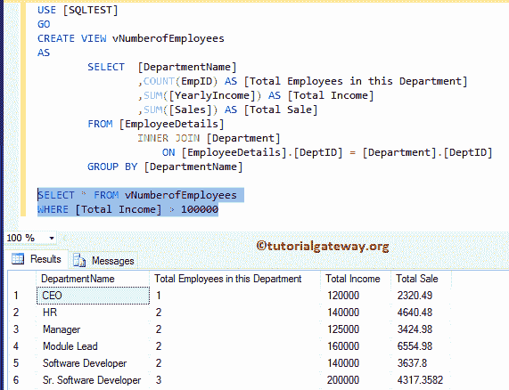

# CTE 表、临时表和派生表之间的差异

> 原文：<https://www.tutorialgateway.org/difference-between-cte-temp-tables-derived-tables/>

在 SQL Server 中，当处理大型数据集(或大量记录)时，我们可能需要将中间结果存储在临时查询中。因此，我们可以进一步访问它们。SQL Server 提供了多个选项来实现相同的效果:CTE、临时表、派生表和表变量。让我们用实例来看看 CTE 表、临时表、派生表和 SQL Server 中的表变量之间的区别。

对于 CTE 表、临时表和派生表之间的差异，我们使用了[SQL 测试]数据库中的两个表(员工详细信息和部门)。员工详细信息表中的可用数据为:



部门表中已有的数据是:



## CTE 表、临时表、派生表和表变量之间的区别

在这一部分，我们的目标是显示每个部门的可用员工总数。以及销售额和他们的总年薪。我们将在所有示例中使用的 [SQL](https://www.tutorialgateway.org/sql/) 查询的基本结构包含

*   我们将使用[内部连接](https://www.tutorialgateway.org/sql-inner-join/)从员工和部门表中选择一列。
*   并且，我们使用 [GROUP BY](https://www.tutorialgateway.org/sql-group-by-clause/) 来聚合列。我建议您访问[聚合函数](https://www.tutorialgateway.org/sql-aggregate-functions/)文章。
*   最后我们使用 CTE，表变量，临时表，派生表来过滤数据。

### 派生表示例

我们将使用派生列来实现我们的目标。建议大家参考 [SQL 派生表](https://www.tutorialgateway.org/sql-derived-table/)一文了解查询。

```
-- Difference between CTE, Temp Tables, Derived tables , and Table variable 
SELECT * FROM
(
	SELECT  [DepartmentName]
		,COUNT(EmpID) AS [Total Employees in this Department]
		,SUM([YearlyIncome]) AS [Total Income]
		,SUM([Sales]) AS [Total Sale]
	FROM [EmployeeDetails]
	INNER JOIN [Department]
	ON [EmployeeDetails].[DeptID] = [Department].[DeptID]
	GROUP BY [DepartmentName]
) AS [Derived Employee Details]
WHERE [Total Income] > 100000
```



### SQL 临时表示例

我们将使用临时表来实现我们的目标。首先，我们使用[插入语句](https://www.tutorialgateway.org/sql-insert-into-select-statement/)将记录插入本地临时表。接下来，我们从总收入大于 100000 的临时表中选择所有记录。建议大家参考 [SQL Temp 表](https://www.tutorialgateway.org/temp-table-in-sql-server/)文章了解查询。

```
-- Difference between CTE, Temp Tables, Derived tables , and Table variable 

--Inserting records into temp table #TempEmployeeDetails
SELECT  [DepartmentName]
	,COUNT(EmpID) AS [Total Employees in this Department]
	,SUM([YearlyIncome]) AS [Total Income]
	,SUM([Sales]) AS [Total Sale]
INTO #TempEmployeeDetails
FROM [EmployeeDetails]
	INNER JOIN [Department]
	ON [EmployeeDetails].[DeptID] = [Department].[DeptID]
GROUP BY [DepartmentName]

-- Selecting Columns from Temp Table
SELECT [DepartmentName]
	  ,[Total Employees in this Department]
	  ,[Total Income]
	  ,[Total Sale]
FROM #TempEmployeeDetails
WHERE [Total Income] > 100000
```



### SQL 表变量示例

这次我们将使用 Table 变量来实现我们的目标。首先，我们声明了一个表变量。接下来，我们使用[插入语句](https://www.tutorialgateway.org/sql-insert-into-select-statement/)将记录插入该表变量。最后，我们从总收入大于 100000 的表变量中选择所有记录。建议大家参考 [SQL 表变量](https://www.tutorialgateway.org/table-variable-in-sql-server/)了解查询。

```
-- Difference between CTE, Temp Tables, Derived tables , and Table variable 
-- Creating Table Variable
DECLARE @EmployeeTableVariable TABLE
(
	[DepartmentName] VARCHAR(255) NULL,
	[Total Employees in this Department] INT NULL,
	[Yearly Income] FLOAT NULL,
	[Sales Amount] FLOAT NULL
)

-- Inserting Data into Table Variable
INSERT INTO @EmployeeTableVariable
    SELECT  [DepartmentName]
	   ,COUNT(EmpID) AS [Total Employees in this Department]
	   ,SUM([YearlyIncome]) AS [Yearly Income]
	   ,SUM([Sales]) AS [Sales Amount]
    FROM [SQLTEST].[dbo].[EmployeeDetails]
	INNER JOIN [SQLTEST].[dbo].[Department]
	ON [EmployeeDetails].[DeptID] = [Department].[DeptID]
    GROUP BY [DepartmentName]

-- Selecting records from the Table variable
SELECT [DepartmentName], [Total Employees in this Department], [Yearly Income], [Sales Amount]
FROM @EmployeeTableVariable
WHERE [Yearly Income] > 100000
```



### SQL 公共表表达式示例

这次我们将使用公共表表达式(或 CTE)来实现我们的目标。首先，我们创造一个 CTE。接下来，我们将从总收入大于 10 万的 CTE 中选择所有记录。建议大家参考 [SQL Server CTE](https://www.tutorialgateway.org/sql-server-cte/) 了解查询。

```
-- Difference between CTE, Temp Tables, Derived tables , and Table variable 
-- Creating CTE (Common Table Expression)
WITH EmployeeExpression ( [DepartmentName], 
			  [Total Employees in this Department], 
			  [Yearly Income], 
			  [Sales Amount]
			) 
AS
(
    SELECT  [DepartmentName]
	   ,COUNT(EmpID) AS [Total Employees in this Department]
	   ,SUM([YearlyIncome]) AS [Yearly Income]
	   ,SUM([Sales]) AS [Sales Amount]
	FROM [SQLTEST].[dbo].[EmployeeDetails]
	INNER JOIN [SQLTEST].[dbo].[Department]
		ON [EmployeeDetails].[DeptID] = [Department].[DeptID]
	GROUP BY [DepartmentName]
)

-- Selecting records from the EmployeeExpression CTE
SELECT [DepartmentName], 
       [Total Employees in this Department], 
       [Yearly Income], 
       [Sales Amount]
FROM EmployeeExpression
WHERE [Yearly Income] > 100000
```



### SQL 视图示例

您也可以使用视图来实现我们的目标。首先，我们创建一个视图，从两个表中选择所有匹配的记录以及聚合。接下来，我们从视图中选择总收入大于 100000 的所有记录。请参考 [SQL 视图](https://www.tutorialgateway.org/views-in-sql-server/)了解查询。

```
-- Difference between CTE, Temp Tables, Derived tables , and Table variable 

--Creating a View
CREATE VIEW vNumberofEmployees
AS
	SELECT  [DepartmentName]
		,COUNT(EmpID) AS [Total Employees in this Department]
		,SUM([YearlyIncome]) AS [Total Income]
		,SUM([Sales]) AS [Total Sale]
	FROM [EmployeeDetails]
	INNER JOIN [Department]
		ON [EmployeeDetails].[DeptID] = [Department].[DeptID]
	GROUP BY [DepartmentName]

-- Selecting Records from vNumberofEmployees View
SELECT * FROM vNumberofEmployees
WHERE [Total Income] > 100000
```

