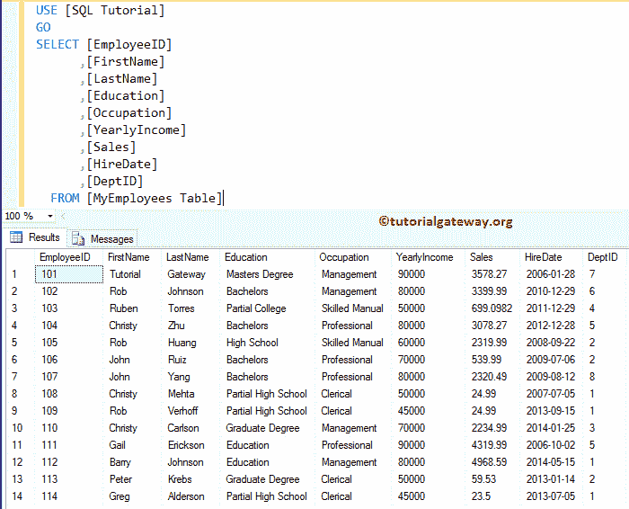

# 统计 SQL 组中的记录

> 原文：<https://www.tutorialgateway.org/count-records-in-sql-group/>

如何举例统计 SQL 组中的记录？。为此，我们将使用数据库中的[MyEmployee 表]表。从下图可以观察到【MyEmployee 表】表中有十四条记录



## 如何统计 SQL 组中的记录

通常，我们会编写 SQL 查询来检查属于特定类别或颜色的产品总数等。在这些情况下，我们使用 `GROUP BY`子句按类别或颜色对产品进行分组。

要计算每组中存在的记录总数，我们必须使用[计数功能](https://www.tutorialgateway.org/sql-count-function/)。让我们看看 [SQL Server](https://www.tutorialgateway.org/sql/) 的例子

```
-- How to Count Records in SQL Group

SELECT COUNT( [EmployeeID]) AS [Total Records]
      ,[Education]
      ,SUM([YearlyIncome]) AS Income
      ,SUM([Sales]) AS Sale
 FROM [MyEmployees Table]
 GROUP BY [Education]
 ORDER BY Income DESC
```


提示:[`GROUP BY`子句](https://www.tutorialgateway.org/sql-group-by-clause/)也会对空记录进行分组，并进行计数。您可以使用不为空的 [`WHERE`子句](https://www.tutorialgateway.org/sql-where-clause/)来删除空值