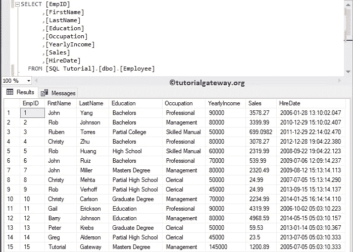
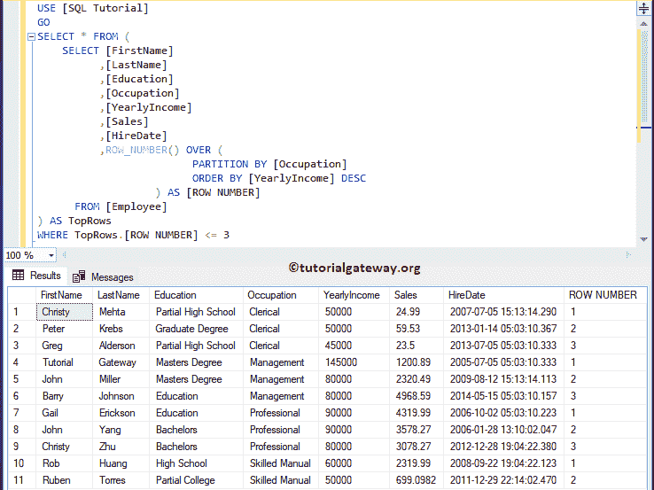
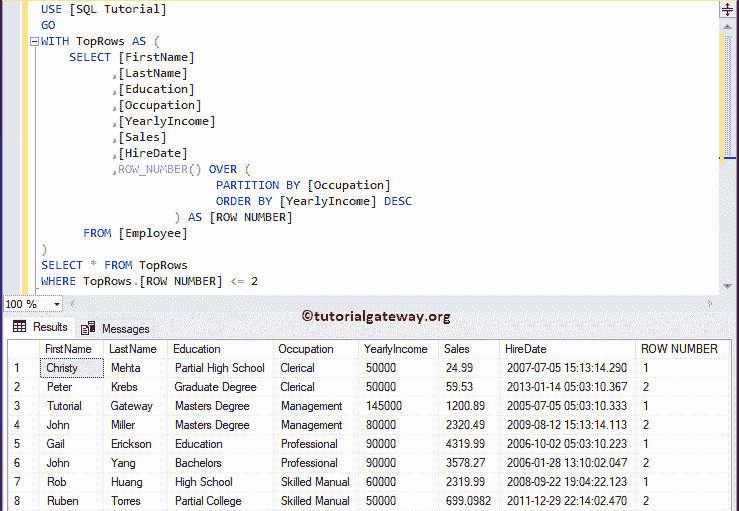

# 为 SQL Server 中的每个类别选择前`N`条记录

> 原文：<https://www.tutorialgateway.org/select-top-n-records-for-each-category-in-sql-server/>

在本文中，我们将通过示例向您展示如何在 SQL Server 中为每个类别或每个组选择前 N 条记录。对于这个精选的前 3 名演示，我们将使用下面显示的数据



## 为 SQL 示例 1 中的每个类别选择前 N 条记录

在这个 [SQL Server](https://www.tutorialgateway.org/sql/) 示例中，我们向您展示了如何使用[子查询](https://www.tutorialgateway.org/sql-subquery/)选择每个[组](https://www.tutorialgateway.org/sql-group-by-clause/)中的前 2 行。

```
-- Select First Row in each SQL Group By group

SELECT * FROM (
SELECT [FirstName]
      ,[LastName]
      ,[Education]
      ,[Occupation]
      ,[YearlyIncome]
      ,ROW_NUMBER() OVER (
                     PARTITION BY [Occupation] 
                     ORDER BY [YearlyIncome] DESC
         	   ) AS [ROW NUMBER]
  FROM [Customers]
  ) groups
WHERE groups.[ROW NUMBER] = 1
ORDER BY groups.YearlyIncome DESC
```



## 在 SQL Server 示例 2 中，为每个类别选择前 2 条记录

[ROW_NUMBER](https://www.tutorialgateway.org/sql-row_number/) 函数允许您为分区中的每条记录分配等级编号。您也可以根据自己的需要使用剩余的[排名功能](https://www.tutorialgateway.org/ranking-functions-in-sql-server/)。

*   在 [CTE](https://www.tutorialgateway.org/sql-server-cte/) 内，首先按职业划分数据，用年收入分配排名号。
*   接下来，它将从每个组中选择前 2 行。

```
WITH TopRows AS (
	SELECT [FirstName]
		  ,[LastName]
		  ,[Education]
		  ,[Occupation]
		  ,[YearlyIncome]
		  ,[Sales]
		  ,[HireDate]
		  ,ROW_NUMBER() OVER (
						 PARTITION BY [Occupation] 
						 ORDER BY [YearlyIncome] DESC
         		   ) AS [ROW NUMBER]
	  FROM [Employee]
)
SELECT * FROM TopRows
WHERE TopRows.[ROW NUMBER] <= 2
```

