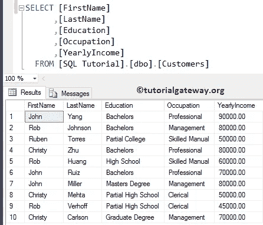
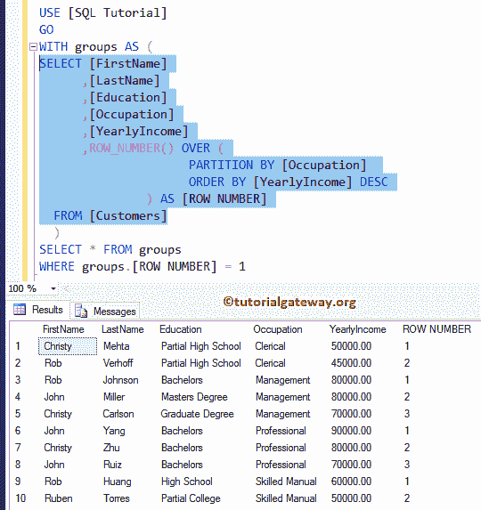
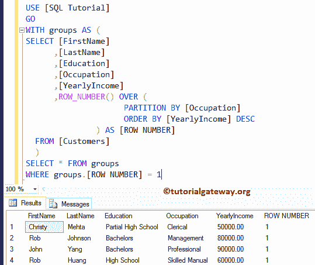
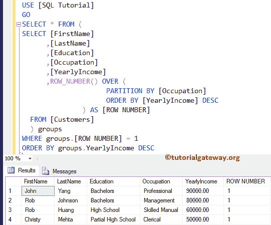

# 按组选择每个 SQL 组中的第一行

> 原文:[https://www . tutorialgateway . org/select-每 sql 中的第一行-逐组/](https://www.tutorialgateway.org/select-first-row-in-each-sql-group-by-group/)

如何通过示例选择每个 SQL Group By 组中的第一行。对于该 SQL 选择每个组示例中的第一行，我们使用下面显示的数据



## SQL 行号函数示例

函数的作用是:给分区中的每条记录分配一个等级号。在本例中，我们向您展示了如何从每个 SQL 组中选择第一行。以下 SQL 查询将

*   首先，按职业对数据进行划分，并使用年收入分配等级编号。
*   接下来，ROW_NUMBER 将从每个组中选择第一行。

```
-- Select First Row in each SQL Group By group

-- Using CTE to save the grouping data
WITH groups AS (
SELECT [FirstName]
      ,[LastName]
      ,[Education]
      ,[Occupation]
      ,[YearlyIncome]
      ,ROW_NUMBER() OVER (
                     PARTITION BY [Occupation] 
                     ORDER BY [YearlyIncome] DESC
         	   ) AS [ROW NUMBER]
  FROM [Customers]
  )
SELECT * FROM groups
WHERE groups.[ROW NUMBER] = 1
```

让我给你看看 [CTE](https://www.tutorialgateway.org/sql-server-cte/)



里面[选择语句](https://www.tutorialgateway.org/sql-select-statement/)的 [SQL Server](https://www.tutorialgateway.org/sql/) 输出

我们正在提取行号等于 1 的所有记录。



下面的语句使用数据的职业将数据划分为分区，然后我们使用它们的[年收入]按降序对分区数据进行排序。从上面你可以看到，我们有四个分区

```
PARTITION BY [Occupation] 
ORDER BY [YearlyIncome] DESC
```

接下来，我们使用 ROW_NUMBER()函数将排名分配给记录。建议大家参考 [SQL ROW_NUMBER](https://www.tutorialgateway.org/sql-row_number/) 文章。

```
ROW_NUMBER() OVER (
              PARTITION BY [Occupation] 
              ORDER BY [YearlyIncome] DESC
             ) AS [ROW NUMBER]
```

## 选择每个组中的第一行示例 2

在本例中，我们使用[子查询](https://www.tutorialgateway.org/sql-subquery/)来选择每个[分组依据](https://www.tutorialgateway.org/sql-group-by-clause/)组中的第一行。

```
-- Select First Row in each SQL Group By group

SELECT * FROM (
SELECT [FirstName]
      ,[LastName]
      ,[Education]
      ,[Occupation]
      ,[YearlyIncome]
      ,ROW_NUMBER() OVER (
                     PARTITION BY [Occupation] 
                     ORDER BY [YearlyIncome] DESC
         	   ) AS [ROW NUMBER]
  FROM [Customers]
  ) groups
WHERE groups.[ROW NUMBER] = 1
ORDER BY groups.YearlyIncome DESC
```

