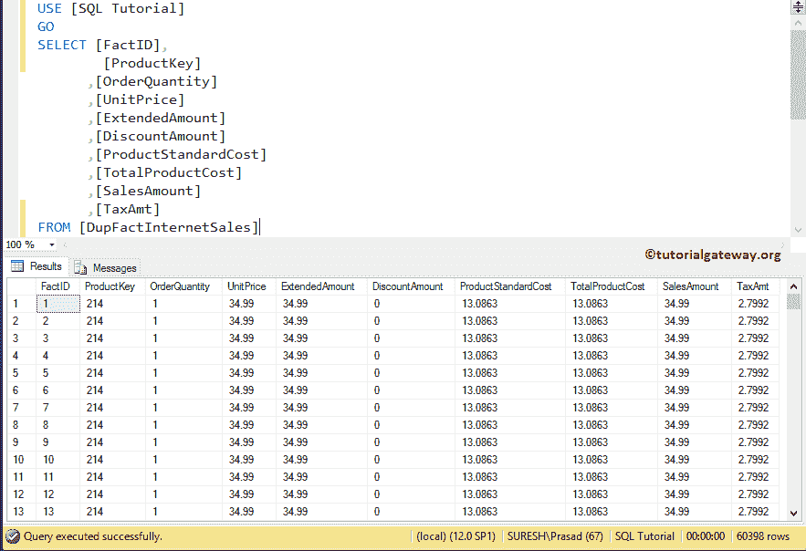
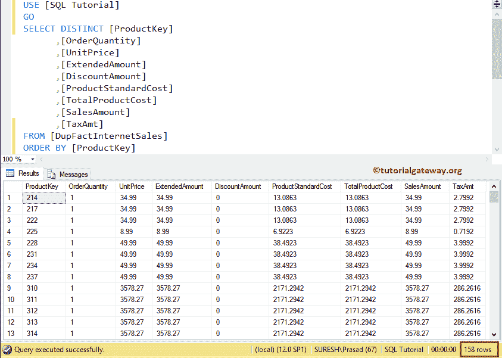
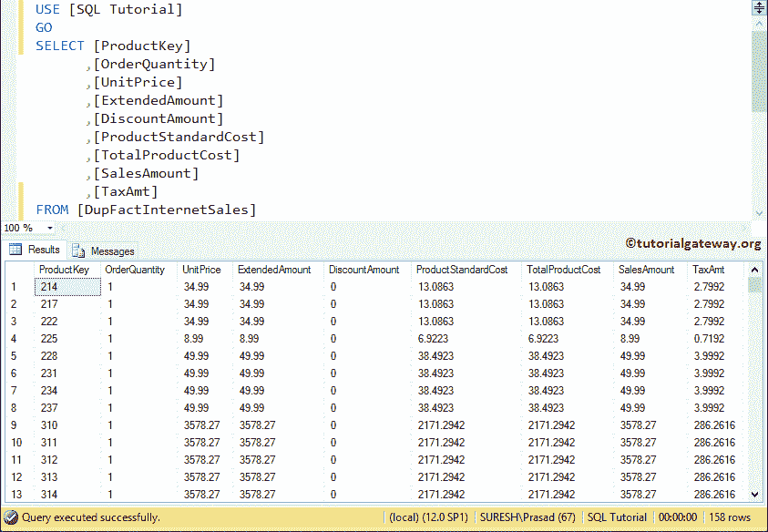
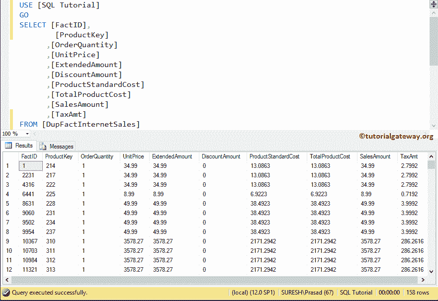

# 删除 SQL Server 中的重复行

> 原文:[https://www . tutorialgateway . org/delete-重复行-in-sql-server/](https://www.tutorialgateway.org/delete-duplicate-rows-in-sql-server/)

如何在 SQL Server 中编写删除重复行的查询是您在面试中可能会遇到的常见面试问题之一。

对于这个 SQL Server 删除重复记录的例子，我们将使用下面显示的数据(冒险工作数据仓库中事实互联网销售的几列)

```
USE [AdventureWorksDW2014]
GO
SELECT [ProductKey]
      ,[OrderQuantity]
      ,[UnitPrice]
      ,[ExtendedAmount]
      ,[DiscountAmount]
      ,[ProductStandardCost]
      ,[TotalProductCost]
      ,[SalesAmount]
      ,[TaxAmt]
FROM [FactInternetSales]
ORDER BY [ProductKey]
```

为了使这个例子尽可能简单，我们创建了一个新表，然后将上面的数据插入到新表中

```
CREATE TABLE [dbo].[DupFactInternetSales](
	[FactID] [int] IDENTITY(1,1) NOT NULL,
	[ProductKey] [int] NOT NULL,
	[OrderQuantity] [smallint] NOT NULL,
	[UnitPrice] [money] NOT NULL,
	[ExtendedAmount] [money] NOT NULL,
	[DiscountAmount] [float] NOT NULL,
	[ProductStandardCost] [money] NOT NULL,
	[TotalProductCost] [money] NOT NULL,
	[SalesAmount] [money] NOT NULL,
	[TaxAmt] [money] NOT NULL
) ON [PRIMARY]

GO
```

下面的截图将向您展示我们插入到数据库中的 DupFactInternetSales 表中的数据。



让我向您展示 [SQL Server](https://www.tutorialgateway.org/sql/) 表中存在的唯一记录。如您所见，我们使用了 [SELECT DISTINCT](https://www.tutorialgateway.org/sql-select-distinct-statement/) 关键字



## 删除 SQL Server 示例 1 中的重复行

在本例中，我们向您展示了如何使用 [ROW_NUMBER](https://www.tutorialgateway.org/sql-row_number/) 函数和[通用表表达式](https://www.tutorialgateway.org/sql-server-cte/)删除 SQL Server 中的重复行。

```
WITH RemoveDuplicate
AS (
     SELECT ROW_NUMBER() 
      OVER (
	    PARTITION BY [ProductKey]
			,[OrderQuantity]
			,[UnitPrice]
			,[ExtendedAmount]
			,[DiscountAmount]
			,[ProductStandardCost]
			,[TotalProductCost]
			,[SalesAmount]
			,[TaxAmt]
	   ORDER BY [ProductKey]
          ) UniqueRowNumber
    FROM [DupFactInternetSales])

DELETE FROM RemoveDuplicate
WHERE  UniqueRowNumber > 1;
```

在 CTE，我们使用的是名为 ROW_NUMBER 的[等级函数](https://www.tutorialgateway.org/ranking-functions-in-sql-server/)。它将分配一个从 1 到 n 的唯一排名号。接下来，我们将删除排名号大于 1 的所有记录。

输出:让我向您展示该语句的输出

```
Messages
--------
(60240 row(s) affected)
```

让我们看看[删除](https://www.tutorialgateway.org/sql-delete-statement/)操作



后，DupFactInternetsales 中呈现的数据

## 删除 SQL Server 示例 2 中的重复行

在这个常见问题中，我们展示了如何使用 [SELF JOIN](https://www.tutorialgateway.org/sql-self-join/) 删除 SQL Server 中的重复行。

```
DELETE InternetSales
FROM   [DupFactInternetSales] InternetSales,
       [DupFactInternetSales] FactInternetSales
WHERE   InternetSales.[ProductKey] = FactInternetSales.[ProductKey] AND
	InternetSales.[OrderQuantity] = FactInternetSales.[OrderQuantity] AND
	InternetSales.[UnitPrice] = FactInternetSales.[UnitPrice] AND
	InternetSales.[ExtendedAmount] = FactInternetSales.[ExtendedAmount] AND 
	InternetSales.[DiscountAmount] = FactInternetSales.[DiscountAmount] AND 
	InternetSales.[ProductStandardCost]= FactInternetSales.[ProductStandardCost] AND 
	InternetSales.[SalesAmount] = FactInternetSales.[SalesAmount] AND 
	InternetSales.[TaxAmt] = FactInternetSales.[TaxAmt] AND 
	InternetSales.FactID > FactInternetSales.FactID
```

让我向您展示该语句的输出

```
Messages
--------
(60240 row(s) affected)
```

输出



## 删除 SQL Server 示例 3 中的重复行

此示例显示了如何使用[左连接](https://www.tutorialgateway.org/sql-left-join/)、[最小](https://www.tutorialgateway.org/sql-min-function/)函数、[分组依据](https://www.tutorialgateway.org/sql-group-by-clause/)和[拥有](https://www.tutorialgateway.org/sql-having-clause/)来删除 SQL Server 中的重复行。

```
DELETE DupFactInternetSales
 FROM DupFactInternetSales
      LEFT JOIN (
               SELECT MIN([FactID]) AS [FactID] 
                    ,[ProductKey]
		    ,[OrderQuantity]
                    ,[UnitPrice]
                    ,[ExtendedAmount]
                    ,[DiscountAmount]
                    ,[ProductStandardCost]
                    ,[TotalProductCost]
                    ,[SalesAmount]
                    ,[TaxAmt]
               FROM [DupFactInternetSales]
               GROUP BY [ProductKey],
		        [OrderQuantity]
                       ,[UnitPrice]
                       ,[ExtendedAmount]
                       ,[DiscountAmount]
                       ,[ProductStandardCost]
                       ,[TotalProductCost]
                       ,[SalesAmount]
                       ,[TaxAmt]
        ) AS InternetSales ON
        [DupFactInternetSales].[FactID] = InternetSales.[FactID]
        WHERE InternetSales.[FactID] IS NULL
```

让我向您展示该语句的输出

```
Messages
--------
(60240 row(s) affected)
```