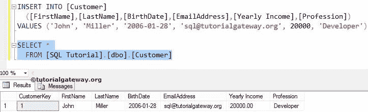
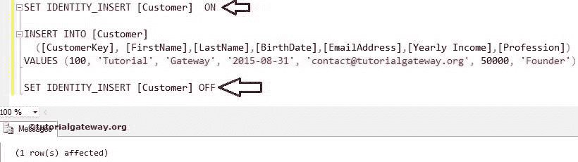
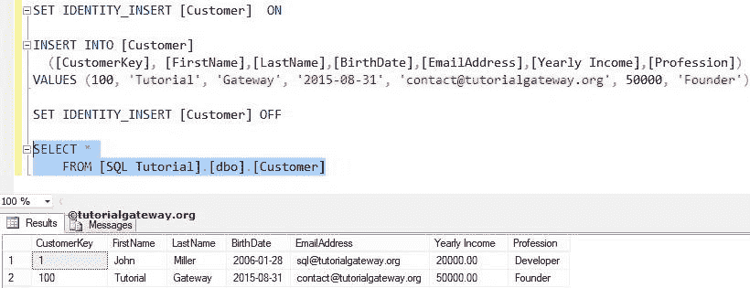

# SQL 标识插入

> 原文:[https://www.tutorialgateway.org/sql-identity_insert/](https://www.tutorialgateway.org/sql-identity_insert/)

如何使用 SQL IDENTITY INSERT 将值插入标识列，并举例说明。为此，我们将在[SQL 教程]数据库中使用下图所示的客户表。

从下面的代码片段中，您可以观察到[客户密钥]列是一个标识列。我们的工作是将值插入这个标识列[客户键]，即 sql 标识插入。

```
CREATE TABLE [Customer]
(
  [CustomerKey] [int] IDENTITY(1,1) NOT NULL,
  [FirstName] [varchar](50) NULL,
  [LastName] [varchar](50) NULL,
  [BirthDate] [date] NULL,
  [EmailAddress] [nvarchar](50) NULL,
  [Yearly Income] [money] NULL,
  [Profession] [nvarchar](100) NULL
)
```

## 使用 SQL 标识插入将值插入标识列

在开始使用 SQL IDENTITY INSERT 命令之前，让我们看看当我们使用以下语句将值插入标识列(客户键)时会发生什么

```
-- Identity Insert
INSERT INTO [Customer] 
  ([CustomerKey], [FirstName],[LastName],[BirthDate],[EmailAddress],[Yearly Income],[Profession])
VALUES (1, 'John', 'Miller', '2006-01-28', 
        '[email protected]', 20000, 'Developer')
```

运行上述查询，将值插入标识列

```
Messages
--------
Msg 544, Level 16, State 1, Line 2
Cannot insert explicit value for identity column in table 'Customer' when IDENTITY_INSERT is set to OFF.
```

从上面的截图中，您可以观察到它抛出了一个错误:当 identity_INSERT 设置为 OFF 时，无法在表“Customer”中为 IDENTITY 列插入显式值。这是因为任何使用 IDENTITY 属性的列都将根据起始位置开始，并根据插入到表中的每一行的增量值自动递增。

让我们看看，当我们在 [SQL Server](https://www.tutorialgateway.org/sql/) 中插入除标识列(客户密钥)之外的剩余值时会发生什么。

```
-- Identity Insert Example
INSERT INTO [Customer] 
  ([FirstName],[LastName],[BirthDate],
   [EmailAddress],[Yearly Income],[Profession])
VALUES ('John', 'Miller', '2006-01-28', 
        '[email protected]', 20000, 'Developer')
```

```
Messages
--------
(1 row(s) affected)
```

从上面的截图中，可以观察到有 1 行受到影响。现在，让我们看看，上面的语句是否通过使用下面的 SQL 查询将值插入到客户表中

```
SELECT * FROM [Customer]
```

从下面，您可以观察到客户键值 1 是因为身份而自动插入的。



### SQL 设置标识 _ 插入开/关

在本例中，我们将使用 SET IDENTITY_INSERT 属性将列的标识设置为开和关

```
--  Identity Insert Example
SET IDENTITY_INSERT [Customer] ON  

INSERT INTO [Customer] 
  ([CustomerKey], [FirstName],[LastName],[BirthDate],
   [EmailAddress],[Yearly Income],[Profession])
VALUES (100, 'Tutorial', 'Gateway', '2015-08-31', 
         '[email protected]', 50000, 'Founder')

SET IDENTITY_INSERT [Customer] OFF
```



以下语句将在“客户”表中将“SQL 标识插入”设置为“开”。

```
SET IDENTITY_INSERT [Customer] ON
```

下面的语句将显式值插入到客户表中。它包括身份列[客户密钥]

```
INSERT INTO [Customer] 
  ([CustomerKey], [FirstName],[LastName],[BirthDate],
   [EmailAddress],[Yearly Income],[Profession])
VALUES (100, 'Tutorial', 'Gateway', '2015-08-31', 
         '[email protected]', 50000, 'Founder')
```

以下语句将在“客户”表中设置“标识插入”为“关”。记住，这句话之后；您不能将值插入“标识”列(此处为[客户密钥])

```
SET IDENTITY_INSERT [Customer] OFF
```

使用下面的查询检查上面的语句是否将值插入到标识列中

```
SELECT * FROM [Customer]
```

您可以看到我们成功地将值插入到了标识列中。



一个会话只允许一个表将其 IDENTITY_INSERT 属性设置为 on。如果您试图在多个表上发出 SET IDENTITY_INSERT ON 语句，SQL 将返回一条错误消息