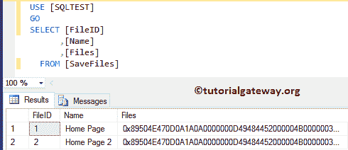

# 将图像插入到 SQL Server 中

> 原文：<https://www.tutorialgateway.org/insert-images-into-sql-server/>

将图像插入到 SQL Server 表中是 SQL Server 论坛中最常见的问题之一。将图像保存到表中最简单的方法是使用 BULK 和 SIGNAL _ BLOB 选项执行 OPENROWSET 命令。首先，让我创建一个新的表格来保存照片。

```
-- Query to Insert Images into SQL Server is: 

CREATE TABLE SaveFiles
(
    FileID INT IDENTITY(1,1) NOT NULL,
    Name NVARCHAR(50) NOT NULL,
    Files VARBINARY(MAX) NOT NULL
)
```

运行上面的创建表查询

```
Messages
--------
Command(s) completed successfully.
```

## 在 SQL Server 中插入图像示例

在这个例子中，我们编写了一个[服务器](https://www.tutorialgateway.org/sql/)查询，使用 OPENROWSET 向表中插入一个图像

```
-- Query to Insert Images into SQL Server is: 

INSERT INTO [dbo].[SaveFiles] (Name, Files)
SELECT 'Home Page 2', 
	BulkColumn FROM OPENROWSET(BULK N'D:\LOGOS\Home Page.png', SINGLE_BLOB) image;
```


您也可以用不同的方式编写上述常见问题查询(SQL Insert Image):

```
-- Query to Insert Images into SQL Server is: 

INSERT INTO [dbo].[SaveFiles] (Name, Files)
SELECT 'Home Page 2', 
	* FROM OPENROWSET(BULK N'D:\LOGOS\Home Page.png', SINGLE_BLOB) image;
```


让我打开 SaveFile [表](https://www.tutorialgateway.org/sql-create-table/)检查我们是否成功地将两个图像插入到表中。

