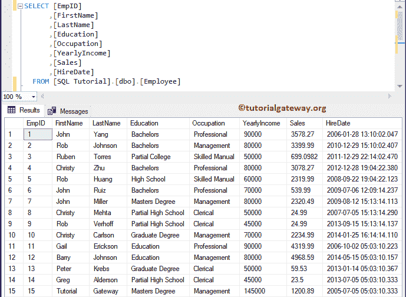
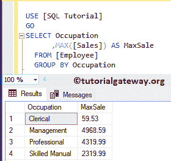
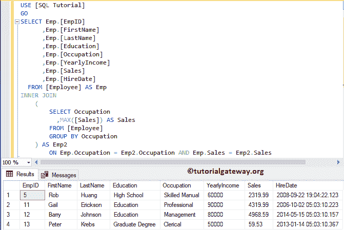
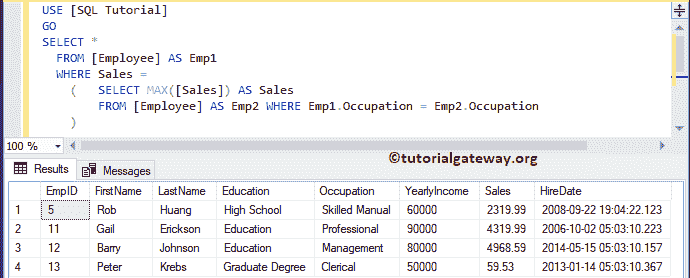
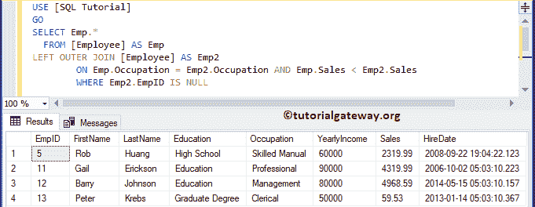

# 在 SQL Server 中选择列上具有最大值的行

> 原文：<https://www.tutorialgateway.org/select-rows-with-maximum-value-on-a-column-in-sql-server/>

在本文中，我们将通过示例了解如何在 SQL Server 中选择列上具有最大值的行。为此，我们将使用下图所示的数据



## 在 SQL Server 示例 1 中选择列上具有最大值的行

如果要返回组列和具有最大值的列，可以使用下面的语句。如您所见，我们使用了[最大](https://www.tutorialgateway.org/sql-max-function/)功能和[分组依据](https://www.tutorialgateway.org/sql-group-by-clause/)

```
SELECT Occupation
      ,MAX([Sales]) AS MaxSale
  FROM [Employee]
  GROUP BY Occupation
```



## 选择列上具有最大值的行示例 2

在本例中，我们将展示如何选择具有最大值的行以及剩余的列。如果要返回剩余的列(非按列分组)，这很有用。

对于这个 [SQL Server](https://www.tutorialgateway.org/sql/) 的例子，我们使用了[内部连接](https://www.tutorialgateway.org/sql-inner-join/)来连接员工表和它自己。

```
SELECT Emp.[EmpID]
      ,Emp.[FirstName]
      ,Emp.[LastName]
      ,Emp.[Education]
      ,Emp.[Occupation]
      ,Emp.[YearlyIncome]
      ,Emp.[Sales]
      ,Emp.[HireDate]
  FROM [Employee] AS Emp
INNER JOIN 
	(
		SELECT Occupation
		  ,MAX([Sales]) AS Sales
		FROM [Employee]
		GROUP BY Occupation
	) AS Emp2
		ON Emp.Occupation = Emp2.Occupation AND Emp.Sales = Emp2.Sales
```



## 选择列上具有最大值的行示例 3

这是另一种方法。这里，我们使用 [Where 子句](https://www.tutorialgateway.org/sql-where-clause/)中的 [`SELECT`语句](https://www.tutorialgateway.org/sql-select-statement/)。

```
SELECT *
  FROM [Employee] AS Emp1
  WHERE Sales = 
	(	SELECT MAX([Sales]) AS Sales
		FROM [Employee] AS Emp2 WHERE Emp1.Occupation = Emp2.Occupation 
	)
```



在这个例子中，我们使用了[左连接](https://www.tutorialgateway.org/sql-left-join/)和[为空](https://www.tutorialgateway.org/sql-is-null-function/)。

```
SELECT Emp.*
  FROM [Employee] AS Emp
LEFT JOIN [Employee] AS Emp2
		ON Emp.Occupation = Emp2.Occupation AND Emp.Sales < Emp2.Sales
		WHERE Emp2.EmpID IS NULL
```

