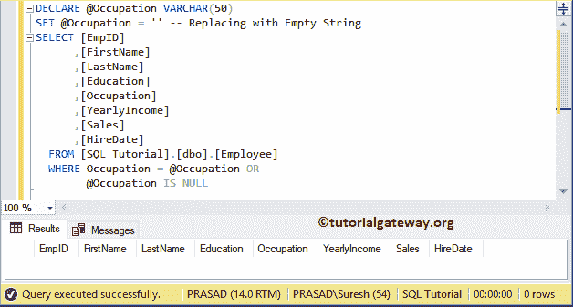

# 参数为空或空时选择全部的 SQL 查询

> 原文:[https://www . tutorialgateway . org/SQL-查询-选择-全部-如果-参数为空或-null/](https://www.tutorialgateway.org/sql-query-to-select-all-if-parameter-is-empty-or-null/)

通常，当您创建一个 SQL 存储过程或任何接受参数的查询时，您可能会强制用户为该参数提供一个值。实时情况并非如此，因此您必须允许空值和空字符串。让我们看看如何写 SQL 查询选择所有如果参数为空或空的例子。

对于这个 SQL select all if Parameter 为空或 null 的演示，我们使用这个数据


一般来说，您可以如下查询:

```
DECLARE @Occupation VARCHAR(50)
SET @Occupation = 'Clerical'
SELECT [EmpID]
      ,[FirstName]
      ,[LastName]
      ,[Education]
      ,[Occupation]
      ,[YearlyIncome]
      ,[Sales]
      ,[HireDate]
  FROM [Employee]
  WHERE Occupation = @Occupation
```


如果您未能提供有效的职业值，那么它将返回空表。

提示:在实时中，我们使用[存储过程](https://www.tutorialgateway.org/stored-procedures-in-sql/)来执行这类操作。但是，为了简化查询，我们选择了常规的 [SQL Server](https://www.tutorialgateway.org/sql/) 查询

## 参数为空或空时选择全部的 SQL 查询示例

下面的示例列表将向您展示获得结果的各种方法

### 参数为空时选择全部的 SQL 查询

在本例中，我们使用 [IIF 函数](https://www.tutorialgateway.org/sql-iif-function/)和[为空](https://www.tutorialgateway.org/sql-is-null-function/)来检查参数值是否为空。如果为真，职业=职业，否则，职业=用户提供的结果。

```
DECLARE @Occupation VARCHAR(50)
SET @Occupation = 'Management'
SELECT [EmpID]
      ,[FirstName]
      ,[LastName]
      ,[Education]
      ,[Occupation]
      ,[YearlyIncome]
      ,[Sales]
      ,[HireDate]
  FROM [Employee]
  WHERE Occupation = IIF(@Occupation IS NULL, Occupation, @Occupation)
```


让我将参数值更改为空


如果尝试空字符串，上面的查询会返回一个空表


### 参数为空时选择全部的 SQL 查询示例 2

在这个例子中，我们使用 [CASE 语句](https://www.tutorialgateway.org/sql-case-statement/)和 [IS NULL](https://www.tutorialgateway.org/sql-is-null-function/) 来检查参数值是否为 NULL。

```
DECLARE @Occupation VARCHAR(50)
SET @Occupation = 'Clerical'
SELECT [EmpID]
      ,[FirstName]
      ,[LastName]
      ,[Education]
      ,[Occupation]
      ,[YearlyIncome]
      ,[Sales]
      ,[HireDate]
  FROM [Employee]
  WHERE Occupation = CASE WHEN @Occupation IS NULL THEN Occupation ELSE @Occupation END
```


让我将参数值调整为空


以上查询返回空字符串


的空表

### 参数为空时选择全部的 SQL 查询示例 3

这里，我们在 [WHERE 子句](https://www.tutorialgateway.org/sql-where-clause/)中使用 [OR 运算符](https://www.tutorialgateway.org/sql-and-or-operators/)和[为空](https://www.tutorialgateway.org/sql-is-null-function/)来检查参数值是否为空。

```
DECLARE @Occupation VARCHAR(50)
SET @Occupation = 'Skilled Manual'
SELECT [EmpID]
      ,[FirstName]
      ,[LastName]
      ,[Education]
      ,[Occupation]
      ,[YearlyIncome]
      ,[Sales]
      ,[HireDate]
  FROM [Employee]
  WHERE Occupation = @Occupation OR
		@Occupation IS NULL
```


您可以看到查询正在返回空值


的所有记录

它正在为空白值



返回空表

### 参数为空或空时选择全部的 SQL 查询

在这个例子中，我们使用了 [IIF 函数](https://www.tutorialgateway.org/sql-iif-function/)和 [ISNULL](https://www.tutorialgateway.org/sql-isnull/) 。首先，ISNULL 函数检查参数值是否为空。如果为真，它将用空字符串或空白替换该值。接下来，IIF 将检查参数是否为空。如果为真，职业=职业，否则，职业=用户提供的结果。

```
DECLARE @Occupation VARCHAR(50)
SET @Occupation = 'Management'
SELECT [EmpID]
      ,[FirstName]
      ,[LastName]
      ,[Education]
      ,[Occupation]
      ,[YearlyIncome]
      ,[Sales]
      ,[HireDate]
  FROM [Employee]
  WHERE Occupation = IIF(ISNULL(@Occupation, '') = '', Occupation, @Occupation)
```


让我们将参数值更改为空


它将返回 Employee 表中空参数值的所有记录。


### 参数为空或空时选择全部的 SQL 查询示例 2

在这个 SQL 示例中，我们使用了 [OR 运算符](https://www.tutorialgateway.org/sql-and-or-operators/)以及 [ISNULL](https://www.tutorialgateway.org/sql-isnull/) 函数。

```
DECLARE @Occupation VARCHAR(50)
SET @Occupation = 'Clerical'
SELECT [EmpID]
      ,[FirstName]
      ,[LastName]
      ,[Education]
      ,[Occupation]
      ,[YearlyIncome]
      ,[Sales]
      ,[HireDate]
  FROM [Employee]
  WHERE Occupation = @Occupation OR
 ISNULL(@Occupation, '') = ''
```


空参数


的结果

结果为空字符串


### 参数为空时选择全部的 SQL 查询示例 3

这里，我们使用 [IF-ELSE 语句](https://www.tutorialgateway.org/sql-if-else/)。如果参数值不为空，则使用[选择语句](https://www.tutorialgateway.org/sql-select-statement/)和 Where 子句，否则不使用 [Where 子句](https://www.tutorialgateway.org/sql-where-clause/)

```
DECLARE @Occupation VARCHAR(50)
SET @Occupation = 'Professional'
IF ISNULL(@Occupation, '') <> ''
BEGIN
SELECT [EmpID]
      ,[FirstName]
      ,[LastName]
      ,[Education]
      ,[Occupation]
      ,[YearlyIncome]
      ,[Sales]
      ,[HireDate]
  FROM [SQL Tutorial].[dbo].[Employee]
  WHERE Occupation = @Occupation
END
ELSE
BEGIN
SELECT [EmpID]
      ,[FirstName]
      ,[LastName]
      ,[Education]
      ,[Occupation]
      ,[YearlyIncome]
      ,[Sales]
      ,[HireDate]
  FROM [Employee]
END
```


结果为空参数


空串结果

