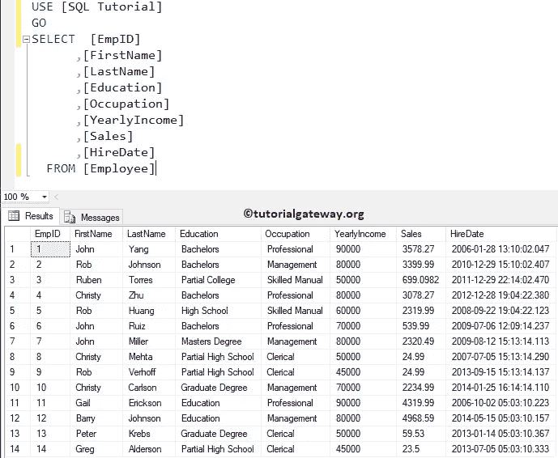
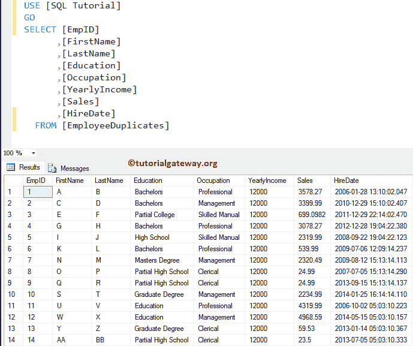
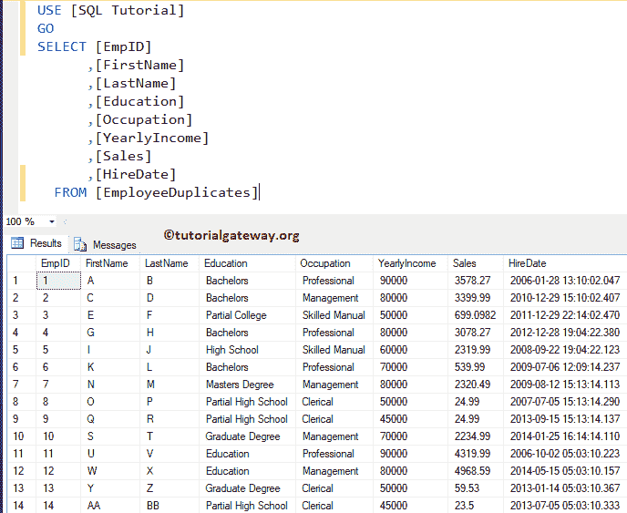
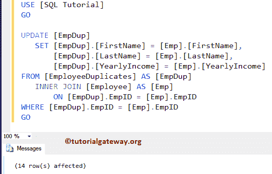
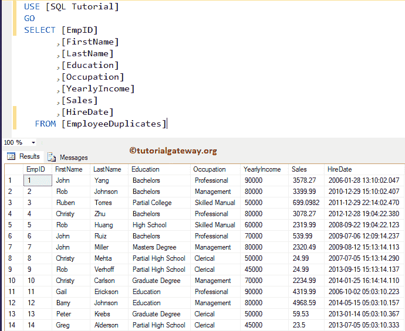
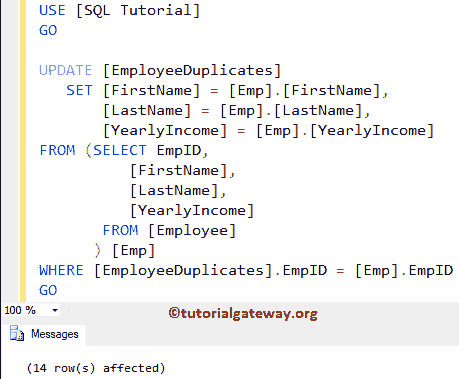
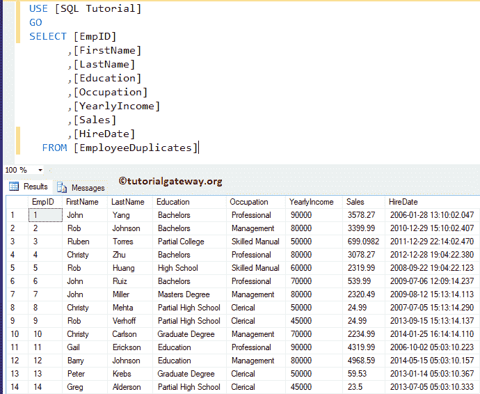
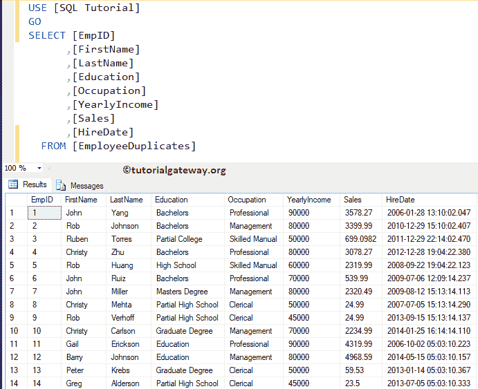

# 如何在 SQL Server 中从`SELECT`更新

> 原文：<https://www.tutorialgateway.org/how-to-update-from-select-in-sql-server/>

如何通过示例使用`SELECT`语句编写一个 SQL 查询来更新表中的列？。“从选择中更新 SQL”是 SQL Server 常见问题之一。对于本例，我们将使用下面显示的数据。



下表将显示员工重复表中的数据。我们的任务是用上面指定的表更新这个表中的列(名字、姓氏和年收入)。



## 如何在 SQL Server 示例 1 中从选择更新

在本例中，我们将向您展示如何使用[子查询](https://www.tutorialgateway.org/sql-subquery/)从[`SELECT`语句](https://www.tutorialgateway.org/sql-select-statement/)更新。

```sql
-- SQL Update Select :- Query to UPDATE from SELECT in SQL Server

UPDATE [EmployeeDuplicates]
   SET [YearlyIncome] = ( SELECT [YearlyIncome] 
			  FROM [Employee]
			  WHERE [Employee].EmpID = [EmployeeDuplicates].EmpID)

GO
```

```sql
Messages
--------
(14 row(s) affected)
```

现在让我给你看看 [SQL Server](https://www.tutorialgateway.org/sql/) 更新表

T4】

### 如何从选择示例 2 更新

上面指定的示例可能是更新单个列的绝佳选择。在这个 SQL update select 示例中，让我们看看如何在 SQL Server 中用 [JOIN](https://www.tutorialgateway.org/sql-inner-join/) 来做一个`UPDATE`语句。

```sql
-- SQL Update Select:- Query to UPDATE from SELECT in SQL Server

UPDATE [EmpDup]
   SET [EmpDup].[FirstName] = [Emp].[FirstName],
	   [EmpDup].[LastName] = [Emp].[LastName],
	   [EmpDup].[YearlyIncome] = [Emp].[YearlyIncome]
FROM [EmployeeDuplicates] AS [EmpDup]
INNER JOIN [Employee] AS [Emp] 
   ON [EmpDup].EmpID = [Emp].EmpID 
WHERE [EmpDup].EmpID = [Emp].EmpID 
GO
```



现在让我给你看更新的表格



### 更新选择示例 3

在本例中，我们向您展示了如何使用`SELECT`语句更新表列。这里，我们在 FROM 语句中使用[子查询](https://www.tutorialgateway.org/sql-subquery/)

```sql
UPDATE [EmployeeDuplicates]
   SET [FirstName] = [Emp].[FirstName],
	   [LastName] = [Emp].[LastName],
	   [YearlyIncome] = [Emp].[YearlyIncome]
FROM (SELECT EmpID,
	     [FirstName], 
	     [LastName],
	     [YearlyIncome] 
       FROM [Employee]
     ) [Emp] 
WHERE [EmployeeDuplicates].EmpID = [Emp].EmpID 
GO
```



现在让我给你看更新的表格



### 如何从选择示例 4 更新

在本例中，我们将向您展示如何使用 Sql Server 中的 [`MERGE`语句](https://www.tutorialgateway.org/sql-merge-statement/)更新`SELECT`语句中的表列

```sql
MERGE INTO [EmployeeDuplicates] AS [EmpDup]
   USING (
           SELECT EmpID,
		  [FirstName], 
		  [LastName],
		  [YearlyIncome] 
           FROM [Employee] 
         ) [Emp]
   ON [EmpDup].EmpID = [Emp].EmpID
WHEN MATCHED THEN
   UPDATE 
  	SET [EmpDup].[FirstName] = [Emp].[FirstName],
	    [EmpDup].[LastName] = [Emp].[LastName],
	    [EmpDup].[YearlyIncome] = [Emp].[YearlyIncome];
```

从选择查询运行上述合并更新

```sql
Messages
--------
(14 row(s) affected)
```

现在让我用`SELECT`语句



中的这个更新来展示更新后的表格