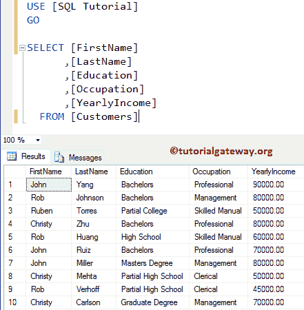
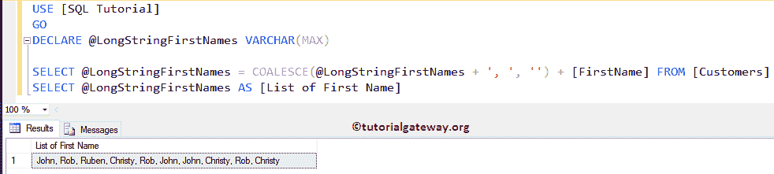
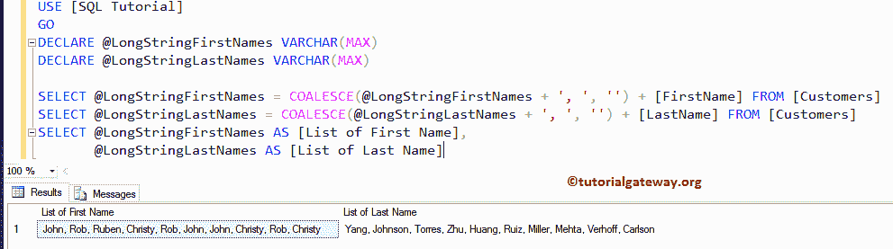
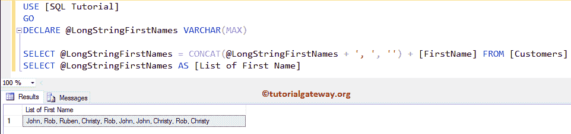
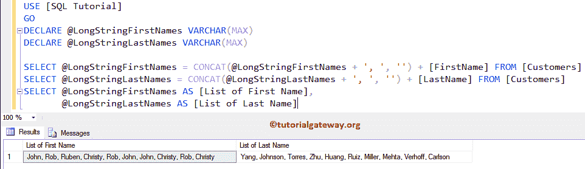
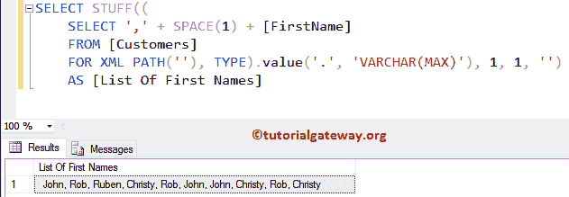
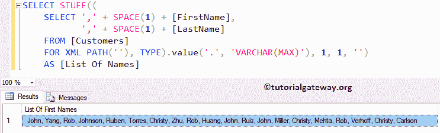

# 将行连接成字符串

> 原文:[https://www . tutorialgateway . org/SQL-concatenate-row-to-string/](https://www.tutorialgateway.org/sql-concatenate-rows-into-string/)

如何用示例编写一个查询来连接 SQL Server 中的行以形成字符串？。这是你在面试中可能会遇到的常见的 SQL 面试问题之一。对于这个 SQL server 串联行的例子，我们使用下面显示的数据



## 将行连接成字符串示例

在本例中，我们将向您展示如何使用[聚结](https://www.tutorialgateway.org/sql-coalesce-function/)函数连接行。

```
-- Query to Concatenate Rows in SQL Server

DECLARE @LongStringFirstNames VARCHAR(MAX)  
SELECT @LongStringFirstNames = COALESCE(@LongStringFirstNames + ', ', '') + [FirstName] FROM [Customers]
SELECT @LongStringFirstNames AS [List of Name]
```



让我也合并姓氏行

```
-- Query to Concatenate Rows in SQL Server

DECLARE @LongStringFirstNames VARCHAR(MAX)
DECLARE @LongStringLastNames VARCHAR(MAX)

SELECT @LongStringFirstNames = COALESCE(@LongStringFirstNames + ', ', '') + [FirstName] FROM [Customers]  
SELECT @LongStringLastNames = COALESCE(@LongStringLastNames + ', ', '') + [LastName] FROM [Customers]
SELECT @LongStringFirstNames AS [List of First Name],
       @LongStringLastNames AS [List of Last Name]
```



### 如何连接行示例 2

它将向您展示如何使用 Sql Server 中的 [CONCAT](https://www.tutorialgateway.org/sql-concat-function/) 函数将行连接成字符串。

```
-- Query to Concatenate Rows in SQL Server

DECLARE @LongStringFirstNames VARCHAR(MAX)

SELECT @LongStringFirstNames = CONCAT(@LongStringFirstNames + ', ', '') + [FirstName] FROM [Customers]  
SELECT @LongStringFirstNames AS [List of First Name]
```



让我也连接姓氏行

```
-- Query to Concatenate Rows in SQL Server

DECLARE @LongStringFirstNames VARCHAR(MAX)
DECLARE @LongStringLastNames VARCHAR(MAX)

SELECT @LongStringFirstNames = CONCAT(@LongStringFirstNames + ', ', '') + [FirstName] FROM [Customers]  
SELECT @LongStringLastNames = CONCAT(@LongStringLastNames + ', ', '') + [LastName] FROM [Customers]
SELECT @LongStringFirstNames AS [List of First Name],
	   @LongStringLastNames AS [List of Last Name]
```



### 将行连接成字符串示例 3

在本例中，我们将向您展示如何使用[空间](https://www.tutorialgateway.org/sql-space-function/)和 XML 路径连接 SQL Server 中的行。

```
-- Query to Concatenate Rows in SQL Server
SELECT STUFF((
    SELECT ',' + SPACE(1) + [FirstName]
    FROM [Customers]
    FOR XML PATH(''), TYPE).value('.', 'VARCHAR(MAX)'), 1, 1, '')
	AS [List Of First Names]
```



让我使用 [SQL](https://www.tutorialgateway.org/sql/) 填充函数和[的 XML 路径](https://www.tutorialgateway.org/sql-for-xml-path/)来组合两列(名和姓)中的行

```
-- Query to Concatenate Rows in SQL Server
SELECT STUFF((
    SELECT ',' + SPACE(1) + [FirstName],
	   ',' + SPACE(1) + [LastName]
    FROM [Customers]
    FOR XML PATH(''), TYPE).value('.', 'VARCHAR(MAX)'), 1, 1, '')
	AS [List Of Names]
```

