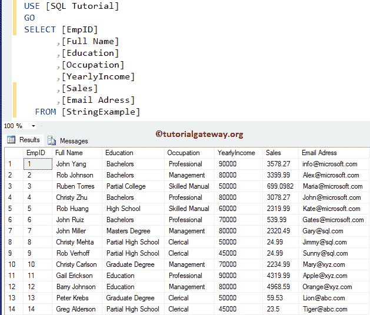
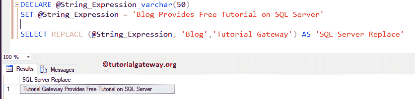
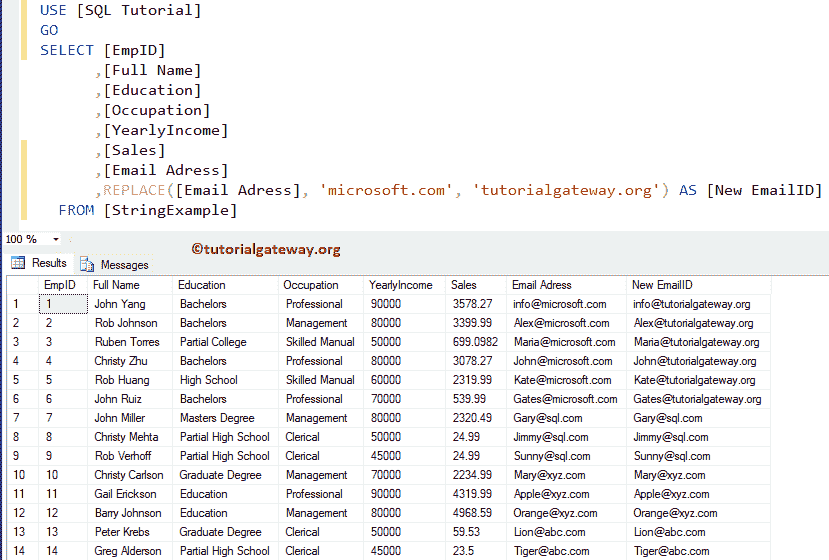
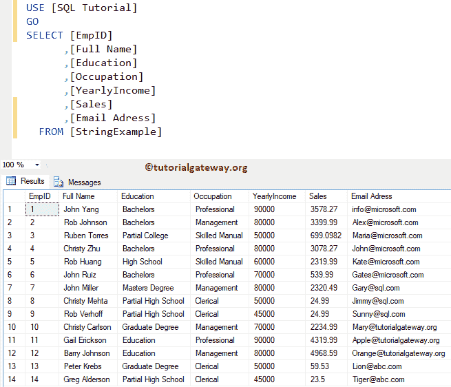

# 如何在 SQL Server 中替换字符串

> 原文：<https://www.tutorialgateway.org/how-to-replace-string-in-sql-server/>

如何用例子替换 SQL Server 表列中的字符串？。对于这个 SQL Server 面试问题，我们将使用下面显示的数据



## 替换 SQL Server 示例 1 中的字符串

在这个替换字符串的例子中，我们将声明一个字符串变量，然后我们将使用[替换](https://www.tutorialgateway.org/sql-replace-function/)函数用新字符串替换字符串的一部分。

```
-- SQL Server Query to Replace String
DECLARE @String_Expression varchar(50)
SET @String_Expression = 'Blog Provides Free Tutorial on SQL Server'

SELECT REPLACE (@String_Expression, 
                'Blog','Tutorial Gateway'
                ) AS 'SQL Server Replace'
```



这个例子展示了如何在 [SELECT 语句](https://www.tutorialgateway.org/sql-select-statement/)中替换一个字符串。在这里，我们将使用[替换功能](https://www.tutorialgateway.org/sql-replace-function/)，同时从 [SQL Server](https://www.tutorialgateway.org/sql/) 表中选择数据。

```
-- SQL Replace Part of a String

SELECT [EmpID]
      ,[Full Name]
      ,[Education]
      ,[Occupation]
      ,[YearlyIncome]
      ,[Sales]
      ,[Email Adress]
      ,REPLACE([Email Adress], 'microsoft.com', 'tutorialgateway.org') AS [New EmailID]
  FROM [StringExample]
```



## 替换 SQL 示例 3 中的字符串

在这个[示例](https://www.tutorialgateway.org/sql-interview-questions/)中，我们将向您展示如何在 SQL [更新语句](https://www.tutorialgateway.org/sql-update-statement/)中替换字符串。这里我们将使用更新语句中的替换函数。

```
-- SQL Replace Part of a String

UPDATE [StringExample]
SET [Email Adress] = REPLACE([Email Adress], 'xyz.com', 'tutorialgateway.org')
```

