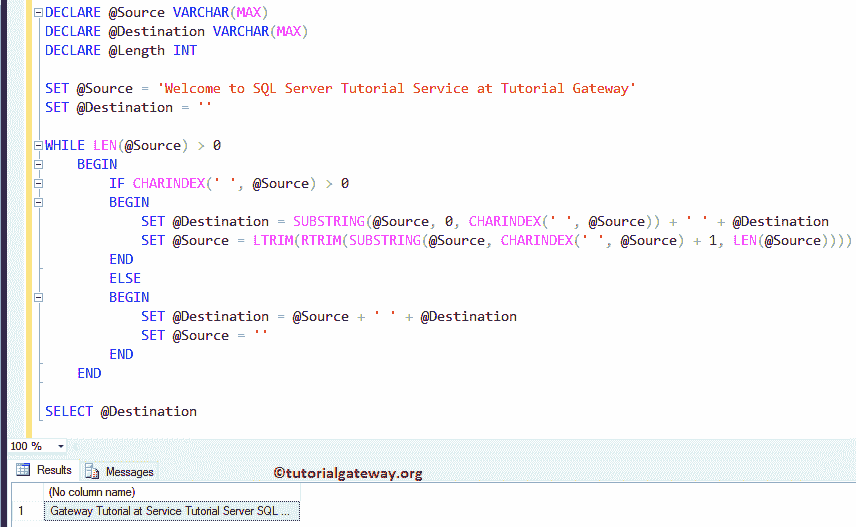
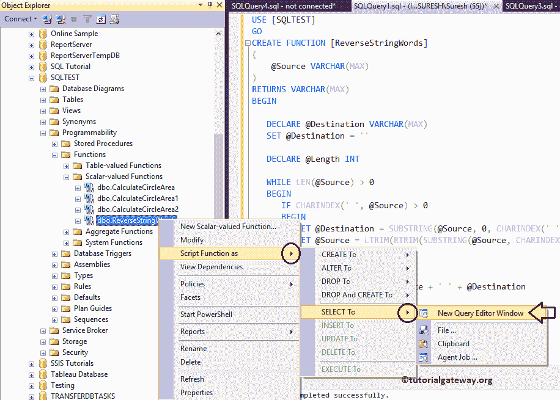
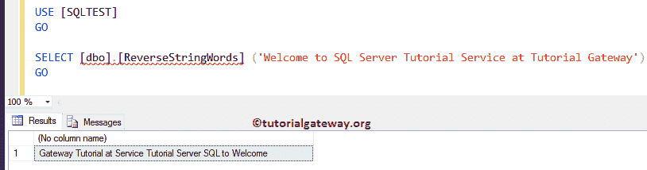

# SQL 反向字符串

> 原文:[https://www.tutorialgateway.org/sql-reverse-string/](https://www.tutorialgateway.org/sql-reverse-string/)

如何写一个 SQL 查询来反转字符串中的每个单词，并给出一个例子？。SQL 反向字符串是您在面试中可能会遇到的标准面试问题之一。

## SQL 逐词倒排字符串示例

函数允许你提取和显示字符串的一部分。在这个 SQL 示例中，我们向您展示了如何选择空格符号前的字符串并反转这些字符串单词。

```
-- SQL Extract Domain From Email

DECLARE @Source VARCHAR(MAX)
DECLARE @Destination VARCHAR(MAX)
DECLARE @Length INT 

SET @Source = 'Welcome to SQL Server Tutorial Service at Tutorial Gateway'
SET @Destination = ''

WHILE LEN(@Source) > 0
  BEGIN
    IF CHARINDEX(' ', @Source) > 0
    BEGIN
	SET @Destination = SUBSTRING(@Source, 0, CHARINDEX(' ', @Source)) + ' ' + @Destination
	SET @Source = LTRIM(RTRIM(SUBSTRING(@Source, CHARINDEX(' ', @Source) + 1, LEN(@Source))))
    END
    ELSE
    BEGIN
	SET @Destination = @Source + ' ' + @Destination
	SET @Source = ''
    END
  END

SELECT @Destination
```



首先，我们使用 DECLARE 语句声明了三个变量。接下来，我们使用 [WHILE 循环](https://www.tutorialgateway.org/sql-while-loop/)来迭代@Source 中出现的每个字符。对于 [SQL Server](https://www.tutorialgateway.org/sql/) while 循环内部的情况，我们使用了 LEN 函数来检查源的长度是否大于 0。

在 SQL 反向字符串示例的 while 循环中，我们使用 SUBSTRING 函数来设置@Destination 值。它允许三个参数，它们是源，起点，终点。这里我们分配了

*   来源为@Source，也可以使用列名
*   接下来，我们使用起始位置作为 0。
*   接下来，我们使用 CHARINDEX 函数来查找“”，这样端点将在空格之前。
*   最后，我们将它添加到@Destination 中，它在循环开始时是空的

要设置@Source 值(意思是更新@source 变量)，我们使用 [SUBSTRING](https://www.tutorialgateway.org/sql-substring-function/) 函数。这里我们分配了

*   来源为@Source，也可以使用列名
*   接下来，我们使用 [CHARINDEX 函数](https://www.tutorialgateway.org/sql-charindex-function/)来查找空白空间，然后我们添加了 1。所以起点在太空之后。
*   最后，我们使用 [LEN](https://www.tutorialgateway.org/sql-len-function/) 函数来指定结束值

从上面的 SQL 反向字符串分析中，您可以观察到，

*   SET @Destination 表示我们正在从 0 个索引开始提取单词，直到空格。这将是第一个词。
*   一旦我们得到了第一个单词，我们将使用 SET @源代码从@Source 中删除这个单词。

## SQL 逐词倒排字符串示例 2

虽然上面的例子将返回结果，但我们希望在用户定义函数中包装 SQL 反向字符串。建议大家参考[用户自定义](https://www.tutorialgateway.org/user-defined-functions-in-sql/)文章，以便更好的理解。

```
-- SQL Reverse String words

CREATE FUNCTION [ReverseStringWords]
(
    @Source VARCHAR(MAX)
)
RETURNS VARCHAR(MAX)  
BEGIN

   DECLARE @Destination VARCHAR(MAX)
   SET @Destination = '' 

   DECLARE @Length INT

   WHILE LEN(@Source) > 0
   BEGIN
      IF CHARINDEX(' ', @Source) > 0
      BEGIN
         SET @Destination = SUBSTRING(@Source, 0, CHARINDEX(' ', @Source)) + ' ' + @Destination
         SET @Source = LTRIM(RTRIM(SUBSTRING(@Source, CHARINDEX(' ', @Source) + 1, LEN(@Source))))
      END
      ELSE
      BEGIN
         SET @Destination = @Source + ' ' + @Destination
         SET @Source = ''
      END
   END          
   RETURN @Destination
END
```

我们可以通过两种方式找到用户定义的函数。请导航到包含函数->可编程性->标量值函数->函数名的数据库。接下来，右键单击函数名将打开上下文菜单。在这里，请选择脚本功能为->选择到->新建查询编辑器窗口选项。



或者编写以下代码片段来反转 SQL Server 中的字符串

```
-- SQL Server String Reverse Example

SELECT [dbo].[ReverseStringWords]('Welcome To SQL Server Tutorial Service at Tutorial Gateway')
GO
```

