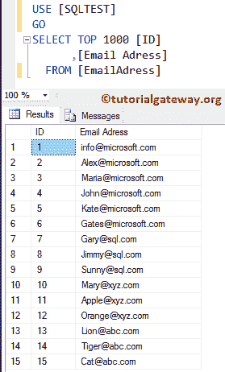
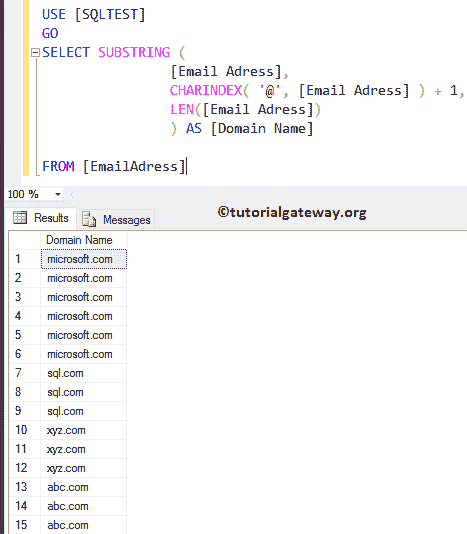
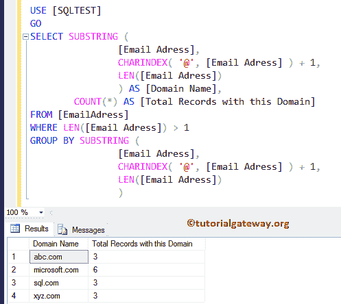
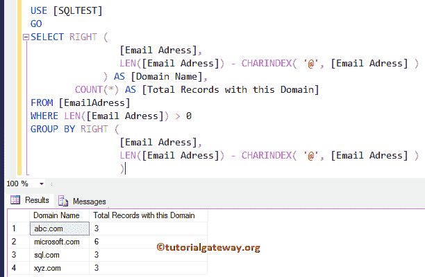

# 从电子邮件中提取域

> 原文：<https://www.tutorialgateway.org/sql-extract-domain-from-email/>

如何编写一个 SQL 查询来从电子邮件地址中提取域，并举例说明。对于这个 SQL 面试问题示例，我们使用以下数据



## 从电子邮件中提取域示例

SUBSTRING 函数允许您提取和显示字符串的一部分。在这个 SQL Server 示例中，我们将向您展示如何在每条记录中的@符号后选择字符串。

```
-- SQL Extract Domain From Email

SELECT SUBSTRING (
		   [Email Adress],
		   CHARINDEX( '@', [Email Adress] ) + 1,
		   LEN([Email Adress])
		 ) AS [Domain Name]
FROM [EmailAdress]
```



一般来说， [SUBSTRING](https://www.tutorialgateway.org/sql-substring-function/) 函数允许三个参数，分别是来源、起点、终点。这里我们分配了

*   来源作为我们的列名
*   接下来我们用 [CHARINDEX 函数](https://www.tutorialgateway.org/sql-charindex-function/)找到@符号，然后加 1。因此起点将在@符号之后。
*   最后，我们使用 [SQL Server](https://www.tutorialgateway.org/sql/) 中的 [LEN](https://www.tutorialgateway.org/sql-len-function/) 函数来指定结束值

```
SUBSTRING (
	    [Email Adress], -- Source
	    CHARINDEX( '@', [Email Adress] ) + 1, -- Start Point
	    LEN([Email Adress] -- End Point
	  )
```

## 从电子邮件中提取域并计数

虽然上面的例子将返回结果，但我们希望计算每个域名的记录数。这里，我们使用 [Group By 子句](https://www.tutorialgateway.org/sql-group-by-clause/)对相似的域名进行分组。然后，我们使用[计数功能](https://www.tutorialgateway.org/sql-count-function/)来统计每组的记录数量。

```
-- SQL Query to Extract Domain name From Email and Count Number of Records

SELECT SUBSTRING (
		   [Email Adress],
		   CHARINDEX( '@', [Email Adress] ) + 1,
		   LEN([Email Adress])
		 ) AS [Domain Name],
	COUNT(*) AS [Total Records with this Domain]
FROM [EmailAdress]
WHERE LEN([Email Adress]) > 1
GROUP BY SUBSTRING (
	  	     [Email Adress],
		     CHARINDEX( '@', [Email Adress] ) + 1,
		     LEN([Email Adress])
		    )
```



## 从电子邮件中提取域示例 2

我们展示如何使用[右功能](https://www.tutorialgateway.org/sql-right-function/)从电子邮件地址中提取域名。

```
-- SQL Query to Extract Domain name From Email and Count Number of Records

SELECT RIGHT (
		[Email Adress],
		LEN([Email Adress]) - CHARINDEX( '@', [Email Adress] )
	     ) AS [Domain Name],
	COUNT(*) AS [Total Records with this Domain]
FROM [EmailAdress]
WHERE LEN([Email Adress]) > 0
GROUP BY RIGHT (
		 [Email Adress],
		 LEN([Email Adress]) - CHARINDEX( '@', [Email Adress] )
	        )
```

