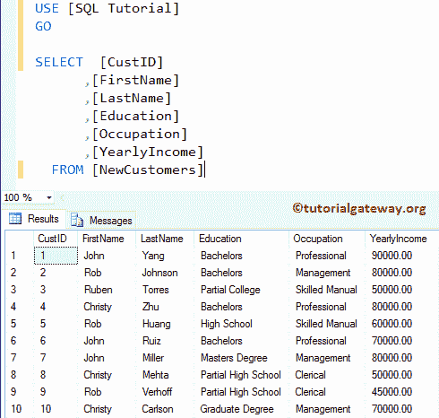
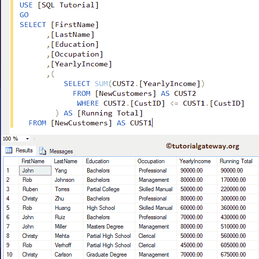
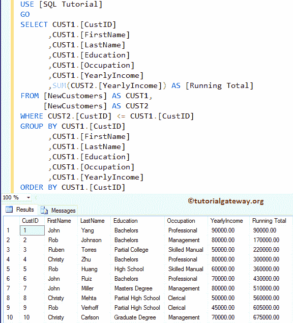
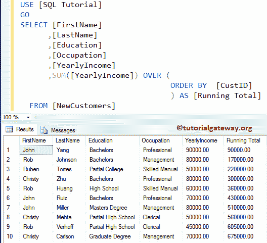

# 在 SQL 中计算运行总数

> 原文：<https://www.tutorialgateway.org/calculate-running-total-in-sql/>

如何在 SQL Server 中编写计算运行总数的查询，并举例说明。对于这个常见的面试问题，我们将使用下图所示的数据



## 计算 SQL 运行总数示例

在本例中，我们将向您展示如何使用[子查询](https://www.tutorialgateway.org/sql-subquery/)来查找运行总数。

```sql
SELECT [FirstName]
      ,[LastName]
      ,[Education]
      ,[Occupation]
      ,[YearlyIncome]
      ,(
	 SELECT SUM(CUST2.[YearlyIncome]) 
         FROM [NewCustomers] AS CUST2
         WHERE CUST2.[CustID] <= CUST1.[CustID]
	) AS [Running Total]
  FROM [NewCustomers] AS CUST1
```



此示例显示了如何使用[连接](https://www.tutorialgateway.org/sql-inner-join/)、[按](https://www.tutorialgateway.org/sql-group-by-clause/)分组和[按](https://www.tutorialgateway.org/sql-order-by-clause/)排序子句来计算运行总数。

```sql
SELECT CUST1.[CustID]
      ,CUST1.[FirstName]
      ,CUST1.[LastName]
      ,CUST1.[Education]
      ,CUST1.[Occupation]
      ,CUST1.[YearlyIncome]
      ,SUM(CUST2.[YearlyIncome]) AS [Running Total]
FROM [NewCustomers] AS CUST1,
     [NewCustomers] AS CUST2	   
WHERE CUST2.[CustID] <= CUST1.[CustID]
GROUP BY CUST1.[CustID]
	,CUST1.[FirstName]
        ,CUST1.[LastName]
        ,CUST1.[Education]
        ,CUST1.[Occupation]
        ,CUST1.[YearlyIncome]
ORDER BY CUST1.[CustID]
```



在这个 [SQL Server](https://www.tutorialgateway.org/sql/) 的例子中，我们将使用[求和](https://www.tutorialgateway.org/sql-sum-function/)函数找到运行总数，然后结束。

```sql
SELECT [FirstName]
      ,[LastName]
      ,[Education]
      ,[Occupation]
      ,[YearlyIncome]
      ,SUM([YearlyIncome]) OVER (
			          ORDER BY  [CustID]
				) AS [Running Total]
  FROM [NewCustomers]
```

更传统的方式是

```sql
SELECT [FirstName]
      ,[LastName]
      ,[Education]
      ,[Occupation]
      ,[YearlyIncome]
      ,SUM([YearlyIncome]) OVER (
			          ORDER BY  [CustID] ROWS UNBOUNDED PRECEDING
				) AS [Running Total]
  FROM [NewCustomers]
```

