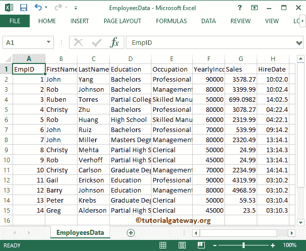

# 将数据从 SQL 导出到 CSV

> 原文：<https://www.tutorialgateway.org/export-data-from-sql-to-csv/>

当有关于将数据从 SQL Server 导出到 CSV 文件的讨论时，我们会立即寻找 [SQL Server 集成服务](https://www.tutorialgateway.org/ssis/)。但是，您可以轻松地从 [SSMS](https://www.tutorialgateway.org/sql/)获得相同的结果。在本文中，我们将通过一个实例向您展示将数据从 SQL 导出到 CSV 的多种方法。

对于第一个将数据从 SQL 导出到 CSV 的示例，我们将使用下面显示的记录。

## 将数据从 SQL 导出到 CSV–方法 1

在本例中，我们将把 SQL 教程数据库中的雇员表导出到本地硬盘中的 CSV 文件(我们将创建该文件)。为此，请选择所有列，或者单击左上角，或者从上下文菜单中选择全选选项。

选择所有列后，请转到左上角，右键单击将打开上下文菜单。请选择结果另存为..从它。

这将打开一个保存对话框，将文件保存在本地硬盘上。从下面的截图可以看到，我们是在 D 驱动器

保存文件

让我们导航到我们提供的文件系统地址，并检查文件名 EmployeeData。

双击 csv 文件查看结果

## 将数据从 SQL 导出到 CSV 方法 2

在对象浏览器中，右击[数据库](https://www.tutorialgateway.org/how-to-create-database-in-sql-server/)将打开上下文菜单。请选择任务，然后导出数据..将数据从 SQL 导出到 CSV 的选项。

选择该选项后，它将打开 SQL Server 导入和导出数据向导。第一页是欢迎页面，点击

不再显示此起始页选项，可以避开此页面

选择数据源页:此窗口用于配置记录来源。我们的来源是 [SQL Server](https://www.tutorialgateway.org/sql/) 数据库，所以我们选择了 SQL Server 原生客户端作为数据源。

接下来，我们使用 Windows 身份验证登录到 PRASAD 服务器实例。请实时使用 SQL Server 身份验证。

选择目的地:此窗口用于配置目的地(我们要将其复制到的位置)。

我们的目标是将数据保存到 CSV 文件中。所以我们选择平面文件目的地作为我们的目的地

请点击浏览按钮从我们的本地驱动器

中选择 CSV 文件

我们正在我们的 D 驱动器

中创建新的 CSV

单击打开按钮创建一个新的 CSV 文件。

接下来，选择要分配的格式。

指定表复制或查询:这里我们有两个选项将数据从 SQL 导出到 CSV

1.  从一个或多个表或视图中复制数据:此选项用于从现有表或视图(所有列)中进行选择
2.  编写一个查询来指定要传输的文件数据选项:在实时中，我们将使用这个选项。因为每个表中都会有不必要的列。所以最好避开它们或者选择有条件的数据。

此窗口用于从 SQL 数据库中选择源表。这里我们选择了“员工”表。

您可以根据需要更改行和列分隔符。如果使用文本文件作为目标，则可以进行许多自定义。点击预览按钮查看传入数据流

保存并运行包:此页面为我们提供了在 SQLServer或文件系统中保存包的选项。目前，我正在选择立即运行选项

点击完成按钮，完成【从 SQL 导出数据到 CSV 向导】

从下面的截图中，您可以观察到状态:成功和消息。

