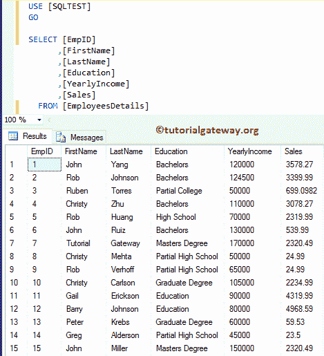
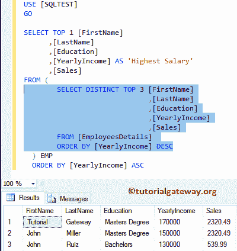
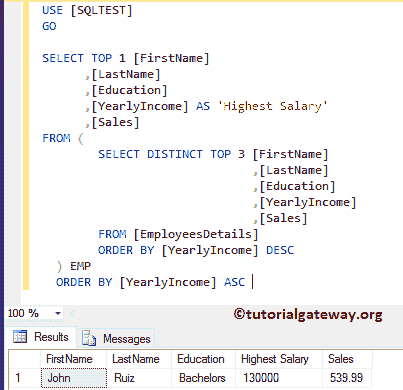
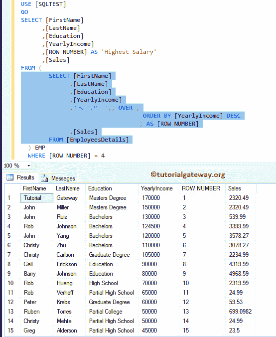
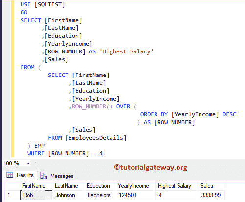
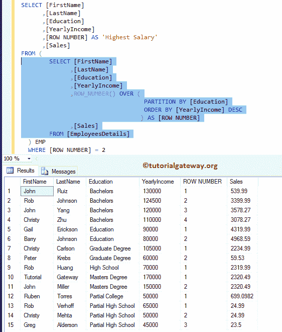
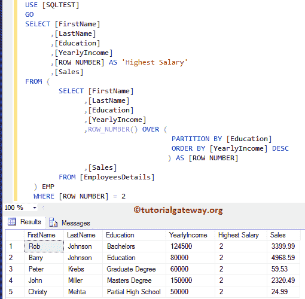

# 查找第 n 个最高工资的 SQL 查询

> 原文:[https://www . tutorialgateway . org/SQL-query-to-find-n-最高工资/](https://www.tutorialgateway.org/sql-query-to-find-nth-highest-salary/)

写一个 SQL Query 来查找第 n 个最高工资、第 2 个最高工资或第 3 个最高工资是最常见的面试问题。在本文中，我们将通过示例向您展示编写 SQL Server 查询以找到第 n 个最高工资的最佳方法。对于第 n 个最高工资演示，我们使用员工详细信息表。



## 查找第 n 个最高工资的 SQL 查询示例 1

在这个 [SQL Server](https://www.tutorialgateway.org/sql/) 的例子中，我们将使用[派生表](https://www.tutorialgateway.org/sql-derived-table/)的概念来寻找第三高的工资。

```
-- SQL Query to find 3rd Highest Salary 

SELECT TOP 1 [FirstName]
      ,[LastName]
      ,[Education]
      ,[YearlyIncome] AS 'Highest Salary'
      ,[Sales]
FROM (
        SELECT DISTINCT TOP 3 [FirstName]
			     ,[LastName]
			     ,[Education]
			     ,[YearlyIncome]
			     ,[Sales]
	FROM [EmployeesDetails] 
	ORDER BY [YearlyIncome] DESC
      ) EMP 
ORDER BY [YearlyIncome] ASC
```

From 子句中的查询是按薪资降序选择前三名员工。我建议你参考[顶条款](https://www.tutorialgateway.org/sql-top-clause/)，通过订购[。如果你想要第二高，那么在第一句](https://www.tutorialgateway.org/sql-order-by-clause/)

[](https://www.tutorialgateway.org/sql-order-by-clause/)

[中用 2 代替 3](https://www.tutorialgateway.org/sql-order-by-clause/)

主输出
和顶部[频繁](https://www.tutorialgateway.org/sql-interview-questions/)查询是按升序返回第一条记录顺序。



## 查找第四高工资的 SQL 查询示例 2

我们使用[行号](https://www.tutorialgateway.org/sql-row_number/)的概念来寻找第四高的工资。您也可以使用任何[等级功能](https://www.tutorialgateway.org/ranking-functions-in-sql-server/)，如:[等级](https://www.tutorialgateway.org/sql-rank-function/)、[密集等级](https://www.tutorialgateway.org/sql-dense_rank/)、 [Ntile](https://www.tutorialgateway.org/sql-ntile-function/) 来获得相同的结果。

```
SELECT [FirstName]
      ,[LastName]
      ,[Education]
      ,[YearlyIncome]
      ,[ROW NUMBER] AS 'Highest Salary'
      ,[Sales]
FROM (
        SELECT [FirstName]
	      ,[LastName]
	      ,[Education]
	      ,[YearlyIncome]
	      ,ROW_NUMBER() OVER (
		                   ORDER BY [YearlyIncome] DESC
		                  ) AS [ROW NUMBER]
	      ,[Sales]
	FROM [EmployeesDetails] 
      ) EMP 
WHERE [ROW NUMBER] = 4
```

如您所见，内部查询中的 Row_Number()根据年收入



给出排名

我们从内部查询中选择所需的等级。如果你想要第二高，那么在 where 子句中用 2 替换 4。



也可以用 SQL [CTE](https://www.tutorialgateway.org/sql-server-cte/) 得到同样的结果。

## 查找每个组中第 n 个最高工资的 SQL 查询

我们发现每个组的工资都是第二高的。这与我们在前面的示例中使用的查询相同，但是我们添加了 PARTITION BY 子句来分隔组。

```
SELECT [FirstName]
      ,[LastName]
      ,[Education]
      ,[YearlyIncome]
      ,[ROW NUMBER] AS 'Highest Salary'
      ,[Sales]
FROM (
        SELECT [FirstName]
	      ,[LastName]
	      ,[Education]
	      ,[YearlyIncome]
	      ,ROW_NUMBER() OVER (
		                   PARTITION BY [Education]
                                   ORDER BY [YearlyIncome] DESC
		                  ) AS [ROW NUMBER]
	      ,[Sales]
	FROM [EmployeesDetails] 
      ) EMP 
WHERE [ROW NUMBER] = 2
```

如您所见，内部查询中的 Row_Number()根据每个分区(教育)的年收入



给出了排名

我们从内部查询中选择所需的等级。同样，如果你想要最高 3nd，那么在 where 子句中用 3 替换 2。

