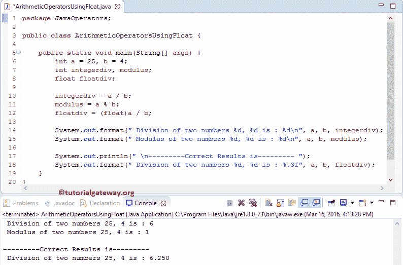

# Java 算术运算符

> 原文：<https://www.tutorialgateway.org/java-arithmetic-operators/>

Java 算术运算符包括算术加法、减法、乘法、除法和模数等运算符。所有这些 Java 算术运算符都是二进制运算符，这意味着它们对两个操作数进行运算。

下表用例子展示了 Java 编程语言中的所有算术运算符。

| Java 算术运算符 | 操作 | 例子 |
| + | 添加 | 10 + 3 = 13 |
| – | 减法 | 10 – 3 = 7 |
| * | 增加 | 10 * 3 = 30 |
| / | 分开 | 10 / 3 = 3 |
| % | 模数–它返回除法后的余数 | 10 % 3 = 1(此处余数为 1)。 |

## Java 算术运算符示例

这个 Java 程序允许用户插入两个整数变量 a，b。接下来，我们使用这两个变量在 Java 编程语言中执行各种算术运算。

```java
package JavaOperators;

import java.util.Scanner;

public class ArithmeticOperators {
	private static Scanner sc;

	public static void main(String[] args) {
		int a, b;
		int addition, subtraction, multiplication, division, modulus;
		sc = new Scanner(System.in);
		System.out.println("\n Please Enter two integer Value: ");
		a = sc.nextInt();
		b = sc.nextInt();

		addition = a + b; 
		subtraction = a - b; 
		multiplication = a * b; 
		division = a / b; 
		modulus = a % b; 

		System.out.format("\nAddition of two numbers %d, %d is : %d\n", a, b, addition);
		System.out.format("Subtraction of two numbers %d, %d is : %d\n", a, b, subtraction);
		System.out.format("Multiplication of two numbers %d, %d is : %d\n", a, b, multiplication);
		System.out.format("Division of two numbers %d, %d is : %d\n", a, b, division);
		System.out.format("Modulus of two numbers %d, %d is : %d\n", a, b, modulus);
	}
}
```

```java
Please Enter two integer Value: 
20
16

Addition of two numbers 20, 16 is : 36
Subtraction of two numbers 20, 16 is : 4
Multiplication of two numbers 20, 16 is : 320
Division of two numbers 20, 16 is : 1
Modulus of two numbers 20, 16 is : 4
```

当我们使用除法(/)运算符时，结果将完全取决于它所属的数据类型。例如，如果数据类型是整数，那么它将通过取整该值(7 / 3 = 2)来产生整数值。要获得正确的结果，请将数据类型更改为 float。请不要混淆，让我们再看一个例子，以便更好地理解。

## 使用浮点的 Java 算术运算符

在这个例子中，我们使用了两个变量 a 和 b，它们的值分别是 25 和 4。我们将使用这两个变量来展示我们在对 Int 和 Float Datatype 执行 Java 算术运算时通常面临的问题。

```java
// Java Program to Perform Division and Modulus on Float data type 

package JavaOperators;

public class ArithmeticOperatorsUsingFloat {

	public static void main(String[] args) {
		int a = 25, b = 4;
		int integerdiv, modulus;
		float floatdiv;

		integerdiv = a / b;
		modulus = a % b;
		floatdiv = (float)a / b;

		System.out.format(" Division of two numbers %d, %d is : %d\n", a, b, integerdiv);
		System.out.format(" Modulus of two numbers %d, %d is : %d\n", a, b, modulus);

		System.out.println(" \n---------Correct Results is--------- ");
		System.out.format(" Division of two numbers %d, %d is : %.3f", a, b, floatdiv);
	}
}
```



如果你观察上面的结果，对于相同的计算，我们得到两个不同的结果。因为对于第一个结果，a 和 b 都是整数，输出也是整数(integerdiv)。所以，编译器忽略小数点后的项，显示答案 6 而不是 6.250，a % b 是 1，因为余数是 1。

接下来，我们将输出数据类型更改为 float (floatdiv)，并将结果转换为 float 以获得我们想要的结果。使用除法运算符时要小心(类型转换在这里起着主要作用)。

## 使用哎呀的 Java 算术运算符

在这个 Java 算术运算符的例子中，我们使用面向对象编程来划分代码。为此，首先，我们将创建一个保存方法的类。

```java
package JavaOperators;

public class ArithmeticOperator {
	int addition, subtraction, multiplication, division, modulus;

	public int addition(int a, int b) {
		addition = a + b; 
		return addition;
	}
	public int subtraction(int a, int b) {
		subtraction = a - b; 
		return subtraction;
	}	
	public int multiplication(int a, int b) {
		multiplication = a * b; 
		return multiplication;
	}
	public int division(int a, int b) {
		division = a / b; 
		return division;
	}
	public int modulus(int a, int b) {
		modulus = a % b; 
		return modulus;
	}
}
```

在算术运算符示例的主程序中，我们将创建上述指定类的实例并调用方法。

```java
package JavaOperators;

import java.util.Scanner;

public class ArithmeticOperatorsUsingClass {
	private static Scanner sc;

	public static void main(String[] args) {
		int a, b;
		int addition, subtraction, multiplication, division, modulus;
		sc = new Scanner(System.in);
		System.out.println("\n Please Enter two integer Value: ");
		a = sc.nextInt();
		b = sc.nextInt();

		ArithmeticOperator arith = new ArithmeticOperator(); 
		addition = arith.addition(a, b); 
		subtraction = arith.subtraction(a, b);
		multiplication = arith.multiplication(a, b);
		division = arith.division(a, b);
		modulus = arith.modulus(a, b);

		System.out.format("\n Addition of two numbers %d, %d is : %d\n", a, b, addition);
		System.out.format(" Subtraction of two numbers %d, %d is : %d\n", a, b, subtraction);
		System.out.format(" Multiplication of two numbers %d, %d is : %d\n", a, b, multiplication);
		System.out.format(" Division of two numbers %d, %d is : %d\n", a, b, division);
		System.out.format(" Modulus of two numbers %d, %d is : %d\n", a, b, modulus);
	}
}
```

```java
 Addition of two numbers 12, 3 is : 15
 Subtraction of two numbers 12, 3 is : 9
 Multiplication of two numbers 12, 3 is : 36
 Division of two numbers 12, 3 is : 4
 Modulus of two numbers 12, 3 is : 0
```

算术运算符类分析:这里，我们声明了五个整数类型的函数，所有这些方法都接受两个整数参数。在这些函数中，我们使用 Java 算术运算符执行算术运算。

主要类别分析:

首先，我们创建了一个算术运算符类的实例/对象

```java
ArithmeticOperator arith = new ArithmeticOperator();
```

接下来，我们调用当前 [Java](https://www.tutorialgateway.org/java-tutorial/) 实例中所有可用的五个方法。所有这些方法都返回一个整数值，所以我们将返回值赋给相应的变量。

最后，我们使用下面的 System.out.format 语句来打印这些算术运算符。