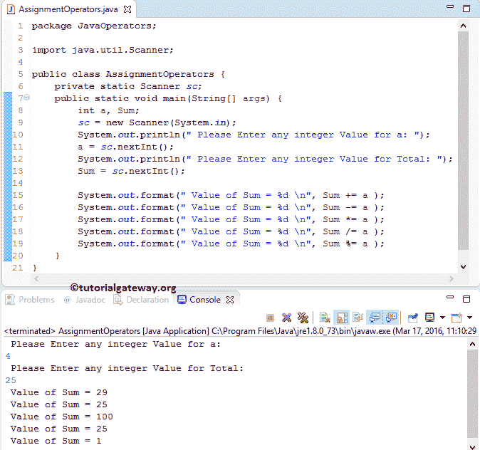

# Java 赋值运算符

> 原文：<https://www.tutorialgateway.org/java-assignment-operators/>

Java 赋值运算符用于将值赋给声明的变量。Equals ( =)运算符是 Java 中最常用的赋值运算符。例如:

```
int i = 25;
```

下表显示了 Java 编程语言中的所有赋值运算符。

| Java 赋值运算符 | 例子 | 说明 |
| = | x = 9 | 值 25 分配给 x |
| += | x += 9 | 这与 x = x + 9 相同 |
| -= | x -= 9 | 这与 x = x–9 相同 |
| *= | x *= 9 | 这与 x = x * 9 相同 |
| /= | x /= 9 | 这与 x = x / 9 相同 |
| %= | x %= 9 | 这与 x = x % 9 相同 |

## Java 赋值运算符示例

在这个 Java 程序中，我们使用了两个整数变量 a 和 Sum。接下来，我们将使用这两个变量来展示 Java 编程语言中所有赋值运算符的工作功能

```
package JavaOperators;

import java.util.Scanner;

public class AssignmentOperators {
	private static Scanner sc;
	public static void main(String[] args) {
		int a, Sum;
		sc = new Scanner(System.in);
		System.out.println(" Please Enter any integer Value: ");
		a = sc.nextInt();
		System.out.println(" Please Enter any integer Value for Total: ");
		Sum = sc.nextInt();

		System.out.format(" Value of Sum = %d \n", Sum += a );
		System.out.format(" Value of Sum = %d \n", Sum -= a );
		System.out.format(" Value of Sum = %d \n", Sum *= a );
		System.out.format(" Value of Sum = %d \n", Sum /= a );
		System.out.format(" Value of Sum = %d \n", Sum %= a );
	}
}

```



在这个赋值运算符示例中，第十行语句将要求用户输入整数值。接下来，在这个 [Java 程序](https://www.tutorialgateway.org/learn-java-programs/)中，我们将把用户输入值赋给整型变量 a。

[Java](https://www.tutorialgateway.org/java-tutorial/) 语句的第 12 行会要求用户输入整数值 Sum。然后，我们将把用户输入值赋给整数变量 Sum。

下一行，我们使用可用的赋值运算符对 a 和 Sum 变量执行所有赋值操作。让我们看看 Java 赋值运算符的功能

Sum += a 表示
Sum = Sum + a == > 25 + 4 = 29

Sum -= a 表示
Sum = Sum–a = =>29–4 = 25

Sum *= a 表示
Sum = Sum * a == > 25 * 4 = 100

Sum /= a 表示
Sum = Sum/ a == > 100 / 4 = 25

Sum%= a 表示
Sum = Sum % a = =>25% 4 = 1(25/4 的余数为= 1)