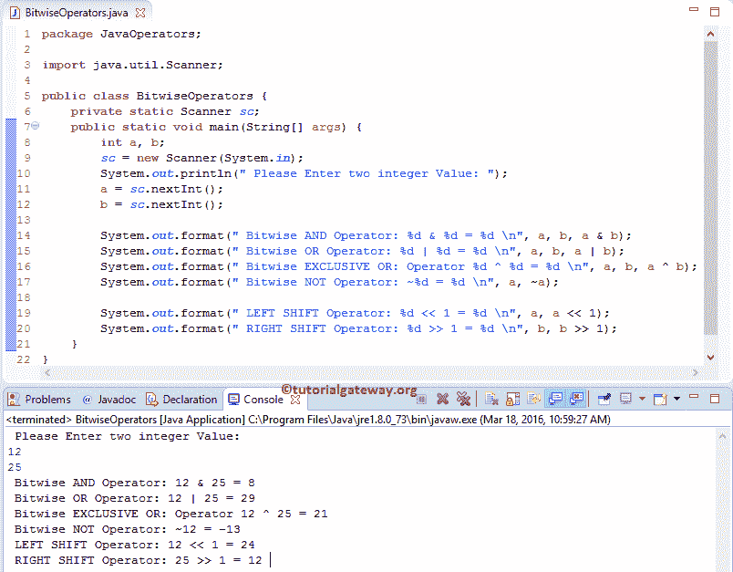

# Java 中的按位运算符

> 原文：<https://www.tutorialgateway.org/bitwise-operators-in-java/>

Java 编程中的按位运算符用于执行位操作。在 Java bitwise 中，所有十进制值将转换为二进制值(位序列，即 0100、1100、1000、1001 等。).Java 逐位运算符将处理这些位，例如将它们从左向右移动或将位值从 0 转换为 1 等。

下表显示了不同的 Java Bitwise 运算符及其含义。例如，考虑 x = 6 和 y = 8，它们的二进制形式的值是

x = 0110

y = 1000

| 经营者 | 意义 | 例子 |
| & | 和 | X & Y = 0000 |
| &#124; | 运筹学 | X &#124; Y = 1110 |
| ^ | 异或 | X ^ Y = 1110 |
| ~ | 补充 | ~ X = 00001001(Not 运算符将所有 0 转换为 1)。记住，N 的恭维将是-(N + 1) |
| << | 左移位 | X << 1 = 00001100(位将向左移动 1 步。如果我们使用 2 或 3，那么它们会相应地移动) |
| >> | 右移 | Y >> 1 = 00000100 |

让我们看看 Java 编程语言中按位运算符背后的真值表

| x | y | x & y | X &#124; y | x ^ y |
| Zero | Zero | Zero | Zero | Zero |
| Zero | one | Zero | one | one |
| one | Zero | Zero | one | one |
| one | one | one | one | Zero |

## Java 示例中的按位运算符

这个例子有助于实际理解 Java 按位运算符。这个程序允许用户输入两个整数变量 a 和 b，我们将使用这两个变量来显示各种操作。

```
package JavaOperators;

import java.util.Scanner;

public class BitwiseOperators {
	private static Scanner sc;
	public static void main(String[] args) {
		int a, b;
		sc = new Scanner(System.in);
		System.out.println(" Please Enter two integer Value: ");
		a = sc.nextInt();
		b = sc.nextInt();

		System.out.format(" Bitwise AND Operator: %d & %d = %d \n", a, b, a & b);
		System.out.format(" Bitwise OR Operator: %d | %d = %d \n", a, b, a | b);
		System.out.format(" Bitwise EXCLUSIVE OR: Operator %d ^ %d = %d \n", a, b, a ^ b);
		System.out.format(" Bitwise NOT Operator: ~%d = %d \n", a, ~a);

		System.out.format(" LEFT SHIFT Operator: %d << 1 = %d \n", a, a << 1);
		System.out.format(" RIGHT SHIFT Operator: %d >> 1 = %d \n", b, b >> 1);
	}
}
```



在这个 Java Bitwise Operators 示例中，前三个语句将要求用户输入整数值 a、b。接下来，我们将为变量分配用户输入值。

以下 System.out.format 语句将对 a 和 b 执行按位运算，然后显示输出

在这个 Java Bitwise Operators 示例中，我们将值赋值为 a = 12 和 b = 25。12 = 00001100 和 25 = 00011001 的二进制形式。

让我们看看 [Java](https://www.tutorialgateway.org/java-tutorial/) 的计算。

逐位与运算= a & b
00001100&00011001 = =>00001000 = 8

逐位或运算= a | | b
00001100 | | 00011001 = =>00011101 = 29

接下来，按位异或运算= a ^ b
00001100 | | 00011001 = =>00010101 = 21

补码运算= ~a
前面说过，N 的补码会是-(N + 1)。意思是–( 12+1)=-13

爪哇左移= a<< 1
00001100<T2【1】00011000 = 24

爪哇右移= b > > 1
00011001>T2】1 = 00001100 = 12