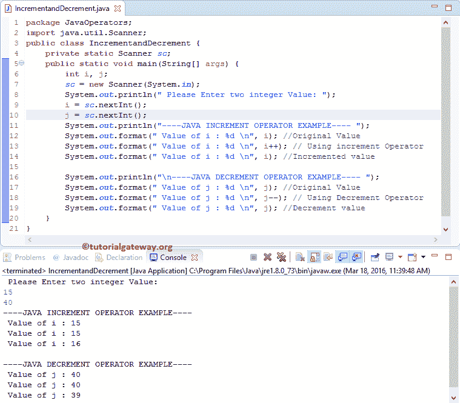

# Java 中的递增和递减运算符

> 原文：<https://www.tutorialgateway.org/increment-and-decrement-operators-in-java/>

Java 中的递增和递减运算符用于将值增加或减少 1。例如，Java 增量运算符++对于将现有变量值增加 1 (i = i + 1)非常有用。此外，Java 减量运算符––对于将当前值减 1(I = I–1)非常有用。Java 编程中递增和递减运算符的语法都是

```
Increment Operator : ++x or x++

Decrement Operator: --x or x--
```

## Java 示例中的递增和递减运算符

这个例子有助于实际理解 Java 中的递增和递减运算符。这个 Java 程序允许用户输入两个整数变量 I 和 j。接下来，我们使用这两个变量来显示 Java 递增和递减运算符的功能。

```
// Increment and Decrement Operators in Java Example

package JavaOperators;

import java.util.Scanner;

public class IncrementandDecrement {
	private static Scanner sc;
	public static void main(String[] args) {
		int i, j;
		sc = new Scanner(System.in);
		System.out.println(" Please Enter two integer Value: ");
		i = sc.nextInt();
		j = sc.nextInt();

	    System.out.println("----JAVA INCREMENT OPERATOR EXAMPLE---- \n");
		System.out.format(" Value of i : %d \n", i); //Original Value
		System.out.format(" Value of i : %d \n", i++); // Using increment Operator
		System.out.format(" Value of i : %d \n", i); //Incremented value

	    System.out.println("----JAVA DECREMENT OPERATOR EXAMPLE---- \n");
		System.out.format(" Value of j : %d \n", j); //Original Value
		System.out.format(" Value of j : %d \n", j--); // Using Decrement Operator
		System.out.format(" Value of j : %d \n", j); //Decrement value
	}
}
```



在这个 Java 递增和递减运算符示例中，第一条语句将要求用户输入整数值 I，j。接下来，我们将用户输入值赋给变量。

在第 13 行，我们使用了增量运算符。这意味着将首先返回 I 的值(即 15)，然后 I 值递增 1。

在第 14 行，我们再次调用 I 值，这次它显示 16，因为该值已经更新。减量运算符也是如此。

## Java 前增量和后增量

如果您观察以上语法，我们可以在操作数之前或之后分配递增和递减运算符。当++或——用在像++x、–x 这样的操作数之前时，我们称之为 Java 前缀。如果在操作数之后使用++或——比如 x++或 x —,那么我们称之为 Java 后缀。

让我们探索一下 Java 前缀和后缀功能

1.  +++I(预增量):它甚至在将 I 的值赋给变量 I 之前就将 I 的值递增。
2.  i++(后递增):Java Postfix 运算符将首先返回变量值(即 I 值)，然后只有 I 值递增 1。
3.  –I(预递减):它甚至会在将 I 的值赋给变量 I 之前就将其递减
4.  I –(后置递减):这个 [Java](https://www.tutorialgateway.org/java-tutorial/) 前缀运算符首先返回变量值(即 I 值)，然后只有 I 值递减 1。

### Java 前缀和后缀示例

这个前缀和后缀 [Java 程序](https://www.tutorialgateway.org/learn-java-programs/)将向你展示，如何使用 Java 递增和递减运算符作为前缀和后缀

```
// Java Pre Increment and Post Increment example

package JavaOperators;

public class PreandPostIncrement {
	public static void main(String[] args) {
		int i = 10, j = 20, x = 15, y = 65;

	    System.out.println("----JAVA PRE INCREMENT OPERATOR EXAMPLE---- ");
		System.out.format(" Value of i : %d \n", i); //Original Value
		System.out.format(" Value of i : %d \n", ++i); // Using Pre increment Operator
		System.out.format(" Value of Incremented i : %d \n", i); //Incremented value

	    System.out.println("\n----JAVA POST INCREMENT OPERATOR EXAMPLE---- ");
		System.out.format(" Value of j : %d \n", j); //Original Value
		System.out.format(" Value of j : %d \n", j++); // Using Post increment Operator
		System.out.format(" Value of Incremented j : %d \n", j); //Incremented value

	    System.out.println("\n----JAVA PRE DECREMENT OPERATOR EXAMPLE---- ");
		System.out.format(" Value of x : %d \n", x); //Original Value
		System.out.format(" Value of x : %d \n", --x); // Using Pre Decrement Operator
		System.out.format(" Value of Decremented x : %d \n", x); //Decremented value

	    System.out.println("\n----JAVA POST DECREMENT OPERATOR EXAMPLE---- ");
		System.out.format(" Value of y : %d \n", y); //Original Value
		System.out.format(" Value of y : %d \n", y--); // Using Pre Decrement Operator
		System.out.format(" Value of Decremented y : %d \n", y); //Decremented value
	}
}
```

```
----JAVA PRE INCREMENT OPERATOR EXAMPLE---- 
 Value of i : 10 
 Value of i : 11 
 Value of Incremented i : 11 

----JAVA POST INCREMENT OPERATOR EXAMPLE---- 
 Value of j : 20 
 Value of j : 20 
 Value of Incremented j : 21 

----JAVA PRE DECREMENT OPERATOR EXAMPLE---- 
 Value of x : 15 
 Value of x : 14 
 Value of Decremented x : 14 

----JAVA POST DECREMENT OPERATOR EXAMPLE---- 
 Value of y : 65 
 Value of y : 65 
 Value of Decremented y : 64 
```

虽然递增和递减运算符主要用于`for`循环、While 和 Do-`while`循环。这里，我们没有给出任何例子，因为理解循环概念还为时过早。尝试理解 Java 前缀和后缀的概念。这样就可以轻松理解`if`语句、`for`循环、`while`循环和 do-`while`循环的语法。