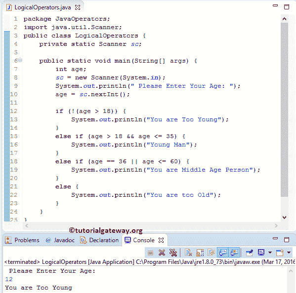

# Java 逻辑运算符

> 原文：<https://www.tutorialgateway.org/java-logical-operators/>

Java 逻辑运算符组合两个或多个条件，并使用&&(逻辑与)、||(逻辑或)和来执行逻辑运算！(逻辑非)。

Java 关系运算符比较两个变量，如果我们想要比较多个条件呢？很简单，Java 逻辑运算符就可以了。下表通过示例描述了 Java 逻辑运算符

| 经营者 | 名字 | 描述 | 例子 |
| && | 和 | 当两个条件都为真时，它将返回真 | 如果(年龄> 18 &&年龄< = 25) |
| &# 124;&# 124; | 运筹学 | 当至少一个条件为真时，这将返回真 | If(年龄== 35 &# 124;&# 124;年龄< 60) |
| ！ | 逻辑非 | 如果条件为真，逻辑“非”运算符将使其为假 | 如果年龄= 18 岁那么！(年龄= 18)返回 false。 |

让我们看看 Java 中逻辑运算符背后的真值表，以便更好地理解

&& (Java 逻辑与)真值表

| 条件 1 | 条件 2 | 条件 1 和条件 2 |
| 真实的 | 真实的 | 真实的 |
| 真实的 | 错误的 | 错误的 |
| 错误的 | 真实的 | 错误的 |
| 错误的 | 错误的 | 错误的 |

|| (Java 逻辑或)真值表

| 条件 1 | 条件 2 | 条件 1 &# 124;&# 124;条件 2 |
| 真实的 | 真实的 | 真实的 |
| 真实的 | 错误的 | 真实的 |
| 错误的 | 真实的 | 真实的 |
| 错误的 | 错误的 | 错误的 |

## Java 逻辑运算符示例

这个例子将有助于了解如何在`if`语句中使用 Java 编程中的逻辑运算符。对于这个例子，我们使用一个整数变量。在`if`语句中，我们使用了 Java 中的关系运算符和逻辑运算符来执行条件检查。

```
// Using Logical Operators in Else If Statement

package JavaOperators;

import java.util.Scanner;

public class LogicalOperators {
	private static Scanner sc;

	public static void main(String[] args) {
		int age;
		sc = new Scanner(System.in);
		System.out.println(" Please Enter Your Age: ");
		age = sc.nextInt();

		if (!(age > 18)) {
			System.out.println("You are Too Young");
		}
		else if (age > 18 && age <= 35) {
			System.out.println("Young Man");
		}
		else if (age == 36 || age <= 60) {
			System.out.println("You are Middle Age Person");
		}
		else {
			System.out.println("You are too Old");
		}
	}
}
```

从下面的 [Java](https://www.tutorialgateway.org/java-tutorial/) 截图，看到我们输入的年龄= 12。意思是年龄不大于 18 岁。所以，第一份声明打印出来了。



让我们看看当我们 28 岁改变价值观时会发生什么。意思是年龄在 18 到 35 岁之间。于是，第二份声明打印出来了。

```
 Please Enter Your Age: 
28
Young Man
```

这一次，我们进入了年龄= 56 岁。意思是年龄在 36 到 60 岁之间。于是，第三份声明打印出来了。

```
 Please Enter Your Age: 
56
You are Middle Age Person
```

我们的年龄= 65 岁。因此，它在 else 块中打印消息

```
 Please Enter Your Age: 
65
You are too Old
```

在本例中，第一条语句将要求用户输入他/她的年龄。接下来，我们将把用户输入值赋给一个变量。

`if`语句中的以下 Java 逻辑运算符将检查年龄是否不大于 18 岁(技术上，年龄是否小于 18 岁)。如果条件为真，则执行 If 块中的语句

以下其他条件将检查年龄是否大于 18 岁，年龄是否小于或等于 35 岁。如果这两个条件都为真，则执行 Else If 块中的语句。

Java 逻辑运算符示例中的下一个 if 条件检查年龄是否等于 36，年龄是否小于或等于 60。如果这两个条件都为真，则执行 Else If 块中的语句。

如果一切都失败了，那么 else 块中的语句“你太老了”就会被执行。