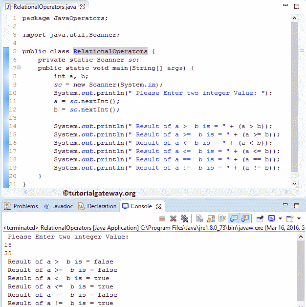

# Java 中的关系运算符

> 原文：<https://www.tutorialgateway.org/relational-operators-in-java/>

Java 编程中的关系运算符主要用于 If 条件或循环中。Java 关系运算符通常用于检查两个变量之间的关系。如果关系为真，那么它将返回布尔真。如果关系为假，那么它将返回布尔假。

下表用例子展示了 Java 编程中的所有关系运算符。

| Java 中的关系运算符 | 使用 | 描述 | 例子 |
| > | a > b | a 大于 b | 5 > 2 返回真 |
| < | a < b | a 小于 b | 5 < 2 返回假 |
| >= | a >= b | a 大于或等于 b | 5 >= 2 返回真 |
| <= | a <= b | a 小于或等于 b | 5 <= 2 返回假 |
| == | a == b | a 等于 b | 5 == 2 返回假 |
| ！= | a！= b | a 不等于 b | 5 != 2 返回真 |

## Java 示例中的关系运算符

这个例子有助于实际理解 Java 关系运算符。

这个 Java 程序允许用户输入两个整数变量 a 和 b。接下来，我们使用这两个变量来执行 Java 编程语言中存在的各种关系操作。

```
package JavaOperators;

import java.util.Scanner;

public class RelationalOperators {
	private static Scanner sc;
	public static void main(String[] args) {
		int a, b;
		sc = new Scanner(System.in);
		System.out.println(" Please Enter two integer Value: ");
		a = sc.nextInt();
		b = sc.nextInt();

		System.out.println(" Result of a >  b is = " + (a > b));
		System.out.println(" Result of a >=  b is = " + (a >= b));
		System.out.println(" Result of a <  b is = " + (a < b));
		System.out.println(" Result of a <=  b is = " + (a <= b));
		System.out.println(" Result of a ==  b is = " + (a == b));
		System.out.println(" Result of a !=  b is = " + (a != b));
	}
}
```



在这个关系运算符示例中，下面的语句将要求用户输入整数值 a、b。接下来，我们将把用户输入值赋给变量。

```
System.out.println(" Please Enter two integer Value: ");
a = sc.nextInt();
b = sc.nextInt();
```

在下一行中，我们对照我们拥有的每个关系运算符来检查这些值

## 在 If 条件下使用 Java 关系运算符

这个例子将有助于理解 Java 编程中的关系运算符如何在 If 条件中使用。对于这个例子，我们使用`if`语句中的两个变量 a 和 b 以及关系运算符来执行条件检查。

```
package JavaOperators;

import java.util.Scanner;

public class RelationalOperatorsinIf {
	private static Scanner sc;
	public static void main(String[] args) {
		int a, b;
		sc = new Scanner(System.in);
		System.out.println("Please Enter two integer Value: ");
		a = sc.nextInt();
		b = sc.nextInt();

		if (a == b) {
			System.out.println("a is equal to b");
		}
		else {
			System.out.println("a is NOT equal to b");
		}
	}
}
```

从 [Java 程序](https://www.tutorialgateway.org/learn-java-programs/)输出中，可以观察到我们输入了 a = 22，b = 65。意思是 a 不等于 b .于是，第二个 [Java](https://www.tutorialgateway.org/java-tutorial/) 语句打印出来了。

```
Please Enter two integer Value: 
22
65
a is NOT equal to b
```

让我们看看当我们改变价值观时会发生什么。从下面的截图中，看到我们输入了 a= 12 和 b= 12。意思是 a 等于 b。所以，打印第一个语句。

```
Please Enter two integer Value: 
12
12
a is equal to b
```

在这个 Java 关系运算符示例中，前三个语句将要求用户输入整数值 a、b，并将用户输入值分配给受关注的变量。

关系运算符 If 条件

如果 x 等于 y，则执行 [If 条件](https://www.tutorialgateway.org/java-if-statement/)块内的语句。

```
System.out.println("a is equal to b");
```

如果 x 不等于 y，则执行 If 条件块中的语句。

```
System.out.println("a is NOT equal to b");
```