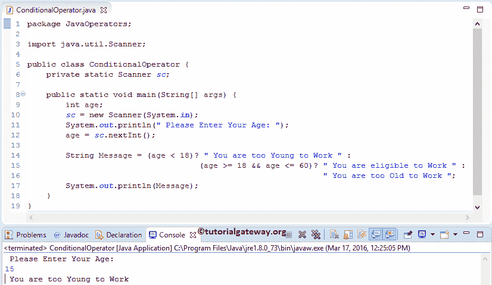

# Java 三元运算符

> 原文：<https://www.tutorialgateway.org/java-ternary-operator/>

Java 三元运算符也称为条件运算符。Java 三元或条件运算符主要用于决策过程中返回真或假。这个三元运算符返回的语句取决于给定的表达式结果。Java 编程中条件运算符的基本语法如下所示:

```
Test_expression ? statement1: statement2
```

如果给定的测试条件或布尔表达式计算结果为真，那么 Java 条件运算符将返回 statement1。如果条件评估为 false，则返回 statement2。

## Java 三元运算符示例

在本程序中，我们将使用三元或条件运算符来确定该人是否有资格投票。

```
package JavaOperators;

import java.util.Scanner;

public class TernaryOperator {
	private static Scanner sc;

	public static void main(String[] args) {
		int age;
		sc = new Scanner(System.in);
		System.out.println(" Please Enter Your Age: ");
		age = sc.nextInt();

		String Message = (age >= 18)? " You are eligible to Vote " : 
					      " You are Not eligible to Vote ";
		System.out.println(Message);

		/** REPLACE THE ABOVE CODE WITH FOLLOWING CODE
		 * 		System.out.println((age >= 18)? 
		 *		" You are eligible to Vote":
                 *       "You are Not eligible to Vote");
		 */			
	}
}
```

这个 Java 三元运算符程序允许用户输入他或她的年龄，并将用户输入的整数值赋给年龄变量。如果用户输入的值是 18 或更高，那么它将在？符号到字符串变量消息。“你有资格投票”

如果他/她输入低于 18，那么第二个语句(在:符号之后)将被分配给字符串变量 Message。“你没有资格投票”

最后，我们使用 [Java](https://www.tutorialgateway.org/java-tutorial/) System.out.println 语句来打印 Message 变量中的字符串数据

```
 Please Enter Your Age: 
15
 You are Not eligible to Vote 
```

让我们尝试不同的价值

```
 Please Enter Your Age: 
29
 You are eligible to Vote
```

### Java 示例中的嵌套条件运算符

在这个[程序](https://www.tutorialgateway.org/learn-java-programs/)中，我们将使用 Java 中的嵌套三元运算符来查找这个人是否有资格工作。

1.  在这个 java 三元运算符示例中，我们声明了一个名为 Message 的字符串变量，并将这个变量赋给了条件函数。
2.  第一个条件检查年龄是否小于 18 岁。如果此条件为真，则它将返回？象征，你太年轻，不能工作
3.  当三元组中的第一个条件失败时，它将在:符号后执行变量。通过使用嵌套条件运算符，我们在此处又检查了一个条件(年龄> = 18 &&年龄< = 60)。如果此条件为真，则它将返回？符号，即你有资格工作
4.  如果条件的嵌套条件失败，那么三元运算符 java 将在:符号之后执行变量，即“你太老了，不能工作”。

```
package JavaOperators;

import java.util.Scanner;

public class ConditionalOperator {
	private static Scanner sc;

	public static void main(String[] args) {
		int age;
		sc = new Scanner(System.in);
		System.out.println(" Please Enter Your Age: ");
		age = sc.nextInt();

		String Message = (age < 18)? " You are too Young to Work " :
                    		  	     (age >= 18 && age <= 60)? " You are eligible to Work ": 
                    				      		       " You are too Old to Work ";
		System.out.println(Message);
	}
}
```



产出 2

```
 Please Enter Your Age: 
28
 You are eligible to Work
```

```
 Please Enter Your Age: 
65
 You are too Old to Work 
```