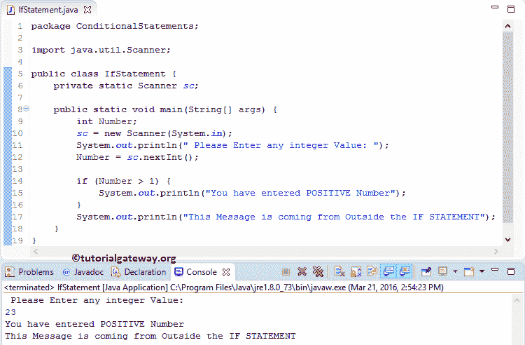

# Java`if`语句

> 原文：<https://www.tutorialgateway.org/java-if-statement/>

在现实编程中，Java`if`语句是最有用的决策代码之一。Java`if`语句允许编译器首先测试条件，并根据结果执行代码块。如果测试条件为真，则只运行`if`语句中的代码。

## Java`if`语句语法

如果 Java 编程语言中的语句具有返回真或假的简单结构:

```
if (test condition)  {

    Statement1;
    Statement2;
    Statement3;
    ………….
    ………….
    StatementN;
}
```

从上面的代码片段中，当测试条件为真时，则状态 1、状态 2、状态 3、……。，StatementN 将被执行。否则，Java`if`语句中的所有语句都将跳过。让我们看看流程图，以便更好地理解。

###`if`语句流程图

下图将展示这个 Java`if`语句


背后的流程图

如果测试条件为真，则执行 STATEMENT1，然后执行 STATEMENTN。当表达式的计算结果为假时，STATEMENTN 将运行。因为它在 if 条件块之外，与条件结果无关，让我们看一个例子，以便更好地理解。

## Java`if`语句示例

这个 Java`if`语句程序允许用户输入任何正整数，它将使用`if`语句检查一个数是否为正。

```
package ConditionalStatements;

import java.util.Scanner;

public class IfStatement {
	private static Scanner sc;

	public static void main(String[] args) {
		int Number;
		sc = new Scanner(System.in);		
		System.out.println("Please Enter any integer Value: ");
		Number = sc.nextInt();

		if (Number > 1) {
			System.out.println("\nYou have entered POSITIVE Number");
		}
	}

}
```

你可以观察到我们输入了 25 作为数字，这个程序会检查 25 是否大于 1。我们都知道它是 True，就是在花括号({})里面打印(System.ot.println 函数)。

```
Please Enter any integer Value: 
25

You have entered POSITIVE Number
```

如果条件不要求花括号容纳一行，但是对于多行或多组代码行，它是强制性的。在`if`语句后面使用花括号总是一种好的做法。让我们更改该值来检查当 Java 条件失败时会发生什么？(数量< 1)。

```
Please Enter any integer Value: 
-5 
```

它什么也不打印，因为在`if`语句块之后我们没有什么可打印的。我猜你对结果感到困惑。让我们再看一个例子。

## Java`if`语句示例 2

这个 If 条件[程序](https://www.tutorialgateway.org/learn-java-programs/)允许你输入任意正整数，它会检查一个数是否为正。

```
package ConditionalStatements;

import java.util.Scanner;

public class IfStatement {
	private static Scanner sc;

	public static void main(String[] args) {
		int Number;
		sc = new Scanner(System.in);		
		System.out.println(" Please Enter any integer Value: ");
		Number = sc.nextInt();

		if (Number > 1) {
			System.out.println("You have entered POSITIVE Number");
		}
		System.out.println("This Message is coming from Outside the IF STATEMENT");
	}
}
```



从上面的输出可以看出， [Java](https://www.tutorialgateway.org/java-tutorial/) 打印了 System.ot.println 两个函数，因为 23 大于 1。让我们尝试负值来故意使条件失效。

```
 Please Enter any integer Value: 
-50
This Message is coming from Outside the IF
```

这里，条件失败(数字< 1)。它不打印`if`语句块中的任何内容，因此它只打印块外的一个 System.ot.println 函数。