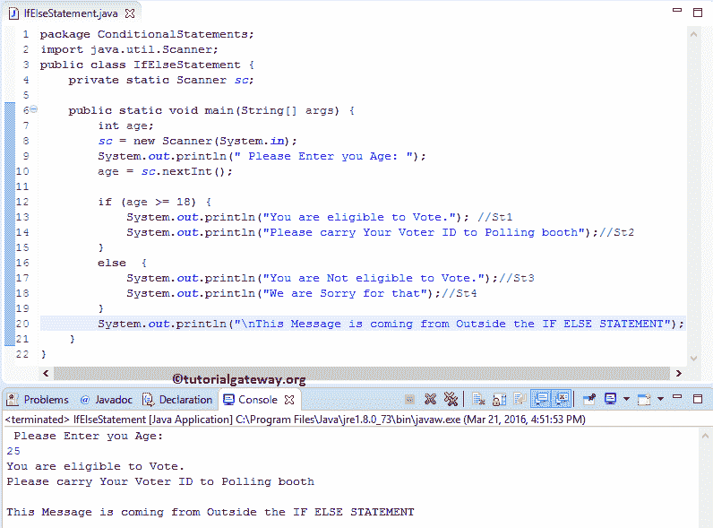

# Java `if-else`语句

> 原文：<https://www.tutorialgateway.org/java-if-else-statement/>

Java `if-else`语句是`if`语句的扩展。我们已经看到，If 子句只在测试条件为真时执行代码块。如果条件为假，它将终止。在实时情况下，当条件失败时，需要执行一些操作反而是有帮助的。为此，Java 引入了`if-else`语句。

在 Java `if-else`语句中，else 块在条件失败时执行代码。让我们看看 Java `if-else`语句的语法:

## Java `if-else`语句语法

Java 编程语言中的`if-else`语句背后的语法如下:

```
if (Test_condition)  {
     //If the condition is TRUE, these lines will execute
     True_statements;
}

else  {
     //If the condition is FALSE, these lines will execute
     False_statements;
}
```

如果上述语法中的 test_condition 为真，将运行 true 语句。此外，如果 test_condition 结果为假，将执行 false 语句。让我们看看流程图，以便更好地理解。

### Java `if-else`语句的流程图

下图显示了 Java `if-else`语句流程图


如果测试条件的结果为真，STATEMENT1 将执行。接下来，执行 STATEMENTN。如果结果为假，STATEMENT2 将执行，然后是 STATEMENTN。在这里，不管测试结果如何，STATEMENTN 都会执行。因为它不在 if else 代码块中，并且对测试条件结果没有影响。

## Java `if-else`语句示例

这个 [Java 程序](https://www.tutorialgateway.org/learn-java-programs/)允许用户输入他/她的年龄。接下来，Javac 将使用 [If](https://www.tutorialgateway.org/java-if-statement/) else 语句验证他是否有资格投票。为了演示 Java `if-else`语句，我们放置了 4 个不同的`System.out.println()`函数。如果测试结果为真， [Java](https://www.tutorialgateway.org/java-tutorial/) 编译器将打印其中两个，如果为假，则打印另外两个。

```
package ConditionalStatements;

import java.util.Scanner;

public class IfElseStatement {
	private static Scanner sc;

	public static void main(String[] args) {
		int age;
		sc = new Scanner(System.in);		
		System.out.println(" Please Enter you Age: ");
		age = sc.nextInt();

		if (age >= 18) {
			System.out.println("You are eligible to Vote."); //St1
			System.out.println("Please carry Your Voter ID to Polling booth");//St2
		}
		else  {
			System.out.println("You are Not eligible to Vote.");//St3
			System.out.println("We are Sorry for that");//St4
		}
		System.out.println("This Message is coming from Outside the IF ELSE STATEMENT");
	}
}
```

分析:用户将进入他们的年龄。如果年龄大于或等于 18 岁，将打印 St1、St2。如果他们的年龄小于 18 岁，St3 和 St4 将作为输出打印。我们还在 If Else 块外放置了一个`System.out.println()`函数。无论条件结果如何，该行都将执行。让我们假设年龄= 25 岁。条件(25 >= 18)为真



让我们进入年龄= 17 岁，故意不满足条件。条件(17 >= 18)为假。

```
Please Enter you Age: 
17
You are Not eligible to Vote.
We are Sorry for that

This Message is coming from Outside the IF ELSE STATEMENT
```