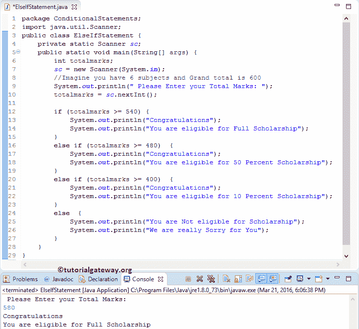

# Java 否则如果语句

> 原文:[https://www.tutorialgateway.org/java-else-if-statement/](https://www.tutorialgateway.org/java-else-if-statement/)

Java`else if`语句是 Java`if-else`语句的扩展，当我们必须比较几个条件时，它非常有用。我们也可以使用嵌套的`if`语句来执行同样的操作。然而，随着条件数量的增加，代码的复杂性也会增加。让我们看看 Java 编程中 Else if 的语法:

## Java `else if`语句语法

Java 编程语言中的 Else If 的语法如下:

```
if(condition1)
          statement1
else if (condition2)
          statement2
      ...........
else if(conditionN)
          statementN
else
    default statements
```

Java`else if`语句通过顺序执行来有效地处理多个条件。它将检查第一个条件，如果表达式计算为真，那么它将运行该块中存在的语句。当表达式计算为假时，Java 将检查下一个(否则如果条件)等等。会有条件 1、条件 2 为真的情况，例如:

x = 18，y = 14

条件 1: if(x！= y)//真

条件 2:否则如果(x > y)//真

在这些情况下，条件 1 下的代码将会执行，因为 Java ELSE IF 条件只有在其先前的`if`语句失败时才会执行。

## Java `else if`语句示例

该程序允许用户输入他/她的总分(总共六个科目分数)。通过使用 Java Else if，我们将计算他/她是否有资格获得奖学金。

请参考 [Java 编程](https://www.tutorialgateway.org/java-tutorial/)中 [Java If Else](https://www.tutorialgateway.org/java-if-else-statement/) 和[嵌套`if`](https://www.tutorialgateway.org/nested-if-in-java-programming/) 的文章。

```
package ConditionalStatements;

import java.util.Scanner;

public class ElseIfStatement {
	private static Scanner sc;

	public static void main(String[] args) {
		int totalmarks;
		sc = new Scanner(System.in);		
		//Imagine you have 6 subjects and Grand total is 600 
		System.out.println(" Please Enter your Total Marks: ");
		totalmarks = sc.nextInt();

		if (totalmarks >= 540) {
			System.out.println("Congratulations"); 
			System.out.println("You are eligible for Full Scholarship");
		}
		else if (totalmarks >= 480)  {
			System.out.println("Congratulations"); 
			System.out.println("You are eligible for 50 Percent Scholarship");
		}
		else if (totalmarks >= 400)  {
			System.out.println("Congratulations"); 
			System.out.println("You are eligible for 10 Percent Scholarship");
		}
		else  {
			System.out.println("You are Not eligible for Scholarship"); 
			System.out.println("We are really Sorry for You");
		}
	}
}
```

输出 1:在下面的 Java`else if`语句截图中，我们输入了 totalmarks = 580。这里，第一个“如果”条件为真。因此，将执行第一个 If 块中的代码。



我们将输入 totalmarks = 510 表示第一个 IF 条件为 FALSE。它将检查 Java else if(总标记> = 480)，这是真的。因此，它将打印这个块内的语句。虽然 Totalmarks >= 400 表达式结果为真，但它不会检查此条件。

```
Please Enter your Total Marks: 
510
Congratulations
You are eligible for 50 Percent Scholarship
```

输出 3:总标记= 450 表示第一个中频条件，总标记> = 480 为假。因此，它将检查总计标记> = 401，这是真的。因此，它将打印这个块内的语句。

```
Please Enter your Total Marks: 
450
Congratulations
You are eligible for 10 Percent Scholarship
```

输出 4:我们输入的总分= 380 表示所有的中频条件都失败了。因此，它将在 else 块中打印语句。

```
Please Enter your Total Marks: 
380
You are Not eligible for Scholarship
We are really Sorry for You
```