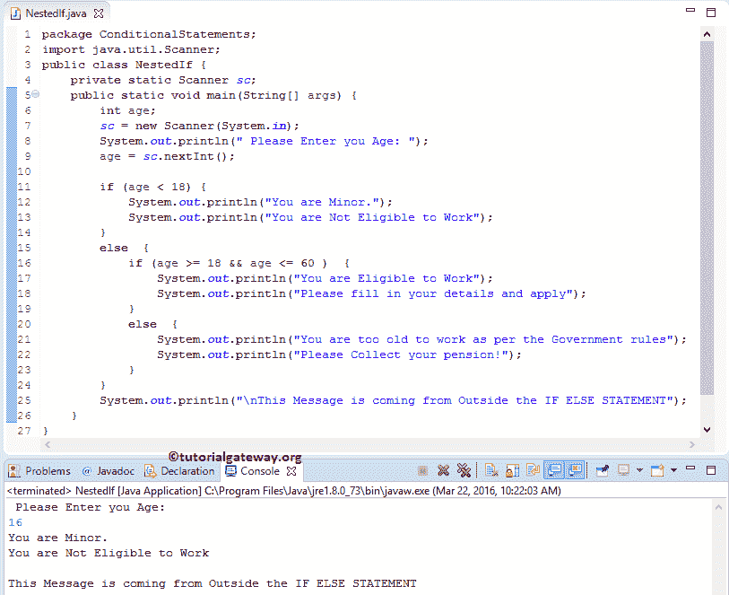

# Java 编程中的嵌套 If

> 原文:[https://www . tutorialgateway . org/nested-if-in-Java-programming/](https://www.tutorialgateway.org/nested-if-in-java-programming/)

如果我们把 if 语句放在另一个 If 块中，在 Java 编程中叫做嵌套 If。Java If Else 语句允许我们根据表达式结果(真、假)打印不同的语句。有时，即使条件为真，我们也必须进一步检查。在这些情况下，我们可以使用 Java 嵌套 IF 语句，但是使用时请小心。

例如，每个人都有资格工作，如果他 18 岁或以上，否则他就没有资格。但是，公司不会给每个人发帖子。因此，我们使用另一个 If 语句，也称为 Java 嵌套 IF 语句来验证他的教育技能或任何特殊的公司要求。在进入示例之前，让我们看看 Java 中嵌套 If 的语法。

## Java 语法中的嵌套 If

Java 编程语言中的嵌套 If 如下:

```
if ( test condition 1)  {

     //If the test condition 1 is TRUE then, it will check for test condition 2
     if ( test condition 2)  {
          //If the test condition 2 is TRUE, these statements will be executed
          Test condition 2 True statements;
     }
     else  {
          //If the test condition 2 is FALSE, these lines will be executed
          Test condition 2 False statements;
     }
else  {
     //If the test condition 1 is FALSE then these lines will be executed
     Test condition 1 False statements;
}
```

### Java 流程图中的嵌套 If

下图将显示 Java 嵌套 If 语句的流程图。


Java 嵌套 If 语句的执行流程是

*   如果条件 1 为假，则 STATEMENT3 将执行。
*   如果测试条件 1 为真，它将检查测试条件 2
    *   表达式为真，则语句 1 将执行
    *   否则执行陈述 2。

## Java 编程示例中的嵌套 If

Java 程序中的嵌套 If else 允许用户输入他/她的年龄，我们将把它存储在可变年龄中。如果给定的年龄小于 18 岁，我们将打印两个报表。当条件失败时，我们将再检查一个条件(嵌套)，如果成功，我们将打印一些东西。如果表达式结果失败，我们打印一些其他的东西。

请参考 [Java 编程](https://www.tutorialgateway.org/java-tutorial/)中 [Java If Else](https://www.tutorialgateway.org/java-if-else-statement/) 和 [IF 条件](https://www.tutorialgateway.org/java-if-statement/)的文章

```
package ConditionalStatements;

import java.util.Scanner;

public class NestedIf {
	private static Scanner sc;

	public static void main(String[] args) {
		int age;
		sc = new Scanner(System.in);		
		System.out.println(" Please Enter you Age: ");
		age = sc.nextInt();

		if (age < 18) {
			System.out.println("You are Minor."); 
			System.out.println("You are Not Eligible to Work");
		}
		else  {
			if (age >= 18 && age <= 60 )  {
				System.out.println("You are Eligible to Work");
				System.out.println("Please fill in your details and apply");
			}
			else  {
				System.out.println("You are too old to work as per the Government rules");
				System.out.println("Please Collect your pension!");
			}
		}
		System.out.println("\nThis Message is coming from Outside the IF ELSE STATEMENT");
	}
}
```

在这个 Java 嵌套 if else 程序中，如果这个人的年龄小于 18 岁，那么他就没有资格工作。如果该人的年龄大于或等于 18 岁，则第一个表达式失败。它将检查 else 语句。在 Else 语句中，还有另一个 if 条件(称为嵌套 If)。

*   它将检查该人的年龄是否大于或等于 18 岁，小于或等于 60 岁。如果表达式评估为真，那么他可以申请这份工作。
*   如果嵌套条件为假，那么他太老了，不能按照政府的规定工作。
*   我们还在 If Else 块之外放置了一个 System.out.println 函数，不管表达式结果如何，它都会执行。

输出 1:从下面的 Java 嵌套 if 截图中，可以观察到我们进入了 16 岁。这里，第一个“如果”条件为真。因此，将执行第一个 if 块中的语句。



我们将进入年龄，因为 25 意味着第一个 IF 表达式为 FALSE。它会去别的街区。在 else 块中，Javac 将检查 if(年龄> = 18 &&年龄< =60)，该值为真。所以它会把代码打印在这个块里面。

```
Please Enter you Age:
25
You are Eligible to Work
Please fill in your details and apply

This Message is coming from Outside the IF ELSE STATEMENT
```

第三个输出:这一次，我们将输入 61 岁来测试 Java 嵌套 If。这意味着第一个中频条件为假。它会去别的街区。在 else 块中，Javac 编译器将检查 if(年龄> = 18 &&年龄<=60), which is FALSE. That is why this [程序](https://www.tutorialgateway.org/learn-java-programs/)是否将打印子 else 块中的代码。

```
Please Enter you Age:
61
You are too old to work as per the Government rules
Please Collect your pension!

This Message is coming from Outside the IF ELSE STATEMENT
```