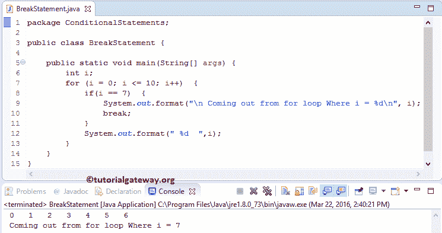

# Java `break`语句

> 原文:[https://www.tutorialgateway.org/java-break-statement/](https://www.tutorialgateway.org/java-break-statement/)

在任何编程语言中，Java break 和 continue 是用来改变程序流程的两个重要语句。

在 Java 编程中，循环对于执行特定的代码块 n 次直到测试条件为假是有用的。在某些情况下，我们必须停止循环，而不完成代码的所有谎言。在这些情况下，我们可以使用这个 Java break 和`continue`语句。

## Java `break`语句

Java`break`语句对于退出任何循环都非常有用，例如 For、While 和 Do While。在执行这些语句时，如果 Javac 编译器在其中找到`break`语句，它将停止执行这些语句，并立即退出循环。

例如，我们在循环内部有十行代码，当特定条件为 True 时，我们希望退出循环；否则，它必须执行所有这些操作。在这种情况下，我们可以使用 If 子句来检查条件，并将 Java`break`语句放在 If 块中。如果条件为真，那么 Javac 将执行中断，并且它将从循环中完全退出控制器。否则，它将执行所有代码行。

Java`break`语句是 Switch Case 中最重要的语句。如果不使用 Java Break，编译器将不会从`switch-case`中退出。Java 编程语言中`break`语句的语法如下:

```
break;
```

## Java `break`语句示例

我们想分享两个例子来显示`for`循环和`while`循环中`break`语句的工作功能。

### Java`for`循环`break`语句

在这个程序中，我们使用`for`循环中的 Java`break`语句退出循环迭代。

```
package ConditionalStatements;

public class BreakStatement {

	public static void main(String[] args) {
		int i;
		for (i = 0; i <= 10; i++)  {
			if(i == 7)  {
				System.out.format("\n Coming out from for loop Where i = %d\n", i);
				break;
			}
			System.out.format(" %d  ",i);
		}
	}
}
```



在这个例子中，首先，我们将 I 的值初始化为:i = 10。在`for`循环中，我们将 I 的值初始化为:i = 0，条件将检查 I 是否小于或等于 10。最后，我们使用[增量运算符](https://www.tutorialgateway.org/increment-and-decrement-operators-in-java/)将该值增加 1。

请参考、 [While](https://www.tutorialgateway.org/java-while-loop/) 、 [Do While](https://www.tutorialgateway.org/java-do-while-loop/) 、 [If 条件](https://www.tutorialgateway.org/java-if-statement/)、 [Continue](https://www.tutorialgateway.org/java-continue-statement/) 文章中 [Java 编程](https://www.tutorialgateway.org/java-tutorial/)了解。

在 For 中，我们放置了 If 条件来测试 I 是否等于 7。

*   如果条件为假，那么它将跳过`break`语句并输出该数字(在我们的例子中是 0、1、2、3、4、5、6)。
*   如果这个条件为真，那么它将执行，迭代将停止在那个数字，而不打印 System.out.format("%d "，I)。

### Java`while`循环`break`语句

在这个[程序](https://www.tutorialgateway.org/learn-java-programs/)中，我们将使用`while`循环中的 Java`break`语句退出循环迭代。

```
package ConditionalStatements;

public class BreakinWhile {

	public static void main(String[] args) {
		int i = 10;

		while ( i > 0)  {
			if(i == 4)  {
				System.out.format("\n Coming out from While Where i = %d", i);
				break;
			}
			System.out.format(" %d  ",i);
			i--;
		}
	}
}
```

```
 10   9   8   7   6   5  
 Coming out from While Where i = 4
```

在这个 Java`break`语句示例中，首先，我们在代码的开头将 I 的值初始化为:i = 10。在`while`循环中，我们检查 I 是否大于 0。

```
while ( i > 0)  {
```

在 While 中，我们放置 if 条件来测试 I 是否等于 4。

*   如果条件为假，那么它将跳过它，并输出那个数字(在我们的例子中是 10，9，8，7，6，5)。
*   如果这个条件为真，那么语句将执行，迭代将停止在这个数字，而不打印 System.out.format("%d "，I)。