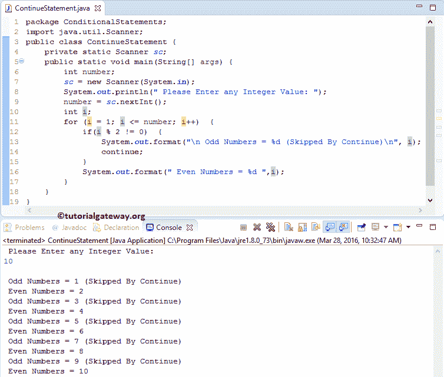

# Java 继续语句

> 原文:[https://www.tutorialgateway.org/java-continue-statement/](https://www.tutorialgateway.org/java-continue-statement/)

Java Continue 语句是控制循环流最有用的语句之一。我们通常在 For 循环、While 循环和 Do While 中使用它。在执行这些时，如果 Javac 编译器在其中找到了 Java Continue 语句，它将停止当前迭代，并从头开始新的迭代。

例如，如果我们在一个循环中有十个语句。如果我们想在某个条件为真时跳过执行后 5 条语句(statement 6—statement 10)；否则，它必须执行其中的所有十个。在这种情况下，我们将 if 子句放在第 5 行之后，并将 Java continue 语句放在 If 块中。如果条件为真，Javac 编译器将停止执行 6 到 10。否则，它将执行 1 到 10。

## Java 继续示例

Java 编程语言中 Continue 语句的语法如下:

```
continue;
```

我们想分享两个例子来展示 Java Continue 在 For 循环和 While 循环中的工作功能

### Java 在 For 循环中继续

在这个 Java 程序中，我们将通过例子展示如何在 Java For 循环中使用 Continue 语句。该程序允许用户输入任何整数值。然后它将显示给定范围内的偶数和奇数。

```
// Java Continue Statement
package ConditionalStatements;

import java.util.Scanner;

public class ContinueStatement {
	private static Scanner sc;
	public static void main(String[] args) {
		int number;
		sc = new Scanner(System.in);		
		System.out.println(" Please Enter any Integer Value: ");
		number = sc.nextInt();
		int i;
		for (i = 1; i <= number; i++)  {
			if(i % 2 != 0)  {
				System.out.format("\n Odd Numbers = %d (Skipped By Continue)\n", i);
				continue;
			}
			System.out.format(" Even Numbers = %d ",i);
		}
	}
}
```



在这个 Java continue 语句示例中，我们不打算解释 for 循环。如果您不理解 [Java](https://www.tutorialgateway.org/java-tutorial/) 代码，那么请访问我们的文章 [For Loop](https://www.tutorialgateway.org/java-for-loop/) 。

*   在 for 循环中，我们放置了 [`if`语句](https://www.tutorialgateway.org/java-if-statement/)来测试(i % 2！= 0).
*   如果该条件为真，则执行 continue 语句，迭代将在该数字处停止，而不打印另一个:System.out.format(“偶数= %d”，I)；。
*   如果条件为假，那么它将跳过 Java continue 语句，并输出该值(在我们的例子中是偶数)。

### While 循环示例中的 Java 继续语句

在这个 [Java 程序](https://www.tutorialgateway.org/learn-java-programs/)中，我们将通过例子展示如何在 [While 循环](https://www.tutorialgateway.org/java-while-loop/)中使用 Java Continue 语句。该程序允许用户输入任何整数值。接下来，它使用 continue 语句，将显示从 0 到给定数字的所有值，除了 4 和 8。

```
package ConditionalStatements;

import java.util.Scanner;

public class ContinueinWhile {
 private static Scanner sc;
 public static void main(String[] args) {
 int number;
 sc = new Scanner(System.in); 
 System.out.println("Please Enter any Integer Value below 10:");
 number = sc.nextInt();
 int i = 0;
 while (i <= number)  {
 if(i == 4 || i == 8)  {
 System.out.format("Skipped = %d \n", i);
 i++;
 continue;
 }
 System.out.format("Values = %d \n", i);
 i++;
 }
 }
}
```

```
Please Enter any Integer Value below 10: 
10
Values = 0 
Values = 1 
Values = 2 
Values = 3 
Skipped = 4 
Values = 5 
Values = 6 
Values = 7 
Skipped = 8 
Values = 9 
Values = 10 
```

这里我们不打算解释 While 循环。如果您不理解 While 循环，那么请访问我们的文章 [Java While 循环](https://www.tutorialgateway.org/java-while-loop/)。在 While 循环中，我们放置 [If 条件](https://www.tutorialgateway.org/java-if-statement/)来测试 I 是等于 4 还是 8。

*   如果该条件为真，将执行 Java continue 语句，迭代将在该数字处停止，而不打印另一个:System.out.format(" Values = %d \n "，I)；。为了更好地理解，我们放置了 system . out . format(" Skipped = % d \ n "，I)；在 If 条件下。因此，每当迭代中断时，这个值就会从这个消息中打印出来。
*   如果条件为假，那么它将跳过 continue 语句，并输出该数字(在我们的例子中为 0，1，2，3，4，6，7，8，10)。