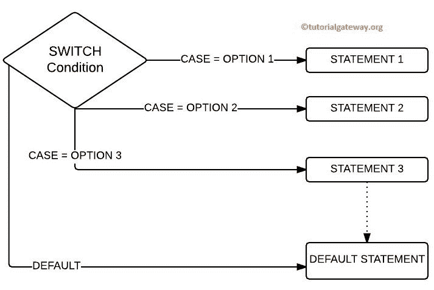
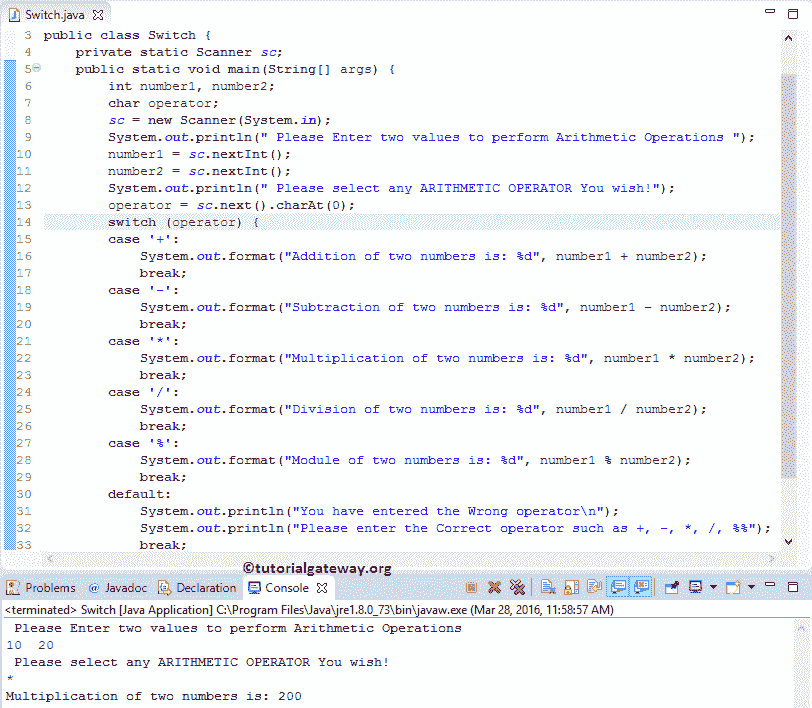

# Java `switch-case`

> 原文：<https://www.tutorialgateway.org/java-switch-case/>

Java switch 语句:Java If Else 条件允许我们在真或假之间进行选择。当有两个以上的选项时，我们只需在 Java 编程中使用嵌套`if`。比如说，如果我们有十个选择呢？，如果我们在这种情况下使用 Nested If，那么编程逻辑将很难理解。

Java 编程中的 Else if 和 switch 语句可以有效地处理这类问题。在之前的文章中，我们已经讨论了 Java `else if`语句。所以，让我们在这里探讨一下 Java switch 案例。

Java 编程中`switch-case`的工作功能几乎与 If 条件相同。如前所述，Switch 语句可能有 n 种情况。因此，它将表达式值与 case 块中分配的值进行比较。

如果值表达式值和大小写值都匹配，那么将执行该大小写语句中的代码块。为了更好地理解，让我们看看 Java switch 案例的语法。

## Java `switch-case`语法

Java 编程中 switch 语句的语法如下:

```
Switch (expression) {
 Case Option 1:
    //Execute when the expression result match Option 1
    break;
 Case Option 2:
    //Execute when the expression result match Option 2
    break;
    ......
 Case Option N:
    //Execute these when the result of expression match Option N
    break;
 Default:
    /*Execute these when the result of expression 
    Not matching with any Option */
    brea;
}
```

这个 Java switch case 语句语法背后的详细解释是:

*   表达式值应该是整数或字符(我们也可以将表达式写成 n/2，但结果应该是整数或可转换的整数)。
*   Java Switch 语句允许我们添加一个默认语句。如果变量值与任何大小写表达式都不匹配，则可选默认值中的代码将执行。
*   break 子句从 tit 中出来是有用的。否则，条件中的所有代码都将被执行。每当遇到中断时，执行流将直接来自 Java 中的 switch 语句。请参考 [Java Break Statement](https://www.tutorialgateway.org/java-break-statement/) 文章，完美理解 Break 关键字。

### Java 交换案例流程图

下图将为您展示这个 Java switch 语句



背后的流程图

Java 中 switch 语句的执行流程是:

*   如果 Case = Option 1，则执行 STATEMENT1，后面跟一个`break`语句以退出开关案例。
*   如果 Case = Option 2，则执行 STATEMENT2，然后中断以退出开关案例。
*   当 Case = Option 3 时，STATEMENT3 将执行，后面跟着要退出的语句。
*   如果选项 1、选项 2 和选项 3 失败，则执行 Default STATEMENT，然后执行 break statement 退出开关情况。

## Java 开关案例示例

这个 [Java 程序](https://www.tutorialgateway.org/learn-java-programs/)允许用户输入两个整数值。它还允许选择任何[算术运算符](https://www.tutorialgateway.org/java-arithmetic-operators/)来使用`switch-case`执行算术运算。

在这个 Java switch 语句示例中，前三行代码，包括 println 将允许用户输入两个整数值。然后，我们将用户输入的值分配给已经声明的名为 number1 和 number2 的变量。

下一次打印将允许用户输入一个字符(它应该是任何算术运算符)。然后，我们将用户输入的字符分配给已经声明的名为运算符的变量。

接下来，我们将使用带有运算符的 Java 开关案例作为选项。如果用户输入+作为运算符，那么+块内的代码将被打印出来。

如果用户以运算符身份输入，将打印以下语句。当用户以运算符身份给出*时，将打印以下代码。

如果用户以运算符身份输入/将打印/部分中的代码。如果用户提供%作为运算符，则%部分中的 println 将打印。

如果用户输入的运算符(字符)不在上述任何一项中(运算符不等于+、-、*、/或%)，将打印以下默认语句。

请参考 [Java](https://www.tutorialgateway.org/java-tutorial/) 中 [Java If](https://www.tutorialgateway.org/java-if-statement/) 、[If](https://www.tutorialgateway.org/java-if-else-statement/)、[If](https://www.tutorialgateway.org/java-else-if-statement/)、[嵌套`if`](https://www.tutorialgateway.org/nested-if-in-java-programming/) 文章。

```
package ConditionalStatements;

import java.util.Scanner;

public class Switch {
 private static Scanner sc;
 public static void main(String[] args) {
 int number1, number2;
 char operator;
 sc = new Scanner(System.in); 
 System.out.println(" Please Enter two values to perform Arithmetic Operations ");
 number1 = sc.nextInt();
 number2 = sc.nextInt();
 System.out.println(" Please select any ARITHMETIC OPERATOR You wish!\n");
 operator = sc.next().charAt(0);

 switch (operator) {
 case '+':
 System.out.format("Addition of two numbers is: %d", number1 + number2);
     break;
 case '-':
 System.out.format("Subtraction of two numbers is: %d", number1 - number2);
 break;
 case '*':
 System.out.format("Multiplication of two numbers is: %d", number1 * number2);
 break;
 case '/':
 System.out.format("Division of two numbers is: %d", number1 / number2);
 break;
 case '%':
 System.out.format("Module of two numbers is: %d", number1 % number2);
 break;
 default:
 System.out.println("You have entered the Wrong operator\n");
 System.out.println("Please enter the Correct operator such as +, -, *, /, %%");
 break; 
 }
 }
}
```

输出 1:让我们输入*运算符，输入数字 1 = 10，数字 2 =20。



让我们输入错误的运算符来检查默认值

```
 Please Enter two values to perform Arithmetic Operations 
40 60
 Please select any ARITHMETIC OPERATOR You wish!
6
You have entered the Wrong operator

Please enter the Correct operator such as +, -, *, /, %%
```

## Java `switch-case`字符串示例

在这个[程序](https://www.tutorialgateway.org/learn-java-programs/)中，我们使用字符串数据作为 Switch case 选项。在这个 java switch 语句示例中，我们使用面向对象编程来划分代码。为此，首先，我们将创建一个保存方法的类。

```
package ConditionalStatements;

import java.util.Scanner;

public class StringSwitch {
	private static Scanner sc;
	public static void main(String[] args) {
		String month, Message;
		sc = new Scanner(System.in);	
		System.out.println("Please Enter any Month Name");
		month = sc.next();

		SwitchClass swt = new SwitchClass();
		Message = swt.stringSwitch(month);
		System.out.println(Message);

	}
}
```

在这个 Java switch 案例示例的 Main 程序中，我们将创建上述指定类的一个实例，并调用方法。

```
package ConditionalStatements;
public class SwitchClass {
	public String stringSwitch(String month) {
		String Message;
		switch (month.toLowerCase()) {
		case "january":
			Message = "You have entered January and Month Number  = 1";
		    break;
		case "february":
			Message = "You have entered February and Month Number  = 2";
		    break;
		case "march":
			Message = "You have entered March and Month Number  = 3";
		    break;
		case "april":
			Message = "You have entered April and Month Number  = 4";
		    break;
		case "may":
			Message = "You have entered May and Month Number  = 5";
		    break;
		case "june":
			Message = "You have entered June and Month Number  = 6";
		    break;
		case "july":
			Message = "You have entered July and Month Number  = 7";
		    break;
		case "august":
			Message = "You have entered August and Month Number  = 8";
		    break;
		case "september":
			Message = "You have given September and Month Number  = 9";
		    break;
		case "october":
			Message = "You have given October and Month Number  = 10";
		    break;
		case "november":
			Message = "You have given November and Month Number  = 11";
		    break;
		case "december":
			Message = "You have given December and Month Number  = 12";
		    break;
		default:
			Message = "Please Provide the Proper Month name";
			break; 
		}
		return Message;
	}
}
```

输出 1:让我们提供三月作为月份名称。

```
Please Enter any Month Name
march
You have entered March and Month Number  = 3
```

让我们给出错误的月份名称来检查默认值。

```
Please Enter any Month Name
mar
Please Provide the Proper Month name
```