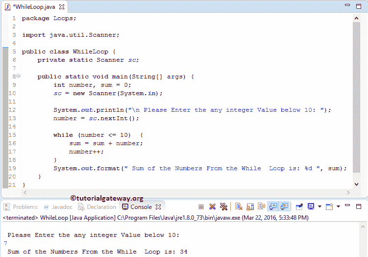

# Java`while`循环

> 原文:[https://www.tutorialgateway.org/java-while-loop/](https://www.tutorialgateway.org/java-while-loop/)

Java`while`循环是对一个代码块迭代给定的次数，直到其中的条件为 False。Java`while`循环从验证条件开始，如果条件为真，`while`循环中的代码将运行。如果条件为假，Java`while`循环至少不会运行一次。

由此，我们可以说，Java`while`循环可能编译零次或更多次。Java`while`循环语法是

```
While ( JCondition )  {
    Jstatement 1;
    Jstatement 2;
    ………….
    Jstatement N;
}
// This statement is from outside of the While Loop
```

首先，Javac 测试 Java`while`循环条件。如果条件结果为真，将运行其中的语句 1 到语句 N。如果为假，Javac 将脱离花括号，并在它之外完成声明。在 Java 编程中，单行代码不需要大括号。但是，如果我们对多个语句忽略它们，Javac 将只执行第一行。一直使用牙套是安全的

## 一个 Java`while`循环的流程图

下图为 Java While Loop 流程图


在它的开始，Java`while`循环测试条件。

1.  如果测试结果为真，`while`循环中的代码将运行。
2.  接下来，我们必须在其中使用 Java 递增和递减运算符来提高或降低该值。
3.  值增加后，Javac 将再次测试该条件。只要测试结果为真，Javac 就会重复这个过程。
4.  如果测试结果为假，Javac 将终止它。

让我们来看一个 java 编程中`while`循环的例子，以获得更好的结论

## Java`while`循环示例

这个 Java`while`循环程序允许用户插入一个小于 10 的整数值。接下来，Javac 编译器找到这些数字的总和，最大为 10。

```
// Java While Loop example

package Loops;

import java.util.Scanner;

public class WhileLoop {
	private static Scanner sc;

	public static void main(String[] args) {
		int number, sum = 0;
		sc = new Scanner(System.in);	

		System.out.println("\n Please Enter the any integer Value below 10: ");
		number = sc.nextInt();

		while (number <= 10)  {
			sum = sum + number;
			number++;
		}
		System.out.format(" Sum of the Numbers From the While  Loop is: %d ", sum);
	}
}
```

我们将输入数字= 7。意思是，总计= 7 + 8 + 9 + 10 = 34



我们使用了`while`循环，其中的条件将确保给定的数字小于或等于 10。

在本例中，用户给定的值:数字= 7。接下来，我们初始化 sum = 0

Java 第一次迭代

总和=总和+数字

总和= 0 + 7 ==> 7

接下来，数字将增加 1(数字++)。请参考 [Java](https://www.tutorialgateway.org/java-tutorial/) 中的[增量&减量运算符](https://www.tutorialgateway.org/increment-and-decrement-operators-in-java/)一文来理解这个++符号。

第二次迭代

在第一次迭代中，数字和总和都变成了数字= 8 和总和= 7

总和= 7 + 8 = 15

第三次迭代

从第二次迭代开始，数= 9，和= 15

总和= 15 + 9 ==> 24

第四次迭代:在 Java`while`循环的第三次迭代中，Number 和 sum 的值都变成了 Number = 10 和 sum = 24

总和= 24 + 10 ==> 34

接下来，数字将增加 1

这里数字= 11。所以，目前的情况将会失败

最后一条 System.out.format 语句将输出给定数字中的位数。

## 无限循环示例

在`while`循环中，如果您跳过增加或减少数字，它将运行无限次，也称为 Java 无限循环。让我给你看一个 Java 无限的例子

```
// Infinite While Loop in Java Programming example 

package Loops;

public class InfiniteWhile {
	public static void main(String[] args) {
		int number = 1;

		while (number <= 10)  {
			System.out.format("Numbers = %d ", number);
		}
	}
}
```

```
1
1
1
1
1
1
.....
....
```

这里，在这个 Java 无限`while`循环的例子中，数字永远是 1，而且永远小于 10。因此，它将无限次地执行该语句。

让我们在前面的例子中放一个增量运算符(number++)。

```
// Infinite While Loop in Java Programming example 

package Loops;

public class InfiniteWhile {
	public static void main(String[] args) {
		int number = 1;

		while (number <= 10)  {
			System.out.format("Values = %d\n", number);
			number++;
		}
	}
}
```

现在，当它等于 10 时，条件将失败。这个`while`循环示例的输出

```
1
2
3
4
5
6
7
8
9
10
```