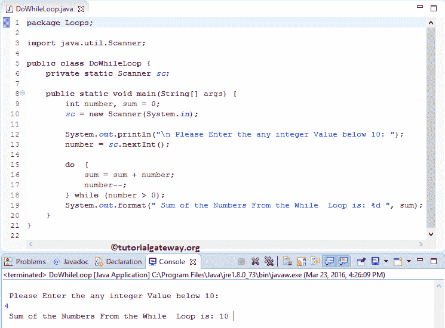

# Java `do-while`循环

> 原文：<https://www.tutorialgateway.org/java-do-while-loop/>

Java`do-while`循环将在循环结束时测试给定的条件。因此，即使给定的条件失败，Java`do-while`循环也会至少执行一次代码块中的语句。

`while`循环在进入代码块之前测试条件。如果条件为真，则只执行其中的语句。否则，语句至少不会执行一次。有些情况下，需要先执行一些操作(执行一些语句)，然后检查条件。在这些情况下，我们可以使用 Java`do-while`循环。

## Java 边做边循环语法

Java 编程语言中`do-while`循环的语法如下:

```
do  {
     statement 1;
     statement 2;
      ………….
     statement n;
} While (condition);
```

首先，它将执行花括号内的语句，然后在到达末尾后，它将检查 while 内的条件。如果条件为真，则它将重复该过程。如果条件失败，那么 Java 边做边循环将被终止。

注意:我们必须在 While 条件后加上分号。

### Java `do-while`循环流程图

Java 边做边循环


背后的流程图

Java `do-while`循环流程图顺序是:

1.  首先，我们初始化变量。接下来，它将进入边做边循环。
2.  它将执行其中的一组语句。
3.  接下来，我们必须在 Java`do-while`循环中使用递增和递减运算符来递增或递减该值。请参考 [Java](https://www.tutorialgateway.org/java-tutorial/) 中[递增和递减运算符](https://www.tutorialgateway.org/increment-and-decrement-operators-in-java/)一文，了解递增和递减运算符。
4.  现在它会检查情况。如果条件为真，那么 Java`do-while`循环中的语句将再次执行。只要条件为真，它就会继续这个过程。
5.  如果条件为假，则它将退出。

## Java `do-while`循环示例

这个程序帮助我们理解 Java 中的`do-while`循环。这个 [Java 程序](https://www.tutorialgateway.org/learn-java-programs/)允许用户输入一个小于 10 的整数值。通过使用这个值，Javac 编译器将把这些值加到 10。

```
// Java Do While Loop example 
package Loops;

import java.util.Scanner;

public class DoWhileLoop {
	private static Scanner sc;

	public static void main(String[] args) {
		int number, sum = 0;
		sc = new Scanner(System.in);	

		System.out.println("\n Please Enter the any integer Value below 10: ");
		number = sc.nextInt();

		do  {
			sum = sum + number;
			number--;
		} while (number > 0); 
		System.out.format(" Sum of the Numbers From the While  Loop is: %d ", sum);
	}
}
```

输出:我们将输入数字= 4。意思是，总计= 4 + 3 + 2 + 1 = 10



在这个 Java 例子中，我们使用了`do-while`循环。While(数字> 0)中的条件将确保数字大于 0。

在这个例子中，用户输入的值:数字= 4，我们初始化总和= 0

第一次迭代
和=和+数
和= 0 + 4 == > 4

接下来，该数字将递减 1(number–)。
接下来，while 里面的条件是真还是假。这里，3 > 0 为真

第二次迭代:在第一次迭代中，数字和和的值都变为数字= 3 和和= 4
和= 4 + 3 == > 7
减量(数字–)后，检查[同时循环](https://www.tutorialgateway.org/java-while-loop/)条件。这里，2 > 0 为真

第三次迭代
在 Java`do-while`循环的第二次迭代中，两者的值都更改为 Number = 2 和 sum = 7
sum = 7 + 2 == > 9

减量后，条件(1 > 0)为真

第四次迭代
第三次迭代后，数= 1，和= 9
和= 9 + 1 == > 10

接下来，该数字将递减 1(number–)。

接下来，while 中的条件为真或假。这里，0 > 0 为假。

`do-while`循环示例中的最后一条 System.out.format 语句将输出给定数字中的位数。

## Java 中的无限`do-while`循环

如果您忘记在 Java`do-while`循环中增加或减少值，那么它将执行无限次(也称为无限循环)。例如:

```
// Infinite Do While Loop in Java Programming example 

package Loops;

public class InfiniteDoWhile {
	public static void main(String[] args) {
		int number = 1;

		do  {
			System.out.format("%d \n", number);
		}while (number <= 10);
	}
}
```

```
1
1
1
1
1
1 
...
...
...
```

这里，在这个 Java`do-while`循环中，数字总是 1，并且数字总是小于 10。因此，它将无限次地继续执行语句。现在，让我们在。上面例子的迭代。

```
// Infinite Do While Loop in Java Programming example 

package Loops;

public class InfiniteDoWhile {
	public static void main(String[] args) {
		int number = 1;

		do  {
			System.out.format("%d \n", number);
			number++;
		}while (number <= 10);
	}
}
```

现在，当它达到 10 时，条件将失效。让我们看看这个程序的输出。

```
1
2
3
4
5
6
7
8
9
10 
```